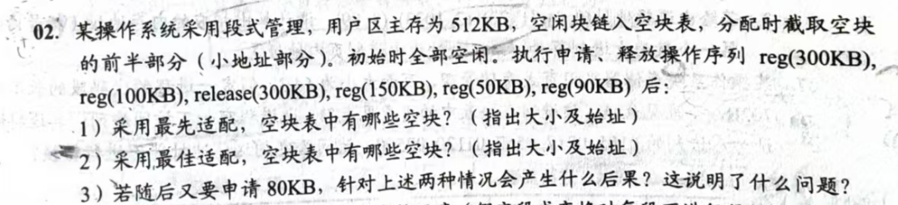
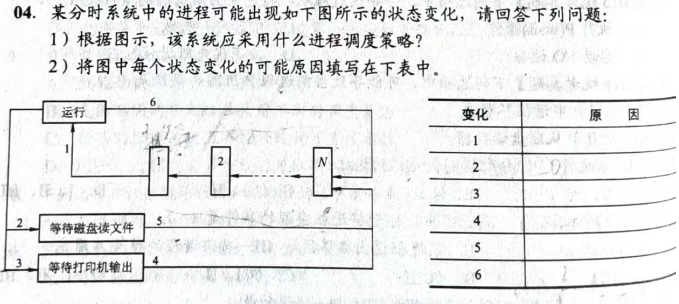
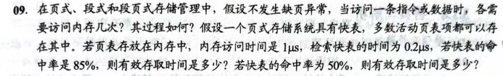
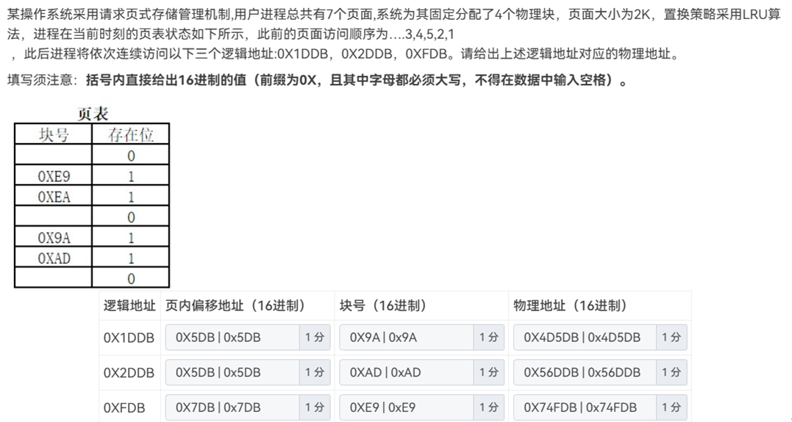

# 2024-2025-1期末卷

1.动态分区分配（王道题改编）（首次适应算法、邻近适应算法）类似下面这题：

2.死锁-安全性算法

3.磁盘调度算法（FCFS、SSTF、SCAN）

4.进程状态与转换（王道原题）

5.快表命中（王道改编）

6.页面置换算法

7.基本分页存储管理（有考-改进clock），类似下面这题：

8.CPU调度（FCFS、SJF）

9.PV操作-英文题-读者（15分）