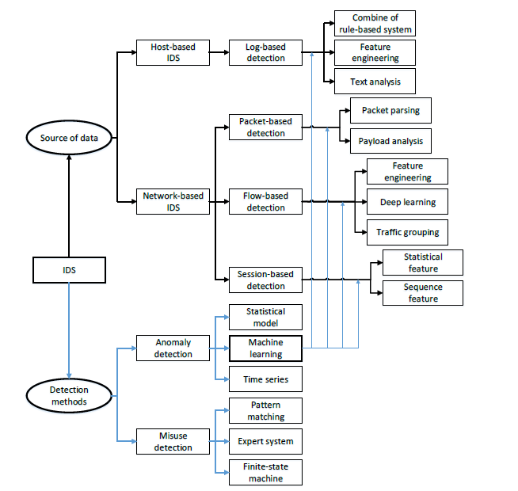
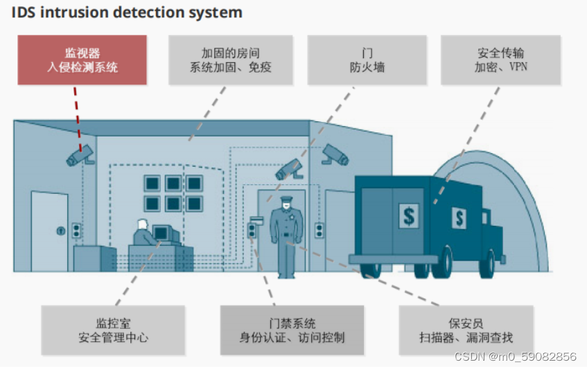
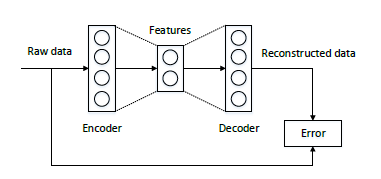

# 基于深度学习的入侵检测系统：网络安全的新防线

# 摘要

随着信息技术的快速发展，网络安全已成为国家安全和社会发展的重要组成部分。基于深度学习的入侵检测系统（IDS）因其在特征提取和模式识别方面的优势，成为网络安全领域的研究热点。本文综述了深度学习技术在IDS中的应用，分析了其技术原理、优势及面临的挑战，并探讨了未来的发展趋势。首先，本文概述了网络安全的基本概念和重要性，然后深入讨论了深度学习技术在IDS中的关键技术和算法，包括卷积神经网络（CNN）、长短期记忆网络（LSTM）和生成对抗网络（GAN）。接着，本文提出了实验评估手段，包括数据集选择、模型训练与测试、性能评估指标等，并对未来的研究方向提出了建议。最后，本文强调了IDS在维护网络安全中的重要性，并对未来的挑战和机遇进行了总结。

关键词：网络安全；深度学习；入侵检测系统；卷积神经网络；长短期记忆网络；生成对抗网络

# Deep Learning-based Intrusion Detection System: A New Line of Defense for Cybersecurity

# Abstract

With the rapid development of information technology, cybersecurity has become a vital component of national security and social development. Deep Learning-Based Intrusion Detection Systems (IDS) have emerged as a research hotspot in the field of cybersecurity due to their advantages in feature extraction and pattern recognition. This paper reviews the application of deep learning technology in IDS, analyzes its technical principles, advantages, and challenges, and discusses future development trends. Firstly, the paper outlines the basic concepts and importance of cybersecurity, then delves into the key technologies and algorithms of deep learning in IDS, including Convolutional Neural Networks (CNN), Long Short-Term Memory Networks (LSTM), and Generative Adversarial Networks (GAN). Subsequently, the paper proposes experimental evaluation methods, including dataset selection, model training and testing, performance evaluation metrics, and suggests directions for future research. Finally, the paper emphasizes the importance of IDS in maintaining cybersecurity and summarizes the challenges and opportunities ahead.

Keywords: Cybersecurity; Deep Learning; Intrusion Detection System; Convolutional Neural Network; Long Short-Term Memory Network; Generative Adversarial Network

# 1 引言

## 1.1 网络安全的重要性和对环境及社会发展的影响

随着信息技术的飞速发展，网络已成为现代社会的基础设施，其安全性直接关系到国家的安全、经济的稳定以及社会的和谐发展。网络安全不仅涉及到保护关键信息基础设施免受攻击，还关系到个人隐私的保护、知识产权的维护以及商业机密的安全。在全球化背景下，网络攻击可能导致跨国界的安全威胁，影响国际关系和地缘政治。此外，随着物联网（IoT）和工业互联网的发展，网络安全问题也扩展到了物理世界，影响着环境监测、智能制造等各个领域，对环境的可持续发展和社会的稳定运行具有深远影响。

### 1.1.1 网络安全的定义和范畴

网络安全是指保护网络和网络中的信息免受攻击、破坏、未经授权的访问或修改，以及确保信息的完整性、机密性和可用性的过程。网络安全的范畴广泛，包括但不限于防火墙、入侵检测系统、恶意软件防护、密码学、二进制安全、Web安全等。随着技术的发展，网络安全的范畴也在不断扩展，涵盖了云计算安全、移动安全、物联网安全等多个新兴领域。

### 1.1.2 网络安全对国家安全和社会经济的影响

网络安全对国家安全至关重要，因为它涉及到保护国家关键信息基础设施，如电力网、交通系统、通信网络等，这些基础设施的安全性直接关系到国家的运行和人民的生活。在社会经济层面，网络安全问题可能导致企业数据泄露、经济损失，甚至影响市场信心和消费者信任。因此，加强网络安全建设对于维护社会稳定和推动经济发展具有重要意义。

### 1.1.3 网络安全的挑战：传统方法与新兴威胁

传统的网络安全方法，如基于签名的入侵检测系统和防火墙，虽然在一定程度上能够防御已知威胁，但对于新出现的攻击模式和零日漏洞往往无能为力。随着攻击者技术的进步和攻击手段的多样化，网络安全面临着越来越多的挑战。新兴威胁包括高级持续性威胁（APT）、分布式拒绝服务（DDoS）攻击、勒索软件以及利用人工智能技术的自动化攻击等。这些威胁对传统的网络安全防御机制提出了新的挑战，需要更加智能和灵活的安全解决方案。

## 1.2 深度学习在网络安全中的应用

近年来，深度学习技术因其在图像识别、自然语言处理等领域的突破性进展而受到广泛关注。在网络安全领域，深度学习技术被用来提高入侵检测系统的准确性和效率，自动从大量网络流量中识别出异常行为和潜在威胁。深度学习模型能够学习复杂的数据模式，为网络安全提供了一种新的防御机制。然而，深度学习模型在网络安全中的应用仍面临诸多挑战，如模型的可解释性、对抗样本的攻击以及模型的泛化能力等。

本文旨在探讨基于深度学习的入侵检测系统（IDS）在网络安全中的应用，分析其技术原理、优势以及面临的挑战，并提出相应的解决方案。论文首先概述网络安全的基本概念和重要性，然后深入讨论深度学习技术在IDS中的应用，包括关键技术、算法和实验评估。接着，探讨深度学习IDS对环境和社会的潜在影响，并展望未来的发展趋势。最后，总结研究成果，并提出未来研究方向。

图 LDS系统架构

# 2. 背景

## 2.1 深度学习技术简介
深度学习作为人工智能领域的一个重要分支，通过模仿人脑的神经网络结构，利用多层次的非线性变换从数据中学习并提取高层次的抽象特征。这种技术在网络安全领域的应用主要体现在其强大的数据处理和模式识别能力，使其在网络攻击检测、恶意软件识别、用户行为分析等方面展现出巨大潜力。

## 2.2 深度学习在网络安全中的优势与挑战
**优势**

1. **自动化特征提取**：深度学习能够自动从原始数据中学习特征表示，无需手动构建特征集合，这大大提高了网络入侵检测的准确性和实时性。
2. **适应复杂环境**：深度学习模型能够适应不断变化的网络环境，提高检测精度，尤其是在面对新型攻击时。
3. **模式识别**：深度学习技术通过分析大量的数据来自动识别异常行为，从而提前预警。

**挑战**

1. **数据质量和隐私问题**：深度学习模型的训练需要大量的高质量数据，而在网络安全领域，获取足够的数据并保护用户隐私是一个巨大的挑战。
2. **模型的可解释性问题**：深度学习模型通常被视为黑箱，如何理解和解释模型的决策过程，对于安全性和可信度的提高至关重要。
3. **对抗攻击**：黑客可能会利用对抗攻击技术来欺骗深度学习模型，这需要研究人员不断更新和增强模型的防御能力。

## 2.3 基于深度学习的入侵检测系统（IDS）
基于深度学习的入侵检测系统通过利用深度学习模型（如卷积神经网络、循环神经网络等）对网络流量的特征进行学习和分类，构建出能够实时监控网络流量并发现异常行为的模型。这些系统可以分为以下几个步骤：

图 经典的IDS系统

1. **数据收集与预处理**：收集网络流量数据，包括正常流量和攻击流量，并进行清洗和预处理，包括去除缺失值、归一化等。
2. **特征提取**：从网络流量数据中提取特征，例如流量的时间序列、流量的特征向量等。
3. **模型训练**：使用深度学习模型对提取的特征进行训练，以学习正常和攻击流量的差异。
4. **攻击检测**：使用训练好的深度学习模型对新的网络流量进行分类，判断是否为攻击流量。

基于深度学习的IDS在网络安全领域具有广阔的应用前景，通过不断的研究和实践，我们有信心能够构建出更加高效、准确的入侵检测系统，为网络安全保驾护航。

# 3. 方法

## 3.1 IDS的传统方法与局限性

传统的入侵检测系统（IDS）主要依赖于签名匹配和异常检测两种方法。签名匹配方法通过预定义的攻击模式（签名）来识别已知攻击，而异常检测方法则通过分析网络流量的统计特征来识别偏离正常行为的异常活动。然而，这些方法存在明显的局限性：

1. **对未知攻击的检测能力有限**：传统IDS难以识别未知或零日攻击，因为它们缺乏相应的签名或模式。
2. **高误报率和漏报率**：由于依赖于静态规则和阈值，传统IDS容易产生误报和漏报。
3. **对加密流量的检测能力不足**：随着加密技术的发展，传统IDS在处理加密流量时面临挑战。
4. **资源消耗和处理能力局限**：在面对大规模网络流量时，传统IDS可能会因为资源消耗和处理能力的限制而变得力不从心。

## 3.2 深度学习在IDS中的应用

深度学习技术以其强大的特征提取能力和模式识别能力，在网络安全领域展现出巨大潜力。在IDS中，深度学习的应用主要体现在以下几个方面：

1. **自动特征提取**：深度学习模型能够从原始数据中自动学习并提取关键特征，减少了人工特征工程的需求。
2. **提高检测准确率**：深度学习模型能够识别复杂的攻击模式，提高对未知攻击的检测准确率。
3. **适应性强**：深度学习模型可以通过持续学习不断适应新的攻击模式和网络环境的变化。
4. **多任务学习**：深度学习模型可以同时执行多种任务，如同时进行入侵检测和异常行为分析。

## 3.3 深度学习IDS的关键技术与算法

深度学习IDS中常用的关键技术和算法包括：

1. **卷积神经网络（CNN）**：
   CNN主要用于处理图像数据，但在IDS中，它可以用于处理转换为图像格式的特征向量。一个基本的CNN结构包含卷积层（Convolutional Layer）、池化层（Pooling Layer）和全连接层（Fully Connected Layer）。数学上，卷积操作可以表示为：
   $$ (f * g)(x) = \int_{-\infty}^{\infty} f(\tau) g(x - \tau) d\tau $$
   其中，$$ f $$是卷积核，$$ g $$是输入信号，$$ * $$表示卷积操作。
2. **长短期记忆网络（LSTM）**：
   LSTM是RNN的一种，特别适合于时间序列数据。LSTM单元通过三个门（输入门、遗忘门、输出门）控制信息的流动，其更新公式为：
   $$ f_t = \sigma(W_f \cdot [h_{t-1}, x_t] + b_f) $$
   $$ i_t = \sigma(W_i \cdot [h_{t-1}, x_t] + b_i) $$
   $$ \tilde{C}_t = \tanh(W_C \cdot [h_{t-1}, x_t] + b_C) $$
   $$ C_t = f_t * C_{t-1} + i_t * \tilde{C}_t $$
   $$ o_t = \sigma(W_o \cdot [h_{t-1}, x_t] + b_o) $$
   $$ h_t = o_t * \tanh(C_t) $$
   其中，$$ f_t, i_t, o_t $$分别是遗忘门、输入门、输出门的激活向量，$$ C_t $$是细胞状态，$$ h_t $$是隐藏状态，$$ \sigma $$是sigmoid函数，$$ * $$表示逐元素乘法。
3. **自编码器（Autoencoder）**：
   自编码器是一种无监督学习模型，用于特征提取和降维。一个简单的自编码器包含编码器和解码器两部分，其目标是最小化重构误差：
   $$ \text{minimize} \ \| x - \hat{x} \|^2 $$
   其中，$$ x $$是输入，$$ \hat{x} $$是重构的输出。
4. **生成对抗网络（GAN）**：
   GAN由生成器（Generator）和判别器（Discriminator）组成，通过对抗训练生成新的数据样本。生成器的目标是产生尽可能接近真实数据的样本，而判别器的目标是区分真实数据和生成的数据。这可以表示为一个最小最大问题：
   $$ \text{min}_G \ \text{max}_D \ V(D, G) = \mathbb{E}_{x \sim p_data(x)}[\log D(x)] + \mathbb{E}_{z \sim p_z(z)}[\log (1 - D(G(z)))] $$
   其中，$$ G $$是生成器，$$ D $$是判别器，$$ x $$是真实数据，$$ z $$是从噪声分布中采样的输入，$$ p_data $$和$$ p_z $$分别是数据和噪声的概率分布。

这些模型在IDS中的应用主要是为了提高对网络攻击的检测能力，尤其是在处理大规模和复杂网络流量数据时。通过这些深度学习模型，IDS能够自动学习数据中的复杂模式，并提高对未知攻击的检测能力。

图 自编码器网络架构

# 4 实验评估手段

## 4.1 数据集选择与预处理

在实验评估中，选择合适的数据集是至关重要的一步，因为它直接影响到模型训练和测试的结果。综述中提到了多个用于IDS评估的数据集，包括但不限于KDD99、NSL-KDD、UNSW-NB15等。这些数据集包含了正常流量和各种攻击类型的流量，是评估IDS性能的标准基准。

预处理步骤包括数据清洗（去除噪声和无关数据）、特征提取（从原始数据中提取有助于模型学习的特征）、数据平衡（处理类别不平衡问题，如通过过采样或欠采样）以及数据划分（将数据集分为训练集、验证集和测试集）。

## 4.2 实验设计：模型训练与测试

实验设计涉及选择合适的机器学习或深度学习模型，以及模型的训练和测试策略。在IDS中，模型训练通常包括监督学习（使用标记的数据集）和无监督学习（处理未标记的数据集）。训练过程中，模型通过学习正常和异常流量的特征来提高其检测能力。

测试阶段，模型在未见过的测试集上进行评估，以验证其泛化能力。测试集的选择应该能够代表实际网络环境中可能遇到的各种情况，包括不同类型的攻击和正常流量。

## 4.3 性能评估指标：准确率、召回率、F1分数等

性能评估指标是衡量模型检测能力的关键。以下是一些常用的评估指标：

- **准确率（Accuracy）**：衡量模型正确分类的样本占总样本的比例。
  $$ \text{Accuracy} = \frac{\text{TP} + \text{TN}}{\text{TP} + \text{FP} + \text{FN} + \text{TN}} $$

- **召回率（Recall）**：衡量模型成功检测到的攻击占所有实际攻击的比例。
  $$ \text{Recall} = \frac{\text{TP}}{\text{TP} + \text{FN}} $$

- **精确率（Precision）**：衡量模型检测为攻击的样本中实际为攻击的比例。
  $$ \text{Precision} = \frac{\text{TP}}{\text{TP} + \text{FP}} $$

- **F1分数（F1 Score）**：精确率和召回率的调和平均值，用于综合考虑精确率和召回率。
  $$ \text{F1 Score} = 2 \times \frac{\text{Precision} \times \text{Recall}}{\text{Precision} + \text{Recall}} $$

- **假阳性率（False Positive Rate, FPR）**：错误地将正常流量标记为攻击的比例。
  $$ \text{FPR} = \frac{\text{FP}}{\text{FP} + \text{TN}} $$

## 4.4 实验结果与分析

实验结果通常包括模型在各个性能评估指标上的表现，以及与其他基线模型或现有方法的比较。分析部分讨论模型的性能，包括其优势和局限性，以及可能影响结果的因素。此外，分析还可能包括模型在不同类型攻击和正常流量上的检测能力，以及模型对于未知攻击的泛化能力。

在IDS的实验评估中，结果分析尤为重要，因为它不仅帮助我们理解模型的性能，还能指导我们如何改进模型以更好地适应实际应用场景。通过深入分析实验结果，我们可以识别模型的不足，并探索提高IDS性能的新方法。

# 5 结论

本文综述了基于深度学习的入侵检测系统（IDS）的研究进展，探讨了其在网络安全领域的重要应用和面临的挑战。深度学习IDS通过自动提取特征和模式识别，显著提高了对网络攻击的检测能力，尤其是在处理未知攻击和新型威胁时。以下是对本文研究的总结:

1. **技术进展**：深度学习技术在IDS中的应用已经取得了显著成果，特别是在自动特征提取和异常检测方面。CNN、LSTM和GAN等模型在实验中展现出了优异的性能。

2. **实验评估**：通过使用标准数据集（如KDD99、NSL-KDD和UNSW-NB15）进行评估，研究者们能够验证深度学习IDS的有效性。性能评估指标（如准确率、召回率和F1分数）为模型优化提供了量化的反馈。

3. **挑战与机遇**：尽管深度学习IDS取得了一定的成功，但仍面临对抗样本攻击、模型鲁棒性和可解释性等技术挑战。此外，隐私保护和数据安全等社会伦理问题也需要得到充分考虑。

通过持续的研究和创新，基于深度学习的IDS有望在未来的网络安全领域发挥更大的作用，为保护我们的数字世界提供强有力的支持。

# 参考文献

Liu H, Lang B. Deep Learning-Based Intrusion Detection Systems: A Systematic Review. Applied Sciences, 2019, 9(20): 4396. DOI: 10.3390/app9204396 [2]

Kizza J M, Kizza W, Wheeler. Guide to computer network security[M]. Berlin: Springer, 2013. [1]

Anderson J P. Computer Security Threat Monitoring and Surveillance; Technical Report; James P. Anderson Company: Philadelphia, PA, USA, 1980. [3]

Michie D, Spiegelhalter D J, Taylor C. Machine Learning, Neural and Statistical Classification; Ellis Horwood Series in Artificial Intelligence: New York, NY, USA, 1994; Volume 13. [4]

Buczak A L, Guven E. A survey of data mining and machine learning methods for cyber security intrusion detection. IEEE Communications Surveys & Tutorials, 2015, 18(2): 1153-1176. [5]

Xin Y, Kong L, Liu Z, Chen Y, Li Y, Zhu H, Gao M, Hou H, Wang C. Machine learning and deep learning methods for cybersecurity. IEEE Access, 2018, 6: 35365-35381. [6]

Agrawal S, Agrawal J. Survey on anomaly detection using data mining techniques. Procedia Computer Science, 2015, 60: 708-713. [7]

Denning D E. An intrusion-detection model. IEEE Transactions on Software Engineering, 1987, SE-13(2): 222-232. [8]

Heberlein L T, Dias G V, Levitt K N, Mukherjee B, Wood J, Wolber D. A network security monitor. In Proceedings of the 1990 IEEE Computer Society Symposium on Research in Security and Privacy, Oakland, CA, USA, 7–9 May 1990; pp. 296–304. [9]

