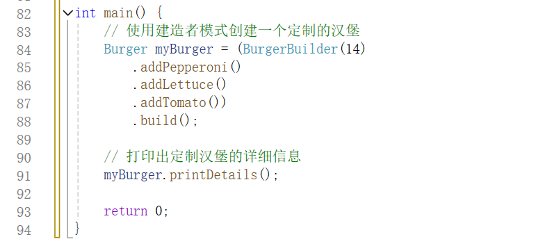
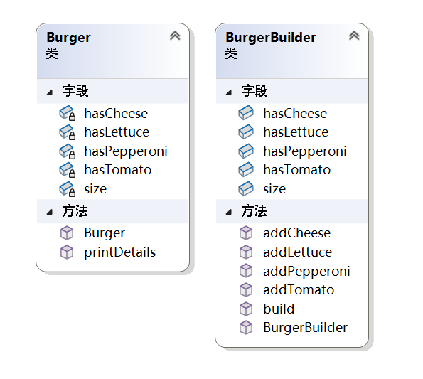
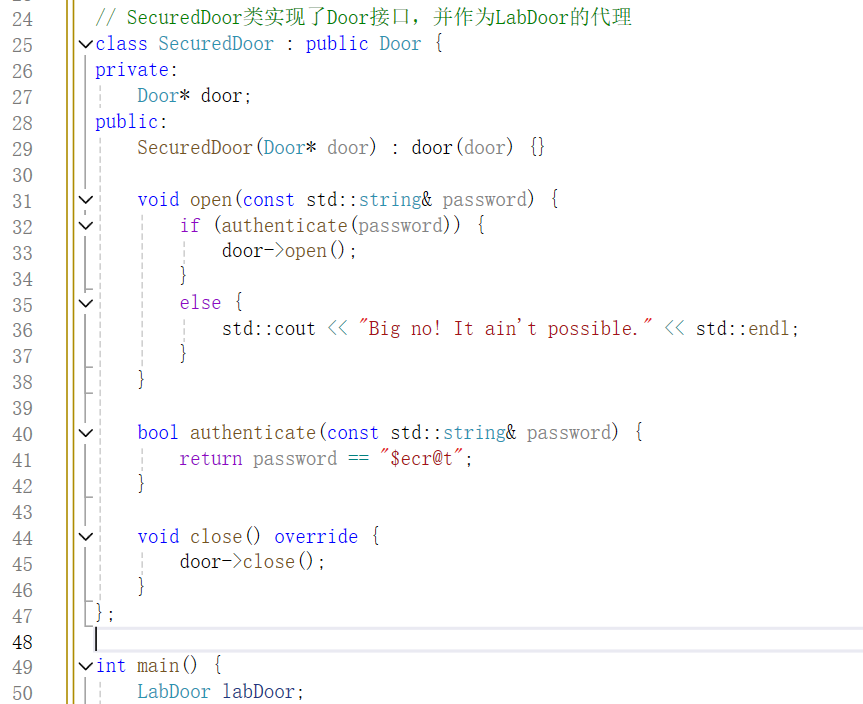
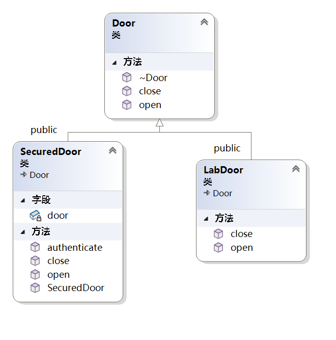
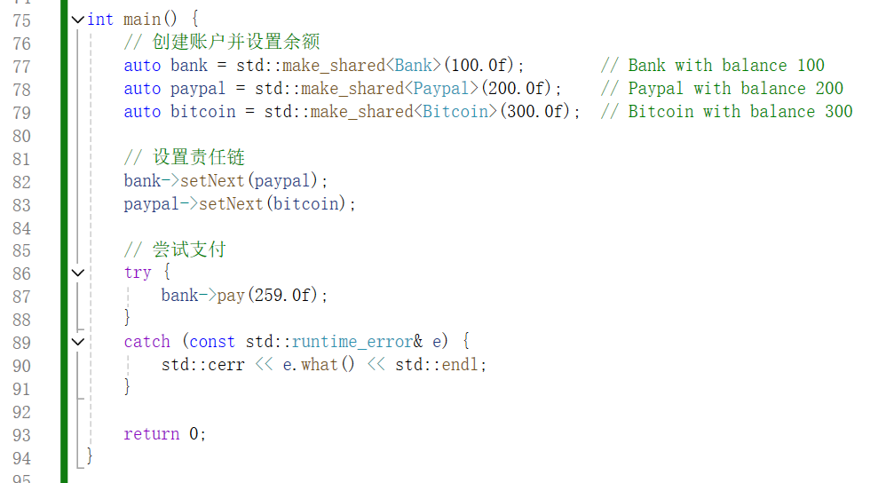
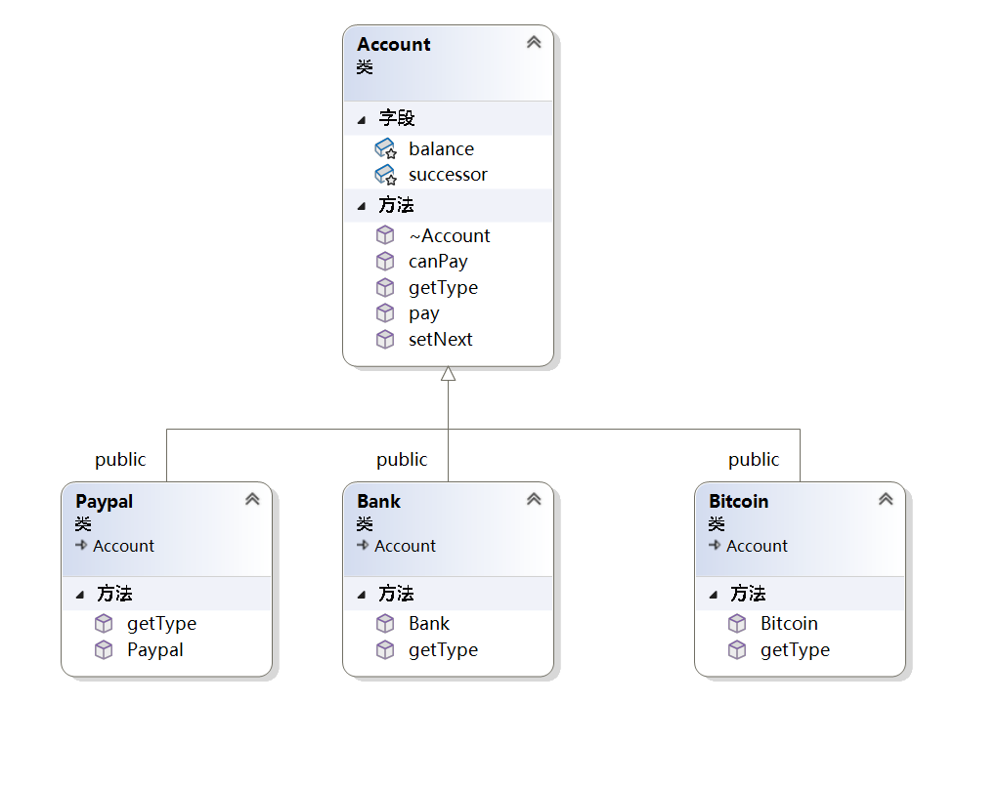

# 摘要

本报告全面探讨了设计模式在现代软件开发中的应用和重要性，特别聚焦于创建型、结构型和行为型设计模式。通过深入分析每种模式的理论基础，并结合实际的编程案例，本报告展示了设计模式如何在提高代码质量、降低维护成本、增强系统适应性方面发挥作用。

在创建型设计模式部分，报告通过塞百味点单案例，揭示了建造者模式在处理复杂对象构建时的优势，特别是在对象创建涉及多步骤和多种选择时。结构型设计模式部分，以门禁卡进门案例为背景，阐述了代理模式在控制对象访问和增加额外功能方面的作用。行为型设计模式部分，通过支付方式案例，探讨了责任链模式在处理多个对象和请求时的效率和灵活性。

报告强调，设计模式不仅提供了解决特定设计问题的通用方案，而且促进了代码的模块化、清晰性和可测试性。通过实际案例的代码实现和类图绘制，本报告为读者提供了对设计模式深入理解和应用的实用指南，展示了设计模式在实际软件开发中的有效应用，以及它们对于构建可维护、可扩展和灵活软件系统的关键作用。最终，本报告总结了设计模式的重要性，并讨论了它们对于现代软件开发的长远影响，鼓励开发者继续探索和应用这些模式，以应对不断变化的技术和业务需求。


# 目录

1 引言


2 创建型设计模式

2.1 创建型设计模式介绍

2.2 问题说明——塞百味点单案例

2.3 方案描述——建造者模式

2.4 结果展示

2.4.1 代码解释

2.4.2 类图绘制

2.5 结论归纳

2.5.1 设计模式的优势

2.5.2 心得体会


3 结构型设计模式

3.1 结构型设计模式介绍

3.2 问题说明——门禁卡进门案例

3.3 方案描述——代理模式

3.4 结果展示

3.4.1 代码解释

3.4.2 类图绘制

3.5 结论归纳

3.5.1 设计模式的优势

3.5.2 心得体会


4 行为型设计模式

4.1 行为型设计模式介绍

4.2 问题说明——支付方式案例

4.3 方案描述——责任链模式

4.4 结果展示

4.4.1 代码解释

4.4.2 类图绘制

4.5 结论归纳

4.5.1 设计模式的优势

4.5.2 心得体会


5 结束语


参考文献


# 1 引言

在软件工程领域，设计模式是一种被广泛认可的最佳实践，它代表了软件开发过程中一些常见问题的通用解决方案。随着软件系统的复杂性不断增加，如何高效地设计和构建可维护、可扩展和灵活的软件架构成为了开发者和架构师面临的重要挑战。设计模式提供了一种结构化的方法来解决这些问题，它们是经过验证的、可重用的解决方案，可以帮助开发者避免重复发明轮子，同时确保软件设计的质量。

本报告旨在探讨三种主要的设计模式类别：创建型、结构型和行为型设计模式。每一种设计模式都针对特定的设计问题提供了解决方案，它们在提高代码质量、降低维护成本以及增强软件系统的适应性方面发挥着关键作用。

创建型设计模式关注于对象的创建机制，其核心思想是将对象的创建与使用分离，从而使得程序在判断针对某个给定实例需要创建哪些对象时更加灵活。结构型设计模式则着重于如何处理对象间的组合，以及如何通过组合已有的结构来构建更大的结构。行为型设计模式则关注对象之间的通信，它们提供了多种对象和行为之间的协作方式，以应对不同的业务需求。

通过对这些设计模式的深入分析和实际案例研究，本报告旨在展示如何将理论应用于实践，以及这些模式如何在实际的软件开发项目中发挥作用。我们不仅会探讨每种设计模式的理论基础，还会通过具体的编程语言（如C++）来实现这些模式，并分析它们在实际应用中的优势和局限性。

最后，本报告将总结设计模式的重要性，并讨论它们对于现代软件开发的影响。通过本报告的学习，读者将能够更好地理解设计模式的概念，掌握如何在实际开发中识别和应用这些模式，以及如何通过这些模式来提高软件系统的整体质量和开发效率。

# 2 创建型设计模式


## 2.1 创建型设计模式介绍


创建者设计模式主要用于将对象的创建和使用相分离，把创建对象的复杂逻辑封装在特定的创建者类中。它通过这种封装，使得客户端无需关注对象创建的具体细节和过程，只需要获取和使用创建好的对象，从而有效降低了客户端与对象创建过程的耦合度，提高了代码的可维护性与可扩展性。 


该模式包含多种类型，如工厂方法模式让子类决定实例化哪一个类，将类的实例化延迟；抽象工厂模式提供创建一系列相关对象的接口，便于创建不同系列的对象组合；建造者模式将复杂对象的构建与表示分离，能通过不同的构建流程创建出不同表示的对象；原型模式则是通过复制现有对象来创建新对象，可快速生成相似的多个对象。


创建者模式在软件开发中具有重要意义，无论是创建具有不同类型的单个对象，还是创建一系列相关的对象组合，亦或是构建复杂且具有多种表示的对象，它都能提供灵活且高效的解决方案，帮助开发者更好地组织和管理代码，应对各种复杂的对象创建需求。 


## 2.2 问题说明——塞百味点单案例

在日常生活中，让我们走进快餐店的世界来理解创建者模式。先想象一下你踏入 Hardee's 快餐店，此时你心中已经明确想要一份特定的套餐，即 “Big Hardee”。你向店员下单后，店员没有多问其他问题，便迅速地将这份套餐递到了你的手中。这整个过程非常直接，就如同简单工厂模式一般，你提出需求，系统（店员）依据既定的简单规则（套餐配置）直接给出对应的产品（“Big Hardee” 套餐），无需复杂的决策或额外的步骤。


然而，并非所有的点餐经历都如此简单。当你走进赛百味时，情况就大不一样了。假设你想要一份定制的套餐，这时创建逻辑瞬间变得复杂起来。首先在面包的选择上，你可能会在全麦、白面包、蜂蜜燕麦等多种类型中犹豫不决；接着是酱汁部分，甜洋葱酱、番茄酱、蛋黄酱、烧烤酱等琳琅满目的酱料让你难以抉择；再到奶酪，切达干酪、马苏里拉奶酪、瑞士奶酪等不同风味也需要你仔细考量。每一个环节都有众多的选项，并且这些选项相互组合会产生各种各样不同的套餐结果。


这就好比在软件设计中遇到复杂对象的创建，需要考虑多个属性或组件的不同组合情况，而此时建造者模式就如同一位贴心的点餐助手，它会引导你逐步完成每一个部分的选择，最终组合成一份独一无二、完全符合你心意的定制套餐，使得复杂的创建过程变得有条不紊且灵活多变，以满足顾客（用户）多样化的需求。


## 2.3 方案描述——建造者模式

建造者模式允许创建不同风格的对象，同时避免构造函数污染。当一个对象可能有多种风格或者创建对象涉及很多步骤时，建造者模式非常有用。它通过将对象的构建过程分解为多个步骤，使得每个步骤都可以独立进行，从而提高了代码的灵活性和可维护性。

根据维基百科的定义，建造者模式是一种对象创建软件设计模式，旨在解决伸缩构造器反模式的问题。伸缩构造器反模式指的是当一个类有多个构造函数，每个构造函数有不同数量和类型的参数时，代码会变得难以维护和使用。通过使用建造者模式，可以避免这种情况，使得代码结构更加清晰和易于管理。

在赛百味点单的过程中，建造者模式的应用非常典型。每一步（如选择面包、酱汁、奶酪和蔬菜）都可以视为一个独立的构建步骤。建造者模式允许我们一步一步地构建最终的三明治对象，而不是在一个复杂的构造函数中一次性完成所有步骤。这不仅提供了清晰的步骤和灵活的定制选项，还确保了代码的易于维护性，使得添加新的选项变得简单且不会影响其他部分的代码。


## 2.4 结果展示

```cpp
#include <iostream>

// 汉堡类，代表最终要构建的复杂对象
class Burger {
private:
    int size;
    bool hasCheese;
    bool hasPepperoni;
    bool hasLettuce;
    bool hasTomato;

public:
    // 构造函数，通过建造者来初始化汉堡的各项属性
    Burger(const BurgerBuilder& builder)
        : size(builder.size),
          hasCheese(builder.hasCheese),
          hasPepperoni(builder.hasPepperoni),
          hasLettuce(builder.hasLettuce),
          hasTomato(builder.hasTomato) {}

    // 打印汉堡的详细信息
    void printDetails() const {
        std::cout << "Size: " << size << " inches" << std::endl;
        std::cout << "Toppings: " << std::endl;
        if (hasCheese) {
            std::cout << " - Cheese" << std::endl;
        }
        if (hasPepperoni) {
            std::cout << " - Pepperoni" << std::endl;
        }
        if (hasLettuce) {
            std::cout << " - Lettuce" << std::endl;
        }
        if (hasTomato) {
            std::cout << " - Tomato" << std::endl;
        }
    }
};

// 汉堡建造者类，负责逐步构建汉堡的各个部分
class BurgerBuilder {
public:
    int size;
    bool hasCheese = false;
    bool hasPepperoni = false;
    bool hasLettuce = false;
    bool hasTomato = false;

    // 构造函数，初始化汉堡的尺寸
    BurgerBuilder(int size) : size(size) {}

    // 添加芝士的方法，返回建造者自身以便链式调用
    BurgerBuilder& addCheese() {
        hasCheese = true;
        return *this;
    }

    // 添加意大利辣香肠的方法，返回建造者自身以便链式调用
    BurgerBuilder& addPepperoni() {
        hasPepperoni = true;
        return *this;
    }

    // 添加生菜的方法，返回建造者自身以便链式调用
    BurgerBuilder& addLettuce() {
        hasLettuce = true;
        return *this;
    }

    // 添加番茄的方法，返回建造者自身以便链式调用
    BurgerBuilder& addTomato() {
        hasTomato = true;
        return *this;
    }

    // 构建方法，根据当前建造者的设置创建并返回一个汉堡对象
    Burger build() {
        return Burger(*this);
    }
};

int main() {
    // 使用建造者模式创建一个定制的汉堡
    Burger myBurger = (BurgerBuilder(14)
                      .addPepperoni()
                      .addLettuce()
                      .addTomato())
                     .build();

    // 打印出定制汉堡的详细信息
    myBurger.printDetails();

    return 0;
}
```


### 2.4.1 代码解释

**汉堡类（`Burger`）**

`Burger`类是我们最终要构建的复杂对象，它包含了汉堡的各项属性（如尺寸、是否有芝士、是否有意大利辣香肠等），其构造函数通过接受一个`BurgerBuilder`对象来初始化这些属性，同时提供了`printDetails`方法用于打印汉堡的详细信息。

```cpp
class Burger {
private:
    int size;
    bool hasCheese;
    bool hasPepperoni;
    bool hasLettuce;
    bool hasTomato;

public:
    // 构造函数，通过建造者来初始化汉堡的各项属性
    Burger(const BurgerBuilder& builder)
        : size(builder.size),
          hasCheese(builder.hasCheese),
          hasPepperoni(builder.hasPepperoni),
          hasLettuce(builder.hasLettuce),
          hasTomato(builder.hasTomato) {}

    // 打印汉堡的详细信息
    void printDetails() const {
        std::cout << "Size: " << size << " inches" << std::endl;
        std::cout << "Toppings: " << std::endl;
        if (hasCheese) {
            std::cout << " - Cheese" << std::endl;
        }
        if (hasPepperoni) {
            std::cout << " - Pepperoni" << std::endl;
        }
        if (hasLettuce) {
            std::cout << " - Lettuce" << std::endl;
        }
        if (hasTomato) {
            std::cout << " - Tomato" << std::endl;
        }
    }
};

```

**汉堡建造者类（`BurgerBuilder`）**

`BurgerBuilder`类负责逐步构建汉堡的各个部分，它包含了汉堡的各项属性，并提供了一系列方法来设置这些属性（如`addCheese`、`addPepperoni`等），每个设置方法返回建造者自身以支持链式调用，最终通过调用`build`方法根据当前建造者的设置创建并返回一个`Burger`对象。

```cpp
class BurgerBuilder {
public:
    int size;
    bool hasCheese = false;
    bool hasPepperoni = false;
    bool hasLettuce = false;
    bool hasTomato = false;

    // 构造函数，初始化汉堡的尺寸
    BurgerBuilder(int size) : size(size) {}

    // 添加芝士的方法，返回建造者自身以便链式调用
    BurgerBuilder& addCheese() {
        hasCheese = true;
        return *this;
    }

    // 添加意大利辣香肠的方法，返回建造者自身以便链式调用
    BurgerBuilder& addPepperoni() {
        hasPepperoni = true;
        return *this;
    }

    // 添加生菜的方法，返回建造者自身以便链式调用
    BurgerBuilder& addLettuce() {
        hasLettuce = true;
        return *this;
    }

    // 添加番茄的方法，返回建造者自身以便链式调用
    BurgerBuilder& addTomato() {
        hasTomato = true;
        return *this;
    }

    // 构建方法，根据当前建造者的设置创建并返回一个汉堡对象
    Burger build() {
        return Burger(*this);
    }
};

```

**主函数（`main`）**

在`main`函数中，我们使用`BurgerBuilder`来创建一个定制的汉堡，首先创建一个指定尺寸（14英寸）的`BurgerBuilder`对象，然后通过链式调用逐步添加配料（意大利辣香肠、生菜和番茄），最后调用`build`方法生成一个`Burger`对象，并打印出定制汉堡的详细信息。

```cpp
int main() {
    // 使用建造者模式创建一个定制的汉堡
    Burger myBurger = (BurgerBuilder(14)
                      .addPepperoni()
                      .addLettuce()
                      .addTomato())
                     .build();

    // 打印出定制汉堡的详细信息
    myBurger.printDetails();

    return 0;
}

```



### 2.4.2 类图绘制




## 2.5 结论归纳

### 2.5.1 设计模式的优势

在这个案例中，使用建造者模式的优势在于它将复杂对象的构建过程与对象的表示分离，使代码更具灵活性和可维护性。通过`BurgerBuilder`类，我们可以逐步设置汉堡的各项属性，并通过链式调用的方式简化代码结构。这样一来，我们可以避免构造函数参数过多导致的复杂性和可读性问题。每个设置方法返回建造者自身，使得我们可以在一行代码中完成多个属性的设置，这种链式调用的方式不仅使代码更简洁，还提高了代码的可读性。

相比之下，如果不使用设计模式，我们可能需要编写多个重载构造函数，或者在一个构造函数中传递大量参数。这不仅增加了代码的复杂度，还容易引入错误和维护困难。尤其是在需要添加新的属性或修改现有属性时，修改构造函数的签名可能会导致大量的代码变更和潜在的错误。使用建造者模式，我们只需在建造者类中添加相应的方法，不会影响到客户端代码的使用。

此外，建造者模式通过提供一个清晰的步骤来构建对象，使得代码更易于理解和扩展。每个步骤都对应一个具体的设置方法，开发者可以很容易地看到和理解对象是如何被构建的。这种分步骤的构建过程也提高了代码的可测试性和可复用性。我们可以很容易地创建不同配置的汉堡对象，而不需要修改现有的代码逻辑，这对于代码的测试和维护都是非常有利的。

总的来说，建造者模式通过解耦对象的构建过程和表示，提供了一个灵活、易于维护和扩展的解决方案。它不仅简化了代码结构，提高了代码的可读性和可维护性，还增强了代码的可测试性和可复用性，使得开发过程更加高效和可靠。

### 2.5.2 心得体会

通过使用建造者模式，我深刻体会到了设计模式在提升代码质量和开发效率方面的巨大优势。建造者模式不仅使得复杂对象的构建过程变得清晰、直观，而且极大地减少了代码的复杂度和维护成本。链式调用的方式简化了代码结构，提高了可读性，同时也避免了构造函数参数过多带来的困扰。在实际开发中，建造者模式帮助我更好地管理对象的创建过程，使代码更具灵活性和可扩展性，特别是在需要频繁调整和扩展对象属性时，显得尤为重要。总的来说，设计模式的应用不仅是编程技巧的提升，更是一种编写高质量、易维护代码的思维方式转变。


# 3 结构型设计模式

## 3.1 结构型设计模式介绍


结构性设计模式在软件设计中扮演着至关重要的角色，它主要聚焦于如何将类或对象进行合理组合，构建出更大、更复杂的结构，以此来满足软件系统不断变化和扩展的需求。通过这些模式，能够有效地提高软件系统的可维护性、可扩展性和灵活性，让软件系统在面对各种复杂的业务场景和功能需求时，能够更加从容地应对和演进。

 

其中包含多种具体的模式，如代理模式通过为其他对象提供代理来控制访问，可用于懒加载、权限验证等场景，像网络访问中的代理服务器；装饰器模式能动态地给对象添加职责，比继承更灵活，如给咖啡添加各种配料；适配器模式则将一个类的接口转换成另一个接口以实现不兼容类的协同工作，类似手机充电的转接头。这些模式各具独特的特点和应用场景，为软件设计提供了丰富的手段。


结构性设计模式为软件开发者提供了一套强大的工具和方法，帮助他们更好地组织和构建软件系统的架构。无论是处理对象之间的关系、功能的扩展，还是不同接口的整合，都能从中找到合适的解决方案，从而减少代码的复杂性，提高代码的复用性，最终提升整个软件系统的质量和开发效率，为软件项目的成功实施和长期维护奠定坚实的基础 。 

## 3.2 问题说明——门禁卡进门案例

在日常生活的各类场景中，门禁系统是我们常见且与安全紧密相连的设施。想象一下，在一座现代化的办公大楼里，每天都有成百上千的人需要进出各个区域。而每一个重要的区域入口处，都设置了一扇坚固的门。这扇门可不简单，它肩负着保障区域安全的重任。


你是否曾经有过这样的经历：当你匆忙赶到公司，手上拿着门禁卡，在靠近门的读卡器时，只需轻轻一刷，随着 “滴” 的一声，门便缓缓打开，你顺利地进入办公区域。这是我们最熟悉的开门方式，通过门禁卡来验证身份，门根据验证结果执行开启的动作，这便是门最基本也是最核心的功能 —— 打开，以允许合法的人员进入。


然而，在某些特殊情况下，比如有紧急情况发生，消防人员需要迅速进入大楼的某个区域，或者是在大楼进行设备维护、系统检修等工作时，工作人员可能并不想通过繁琐的门禁卡验证流程来打开门。此时，就出现了另一种开门的方式，那就是在门的旁边有一个专门设置的按钮。当按下这个按钮时，它能够绕过常规的安全验证程序，直接将门打开。这个按钮实际上就像是一个特殊的 “通道”，为那些在特殊情况下需要快速通过门的人员提供了便利。


从软件设计模式的角度来看，这扇门就如同一个被代理的对象。门本身的打开功能是其基础的业务逻辑，但在实际应用场景中，为了满足不同的需求和安全管理策略，在门的访问控制机制之上添加了一个代理。这个代理就像是一个智能的管理者，它根据不同的情况（是正常的员工刷门禁卡，还是特殊人员按紧急按钮）来决定如何控制门的开启。

## 3.3 方案描述——代理模式

通俗地说，代理模式是指一个类用来表示另一个类的功能。通过代理类，客户端可以间接地操作实际的服务对象。代理类不仅可以将请求转发给真实对象，还可以在此过程中添加额外的逻辑。例如，代理类可以在资源密集型操作时进行缓存，或者在调用实际操作之前进行前置条件检查。这样，代理模式不仅简化了客户端的操作，还增强了系统的灵活性和可扩展性。

根据维基百科的定义，代理在其最一般的形式中，是一个充当其他事物接口的类。代理是一个包装器或代理对象，客户端通过调用代理来访问后台的真实服务对象。使用代理模式的好处包括可以在转发请求的过程中添加额外的功能，如缓存、权限检查等。这使得代理模式在需要控制访问、增强功能或简化复杂系统时，成为一种非常有用的设计模式。

就如同在软件系统中，代理模式可以在不改变目标对象（门）基本功能的前提下，增加额外的控制逻辑、权限管理或者其他功能扩展。比如，代理可以记录每一次门的开启时间、开启方式以及开启者的信息，以便后续进行安全审计和追踪。通过这样的代理机制，既保证了门在正常情况下能够按照常规的安全流程为员工提供便捷的出入服务，又能在特殊情况下灵活应对，满足不同人员、不同场景下的开门需求，从而使整个门禁系统更加智能、安全且富有弹性。


## 3.4 结果展示

```cpp
#include <iostream>
#include <string>

// Door接口
class Door {
public:
    virtual void open() = 0;
    virtual void close() = 0;
    virtual ~Door() = default;
};

// LabDoor类实现了Door接口
class LabDoor : public Door {
public:
    void open() override {
        std::cout << "Opening lab door" << std::endl;
    }

    void close() override {
        std::cout << "Closing lab door" << std::endl;
    }
};

// SecuredDoor类实现了Door接口，并作为LabDoor的代理
class SecuredDoor : public Door {
private:
    Door* door;
public:
    SecuredDoor(Door* door) : door(door) {}

    void open(const std::string& password) {
        if (authenticate(password)) {
            door->open();
        } else {
            std::cout << "Big no! It ain't possible." << std::endl;
        }
    }

    bool authenticate(const std::string& password) {
        return password == "$ecr@t";
    }

    void close() override {
        door->close();
    }
};

int main() {
    LabDoor labDoor;
    SecuredDoor securedDoor(&labDoor);

    securedDoor.open("invalid"); // Big no! It ain't possible.
    securedDoor.open("$ecr@t");  // Opening lab door
    securedDoor.close();         // Closing lab door

    return 0;
}

```


### 3.4.1 代码解释

**接口定义**

```cpp
// Door接口
class Door {
public:
    virtual void open() = 0;
    virtual void close() = 0;
    virtual ~Door() = default;
};
```

在这个示例中，我们首先定义了一个`Door`接口，它包含了两个纯虚函数`open`和`close`。这个接口为所有具体的门类提供了一个统一的接口，确保所有门类都实现这些基本操作。这是代理模式的基础，代理类和实际类都实现相同的接口，从而可以互换使用。

**实际门类实现**

```cpp
// LabDoor类实现了Door接口
class LabDoor : public Door {
public:
    void open() override {
        std::cout << "Opening lab door" << std::endl;
    }

    void close() override {
        std::cout << "Closing lab door" << std::endl;
    }
};
```

接下来，我们实现了一个具体的门类`LabDoor`，它实现了`Door`接口的`open`和`close`方法。`LabDoor`类具体定义了如何打开和关闭实验室的门。在这个类中，`open`方法输出“Opening lab door”，而`close`方法输出“Closing lab door”。这个类代表了我们希望保护的实际对象。

**代理类实现**

```cpp
// SecuredDoor类实现了Door接口，并作为LabDoor的代理
class SecuredDoor : public Door {
private:
    Door* door;
public:
    SecuredDoor(Door* door) : door(door) {}

    void open(const std::string& password) {
        if (authenticate(password)) {
            door->open();
        } else {
            std::cout << "Big no! It ain't possible." << std::endl;
        }
    }

    bool authenticate(const std::string& password) {
        return password == "$ecr@t";
    }

    void close() override {
        door->close();
    }
};
```

然后，我们创建了一个代理类`SecuredDoor`，它也实现了`Door`接口，但在打开门之前添加了额外的认证步骤。`SecuredDoor`类包含了一个指向`Door`对象的指针，并在构造函数中初始化这个指针。代理类的`open`方法接收一个密码参数，调用内部的`authenticate`方法进行密码验证。如果密码正确，则调用实际门对象的`open`方法，否则输出错误信息。`close`方法直接调用实际门对象的`close`方法。这个代理类通过在访问实际门对象之前添加认证步骤，提供了额外的安全性。

**客户端代码**

```cpp
int main() {
    LabDoor labDoor;
    SecuredDoor securedDoor(&labDoor);

    securedDoor.open("invalid"); // Big no! It ain't possible.
    securedDoor.open("$ecr@t");  // Opening lab door
    securedDoor.close();         // Closing lab door

    return 0;
}
```

在`main`函数中，我们首先创建了一个`LabDoor`对象，并将其传递给`SecuredDoor`对象。然后，我们使用代理对象尝试用错误和正确的密码打开门，并调用关闭门的方法。这段代码展示了如何使用代理模式来控制对实际对象的访问，通过代理类在实际操作之前进行必要的检查或处理。代理模式使得我们可以在不修改实际对象的情况下，添加额外的功能或控制。




### 3.4.2 类图绘制



## 3.5 结论归纳

### 3.5.1 设计模式的优势

在这个案例中，使用代理模式显著提升了代码的灵活性和可维护性。通过代理模式，我们能够在不修改实际门类`LabDoor`的情况下，添加额外的认证功能。这种设计模式的优势在于它提供了一种灵活且可扩展的方式来增强或控制对实际对象的访问。

代理模式实现了职责分离。`LabDoor`类专注于门的基本操作（如打开和关闭），而`SecuredDoor`代理类则处理认证逻辑。这种分离使得代码更清晰、更易于维护，因为每个类的职责是明确的，不会混淆在一起。

同时，代理模式提高了代码的可扩展性。如果将来需要更改认证逻辑或添加更多的安全检查，我们只需修改或扩展代理类，而不需要触及实际的`LabDoor`类。这样可以减少对现有代码的影响，降低引入错误的风险。

代理模式还增强了代码的可测试性。我们可以分别对`LabDoor`和`SecuredDoor`进行单元测试，确保它们各自的功能正确无误。通过隔离不同的功能模块，测试变得更加简单和高效。

与未使用设计模式的情况相比，直接在`LabDoor`类中添加认证逻辑会导致代码复杂度增加，职责不清晰，且难以维护和扩展。每次修改认证逻辑都需要修改`LabDoor`类，增加了引入新问题的风险。代理模式通过引入一个中间层，解决了这些问题，使代码结构更加合理，维护和扩展更加便捷。

### 3.5.2 心得体会

通过使用代理模式，我深刻体会到它在增强代码灵活性和可维护性方面的强大作用。代理模式使我能够在不修改核心功能的情况下添加额外的控制和扩展功能，从而实现职责分离和代码复用。它不仅使代码结构更加清晰，还提高了代码的可测试性和可扩展性，为后续的功能扩展和维护提供了极大的便利。代理模式的应用让我更加理解面向对象设计的核心思想，提升了我的编程实践能力。


# 4 行为型设计模式

## 4.1 行为型设计模式介绍

行为型设计模式主要致力于处理对象之间的交互与职责分配问题。它着重关注系统中对象的行为以及这些行为如何相互协作以达成特定的功能或业务逻辑。与创建型和结构性设计模式不同，行为型模式更聚焦于对象动态层面的运作方式，旨在使软件系统在面对复杂多变的行为需求时，能通过合理的设计模式来规范和优化对象间的通信与协作流程，从而提升系统的灵活性、可维护性以及可扩展性。

其中包含了诸如观察者模式，它建立了对象间的一种一对多依赖关系，当被观察对象状态发生变化时，能自动通知所有依赖它的观察者对象，适用于事件处理与消息传递场景，如社交媒体平台上的消息推送机制；策略模式允许在运行时选择不同的算法或行为策略，将算法封装在独立的策略类中，可轻松切换不同策略而不影响系统其他部分，像电商平台中根据不同用户类型采用不同的折扣计算策略；命令模式将请求封装为对象，使得请求的发送者和接收者解耦，便于实现撤销、重做等操作，例如文本编辑器中的撤销和恢复功能就是通过命令模式实现的，这些模式各有侧重，共同为对象间复杂行为交互提供了有效的解决方案。

行为型设计模式在软件开发进程中有着不可忽视的重要性。它们为开发人员提供了应对复杂行为逻辑的成熟方法，避免了代码中大量杂乱无章的对象交互代码，使得系统的行为流程更加清晰易懂、易于维护和修改。通过运用这些模式，软件系统能够更好地适应需求的变化，无论是新增功能、调整业务规则还是优化对象交互方式，都可以在已有模式的基础上进行高效的调整与扩展，进而提高软件产品的质量与开发效率，减少因行为逻辑混乱导致的错误与缺陷，为构建稳定、灵活且功能丰富的软件系统奠定坚实的基础。 


## 4.2 问题说明——支付方式案例

在当今数字化便捷支付的时代，我们每个人在各类金融或电商平台上都拥有自己的账户，并设置了多种支付方式以便在购物消费时灵活选择。就拿日常的网络购物场景来说吧。


想象一下，你是一位热衷于网购的消费者，在你常用的购物平台账户里，精心设置了三种不同的支付方式，分别标记为 A、B 和 C。这三种支付方式各自关联着不同的资金账户，其中支付方式 A 对应的账户里存有 100 美元，支付方式 B 对应的账户中有 300 美元，而支付方式 C 所关联的账户资金较为充裕，拥有 1000 美元。并且，你根据自己的偏好或者某些特定的消费策略，设定了付款的优先顺序为 A 优先，其次是 B，最后才是 C。


有一天，你在浏览购物网站时，相中了一款心仪已久的商品，其价格恰好是 210 美元。当你点击结算并选择付款时，系统内部的责任链机制便开始悄然运作。首先，如同一位严谨的财务审核员，系统会先对支付方式 A 所对应的账户进行检查，仔细核算账户中的余额是否足以支付这笔 210 美元的消费。如果 A 账户的余额充足，能够轻松覆盖这笔费用，那么系统就会迅速执行支付操作，完成此次购物交易，同时，整个支付请求的处理链条也会就此终止，就像一条已经完成使命的生产线停止运转。


然而，如果 A 账户的余额不足，比如只有 100 美元，无法满足 210 美元的支付需求，那么按照预先设定的责任链顺序，支付请求就会像一个被传递的接力棒一样，自动转发到支付方式 B 对应的账户进行检查。系统会再次仔细评估 B 账户中的 300 美元是否能够完成这次购买。要是 B 账户的资金足够，那么它将接过支付的重任，完成交易，链条也会在此时断开。但要是 B 账户的钱也不够支付，那这个请求就会继续沿着这条责任链不断地向前传递，一直到达支付方式 C 对应的账户进行最后的尝试，直到找到一个合适的处理者，也就是能够成功支付这笔款项的账户为止。在这个过程中，A、B 和 C 就如同一条紧密相连的链条上的各个环节，彼此协作又各司其职，共同构成了这个完整的责任链机制，确保了在多种支付方式和复杂资金状况下，购物支付流程能够有条不紊地进行，既保障了消费者的支付意愿能够尽可能地得到满足，又使得整个支付系统的逻辑清晰、高效且易于管理和维护。


## 4.3 方案描述——责任链模式

在这个网络购物的场景中，责任链模式被巧妙地应用于支付流程中。当你决定购买一件价格为 210 美元的商品时，系统首先会检查你设置的首选支付方式 A 的账户余额。如果 A 账户的 100 美元不足以支付这笔费用，系统会自动将支付请求传递给下一个支付方式 B。系统会再次检查 B 账户的余额，若 B 账户的 300 美元足够支付，那么交易就会在此完成。如果 B 账户的资金也不足，系统会继续将请求传递给支付方式 C，直到找到一个能够支付的账户为止。这样，通过责任链模式，系统确保了支付请求能够顺利完成，同时也使得支付逻辑更加灵活和高效。


## 4.4 结果展示

```cpp
#include <iostream>
#include <memory>
#include <stdexcept>
#include <string>

// 抽象类 Account
class Account {
protected:
    std::shared_ptr<Account> successor;
    float balance;

public:
    virtual ~Account() = default;

    void setNext(std::shared_ptr<Account> account) {
        this->successor = account;
    }

    void pay(float amountToPay) {
        if (canPay(amountToPay)) {
            std::cout << "Paid " << amountToPay << " using " << getType() << std::endl;
        } else if (successor) {
            std::cout << "Cannot pay using " << getType() << ". Proceeding .." << std::endl;
            successor->pay(amountToPay);
        } else {
            throw std::runtime_error("None of the accounts have enough balance");
        }
    }

    bool canPay(float amount) const {
        return balance >= amount;
    }

    virtual std::string getType() const = 0;
};

// 具体类 Bank
class Bank : public Account {
public:
    Bank(float balance) {
        this->balance = balance;
    }

    std::string getType() const override {
        return "Bank";
    }
};

// 具体类 Paypal
class Paypal : public Account {
public:
    Paypal(float balance) {
        this->balance = balance;
    }

    std::string getType() const override {
        return "Paypal";
    }
};

// 具体类 Bitcoin
class Bitcoin : public Account {
public:
    Bitcoin(float balance) {
        this->balance = balance;
    }

    std::string getType() const override {
        return "Bitcoin";
    }
};

int main() {
    // 创建账户并设置余额
    auto bank = std::make_shared<Bank>(100.0f);        // Bank with balance 100
    auto paypal = std::make_shared<Paypal>(200.0f);    // Paypal with balance 200
    auto bitcoin = std::make_shared<Bitcoin>(300.0f);  // Bitcoin with balance 300

    // 设置责任链
    bank->setNext(paypal);
    paypal->setNext(bitcoin);

    // 尝试支付
    try {
        bank->pay(259.0f);
    } catch (const std::runtime_error& e) {
        std::cerr << e.what() << std::endl;
    }

    return 0;
}

```


### 4.4.1 代码解释


**抽象类 `Account` 的定义**

在责任链模式中，抽象类 `Account` 扮演了链中每个处理者的角色。它包含一个指向下一个账户的指针 `successor` 和账户余额 `balance`，并定义了 `setNext` 方法用于设置下一个处理者。`pay` 方法用于尝试支付指定金额，如果当前账户余额不足，则将支付请求传递给下一个处理者。`canPay` 方法用于检查当前账户是否有足够余额，而纯虚函数 `getType` 则用于获取账户类型。这种设计确保了每个具体账户类都可以实现自己的支付逻辑，同时又能够在链中传递支付请求。

```cpp
class Account {
protected:
    std::shared_ptr<Account> successor;
    float balance;

public:
    virtual ~Account() = default;

    void setNext(std::shared_ptr<Account> account) {
        this->successor = account;
    }

    void pay(float amountToPay) {
        if (canPay(amountToPay)) {
            std::cout << "Paid " << amountToPay << " using " << getType() << std::endl;
        } else if (successor) {
            std::cout << "Cannot pay using " << getType() << ". Proceeding .." << std::endl;
            successor->pay(amountToPay);
        } else {
            throw std::runtime_error("None of the accounts have enough balance");
        }
    }

    bool canPay(float amount) const {
        return balance >= amount;
    }

    virtual std::string getType() const = 0;
};
```

**具体类 `Bank`、`Paypal` 和 `Bitcoin` 的实现**

具体类 `Bank`、`Paypal` 和 `Bitcoin` 继承自抽象类 `Account`，并实现了 `getType` 方法，返回各自的账户类型。这些类的构造函数用于初始化账户余额。通过这种方式，每个具体账户类都可以有自己的特定实现，但它们都遵循相同的接口和行为模式。这样，当我们设置责任链时，可以确保每个账户都能正确处理支付请求。

```cpp
class Bank : public Account {
public:
    Bank(float balance) {
        this->balance = balance;
    }

    std::string getType() const override {
        return "Bank";
    }
};

class Paypal : public Account {
public:
    Paypal(float balance) {
        this->balance = balance;
    }

    std::string getType() const override {
        return "Paypal";
    }
};

class Bitcoin : public Account {
public:
    Bitcoin(float balance) {
        this->balance = balance;
    }

    std::string getType() const override {
        return "Bitcoin";
    }
};
```

**创建账户对象并设置责任链**

在 `main` 函数中，我们创建了 `Bank`、`Paypal` 和 `Bitcoin` 账户对象，并设置了各自的余额。随后，我们通过调用 `setNext` 方法设置责任链的顺序，即 `bank -> paypal -> bitcoin`。这种设置确保了当一个账户余额不足以支付时，支付请求会自动传递给下一个账户，直到找到能够支付的账户为止。这种设计使得支付过程更加灵活和高效，能够自动处理不同账户的支付请求。

```cpp
int main() {
    auto bank = std::make_shared<Bank>(100.0f);        // Bank with balance 100
    auto paypal = std::make_shared<Paypal>(200.0f);    // Paypal with balance 200
    auto bitcoin = std::make_shared<Bitcoin>(300.0f);  // Bitcoin with balance 300

    bank->setNext(paypal);
    paypal->setNext(bitcoin);

    try {
        bank->pay(259.0f);
    } catch (const std::runtime_error& e) {
        std::cerr << e.what() << std::endl;
    }

    return 0;
}
```



### 4.4.2 类图绘制



## 4.5 结论归纳


### 4.5.1 设计模式的优势

在这个案例中，使用责任链设计模式的优势在于它提供了一种灵活且可扩展的方式来处理支付请求。通过抽象类 `Account` 和具体类 `Bank`、`Paypal`、`Bitcoin` 的设计，我们能够将不同账户的支付逻辑封装在各自的类中，这样每个账户都可以独立地实现自己的支付检查和处理方法。当一个账户无法支付时，支付请求会自动传递给下一个账户，直到找到能够处理的账户为止。这种设计使得代码更加模块化和清晰，便于维护和扩展。如果将来需要添加新的支付方式，只需创建一个新的账户类并将其添加到责任链中即可，无需修改现有代码。此外，责任链模式还提高了代码的可读性和可测试性，因为每个账户类的职责单一且明确，便于单独测试和调试。相比之下，如果不使用设计模式，所有支付逻辑可能会混杂在一起，导致代码复杂且难以维护，增加了出错的风险和修改的难度。通过责任链模式，我们实现了高内聚、低耦合的设计，使得系统更加灵活、易于扩展和维护。

### 4.5.2 心得体会

通过使用责任链模式，我们能够实现代码的高内聚和低耦合，确保每个处理者（如不同的支付账户）独立处理自己的逻辑，同时能够灵活地将请求传递给下一个处理者。这种设计不仅使代码更加模块化和易于维护，还提高了系统的可扩展性和可读性，使得添加新功能变得简单而不影响现有代码。责任链模式有效地解决了复杂请求处理的分散和传递问题，使系统更具弹性和适应性。


# 5 结束语

随着本报告的深入探讨接近尾声，我们对设计模式的重要性和实用性有了更全面的认识。通过对创建型、结构型和行为型设计模式的详细分析，我们不仅理解了它们在理论上的框架和原则，而且通过实际案例的探讨，见证了这些模式在解决实际软件开发问题中的有效性和灵活性。

设计模式作为一种软件工程的智慧结晶，它们的价值在于提供了一种经过时间检验的方法论，帮助开发者避免重复犯错，并且能够快速地采用已知的解决方案来应对新的挑战。在构建复杂系统时，设计模式的应用不仅提升了代码的可读性和可维护性，还增强了系统的扩展性和灵活性，使得软件能够更好地适应未来的变化。

通过本报告中的案例分析，我们可以看到，无论是建造者模式在塞百味点单案例中的应用，代理模式在门禁系统中的应用，还是责任链模式在支付系统中的运用，设计模式都展现了其在简化设计、提高效率和优化资源管理方面的巨大潜力。这些模式的应用不仅解决了眼前的问题，还为未来可能的需求变更和功能扩展提供了便利。

总结来说，设计模式是软件开发者不可或缺的工具。它们不仅是一种技术实践，更是一种思考问题和解决问题的方法。随着技术的不断进步和软件开发领域的不断扩展，设计模式将继续在构建高质量软件系统中扮演关键角色。对于软件开发者而言，掌握设计模式不仅是提升个人技能的需要，更是适应行业发展、保持竞争力的重要途径。

在未来的软件开发实践中，我们鼓励开发者继续探索和应用设计模式，不断从实践中学习，同时也勇于创新，将这些模式应用到新的领域和场景中，以解决更多未知的挑战。随着经验的积累和实践的深入，我们相信设计模式将继续为软件工程领域带来深远的影响。


# 参考文献

[1] Mohuishou. Go设计模式24-总结(更新完毕)[EB/OL]. (2024-07-01)[2024-11-25]. https://lailin.xyz/post/go-design-pattern.html.

[2] Kamran Ahmed. design-patterns-for-humans: An ultra-simplified explanation to design patterns[EB/OL]. [2024-11-25]. https://github.com/kamranahmedse/design-patterns-for-humans.