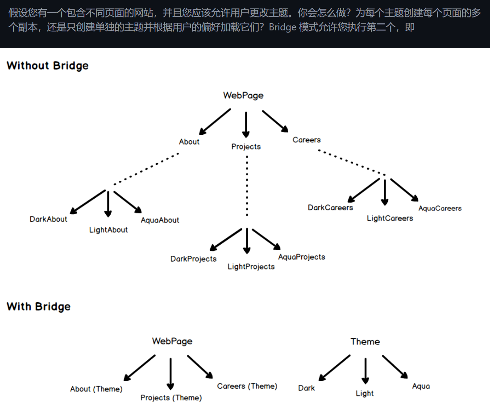

# 适配器模式


In plain words 通俗易懂

> Adapter pattern lets you wrap an otherwise incompatible object in an adapter to make it compatible with another class.
> Adapter 模式允许您将原本不兼容的对象包装在适配器中，以使其与另一个类兼容。


Now let's say we have to add a `WildDog` in our game so that hunter can hunt that also. But we can't do that directly because dog has a different interface. To make it compatible for our hunter, we will have to create an adapter that is compatible
现在，假设我们必须在游戏中添加 `WildDog`，以便猎人也可以猎杀它。但是我们不能直接这样做，因为 dog 有不同的界面。为了使其与我们的猎人兼容，我们必须创建一个兼容的适配器

```php
// This needs to be added to the game
class WildDog
{
    public function bark()
    {
    }
}

// Adapter around wild dog to make it compatible with our game
class WildDogAdapter implements Lion
{
    protected $dog;

    public function __construct(WildDog $dog)
    {
        $this->dog = $dog;
    }

    public function roar()
    {
        $this->dog->bark();
    }
}
```


And now the `WildDog` can be used in our game using `WildDogAdapter`.
现在，`WildDog` 可以通过 `WildDogAdapter` 在我们的游戏中使用。

```php
$wildDog = new WildDog();
$wildDogAdapter = new WildDogAdapter($wildDog);

$hunter = new Hunter();
$hunter->hunt($wildDogAdapter);
```


# 桥接模式

简单讲

> Bridge 模式是关于更喜欢组合而不是继承。实现详细信息从一个层次结构推送到具有单独层次结构的另一个对象。





# 组合模式

In plain words 通俗易懂

> Composite pattern lets clients treat the individual objects in a uniform manner.
> Composite pattern 允许客户端以统一的方式处理各个对象。


And then it can be used as
然后它可以用作

```php
// Prepare the employees
$john = new Developer('John Doe', 12000);
$jane = new Designer('Jane Doe', 15000);

// Add them to organization
$organization = new Organization();
$organization->addEmployee($john);
$organization->addEmployee($jane);

echo "Net salaries: " . $organization->getNetSalaries(); // Net Salaries: 27000
```

organization作为统一方法，处理Developer和Designer（各个不同的对象）