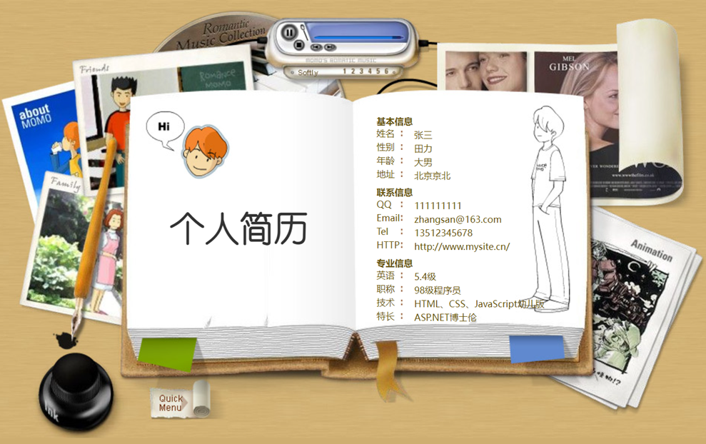
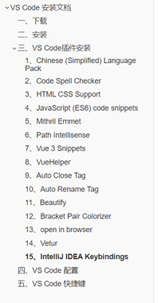

# 第一次作业-简易动态个人简历制作





作业要求：

- 完成页面布局(25)

- 姓名、学号要真实（5）

  链接可以跳转到一个页面(15)

  鼠标放到姓名等位置有放大效果（10）

- 音乐播放功能（2-3首即可），要有播放列表，播放模式(20)

- 加入一个翻书特效，贴入一篇短文，短文有格式(20+5)


基础功能的实现：

- 页面布局、链接跳转


进阶功能：

- 音乐播放


高阶功能：

- 翻书特效


# 参考链接

基础：

[在Web开发中制作个人简历（超简单版）_个人简介web网页作业代码-CSDN博客](https://blog.csdn.net/qq_44640357/article/details/129291388)


进阶：

[《web课程设计》用HTML CSS做一个简洁、漂亮的个人博客网站-腾讯云开发者社区-腾讯云 (tencent.com)](https://cloud.tencent.com/developer/article/2069567)


高阶：

[怎么实现一个3d翻书效果这种整页翻转的效果主要是做rotateY的动画，并结合一些CSS的3d属性实现。 主要是通过计算 - 掘金 (juejin.cn)](https://juejin.cn/post/6844903665216520206)


# Vscode web开发插件安装


1.  code spell checker
2. HTML CSS support





# 翻页效果-perplex

要在Web中利用HTML和CSS实现书面翻页效果，可以参考以下步骤和代码示例。这种效果通常使用CSS3的3D变换来创建视觉上的翻页动画。

## 实现书面翻页效果的步骤

### 1. HTML结构

首先，创建一个简单的HTML结构来表示书的页面。

```html
<!DOCTYPE html>
<html lang="en">
<head>
    <meta charset="UTF-8">
    <title>翻页效果</title>
    <link rel="stylesheet" href="styles.css">
</head>
<body>
    <div class="book">
        <div class="page page-1">第一页内容</div>
        <div class="page page-2">第二页内容</div>
    </div>
    <button onclick="flipPage()">翻页</button>
    <script src="script.js"></script>
</body>
</html>
```

### 2. CSS样式

接下来，使用CSS来设置页面的样式和翻转效果。

```css
body {
    display: flex;
    justify-content: center;
    align-items: center;
    height: 100vh;
    background-color: #f0f0f0;
}

.book {
    position: relative;
    width: 300px;
    height: 400px;
    perspective: 1000px; /* 设置透视效果 */
}

.page {
    position: absolute;
    width: 100%;
    height: 100%;
    background-color: white;
    border: 1px solid #ccc;
    box-shadow: 0 0 10px rgba(0,0,0,0.5);
    transform-style: preserve-3d; /* 保持3D效果 */
    transition: transform 0.6s; /* 动画过渡 */
}

.page-1 {
    z-index: 2; /* 确保第一页在上方 */
}

.page-2 {
    transform: rotateY(180deg); /* 初始状态为旋转180度 */
}
```

### 3. JavaScript交互

最后，使用JavaScript来处理翻页的逻辑。

```javascript
function flipPage() {
    const page1 = document.querySelector('.page-1');
    const page2 = document.querySelector('.page-2');
    
    // 切换翻转状态
    if (page1.style.transform === 'rotateY(180deg)') {
        page1.style.transform = 'rotateY(0deg)';
        page2.style.transform = 'rotateY(360deg)';
    } else {
        page1.style.transform = 'rotateY(180deg)';
        page2.style.transform = 'rotateY(180deg)';
    }
}
```

## 效果说明

- **透视效果**：通过设置`.book`的`perspective`属性，可以创建深度感，使翻页动画看起来更真实。
- **3D变换**：使用`rotateY`来实现页面的翻转。
- **过渡动画**：通过`transition`属性控制动画的平滑过渡。

通过上述步骤，你可以在网页中实现一个简洁的书面翻页效果。可以根据需要进一步调整样式和功能，以适应具体项目需求。

Citations:
[1] https://juejin.cn/post/6844903665216520206
[2] https://juejin.cn/post/7133052704569425957
[3] https://juejin.cn/post/7133043902566629384
[4] https://developer.aliyun.com/article/1239783
[5] https://cloud.tencent.com/developer/article/2069567
[6] https://blog.csdn.net/Q___805235520/article/details/126316246
[7] https://anjingcuc.github.io/courses-wiki/web/homework/
[8] https://blog.csdn.net/qq_44640357/article/details/129291388

