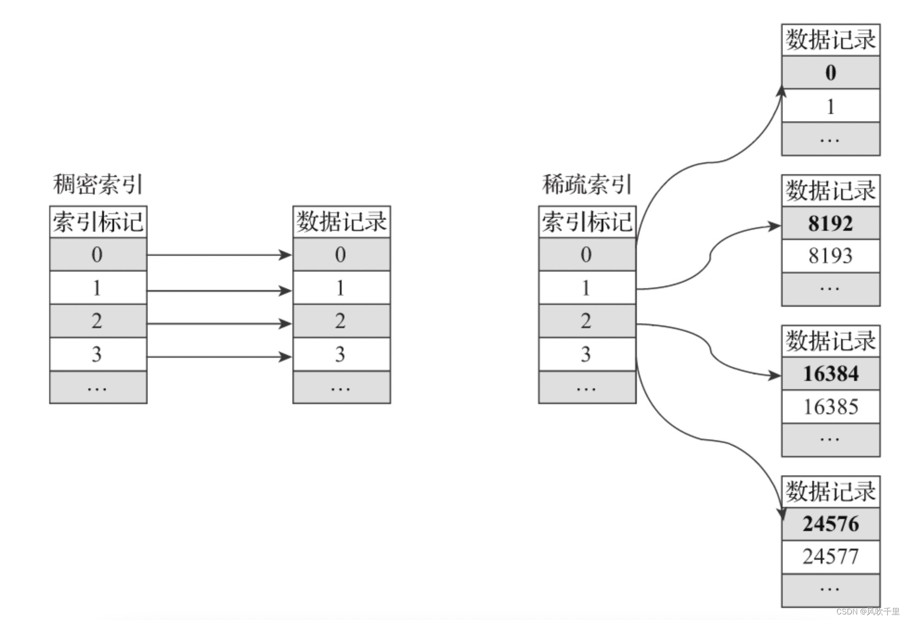
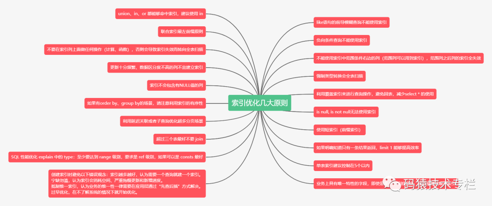

### 索引技术：B+树索引

#### 工作原理

B+树索引是一种常见的数据库索引结构，它基于B+树数据结构实现。B+树是一种平衡的多路搜索树，其中每个节点包含多个子节点，并且所有值都存储在叶子节点中。在数据库中，B+树索引允许快速的数据检索、排序和分组操作。当执行查询时，数据库系统首先检查B+树索引以快速定位到包含所需数据的位置，然后使用索引中的指针快速访问实际数据，极大地减少了需要扫描的数据量，提高了检索效率。

#### 优点
1. **提高查询性能**：B+树索引能够快速定位数据，加速查询操作，尤其是对大型表的查询。
2. **加速排序和分组操作**：使用索引的列进行排序或分组时，可以显著提高性能。
3. **唯一性约束**：唯一索引确保表中的每行都有唯一的索引值，维护数据一致性。

#### 缺点
1. **占用存储空间**：索引会占用额外的存储空间，随着表的增大，索引的大小也会增加。
2. **降低写操作性能**：插入、更新和删除操作需要更新索引，可能导致写操作性能下降。
3. **选择不当可能降低性能**：不恰当的索引选择可能导致性能下降，例如过多或过少的索引，或者选择错误的索引类型。

#### 改进方式

针对**降低写操作性能**的缺点，一种改进方式是**使用写缓冲和异步更新索引**。具体来说，数据库可以暂时将索引更新操作放入一个写缓冲区，而不是在每次数据变更时立即更新索引。然后，系统可以异步地、定期地将这些更新操作应用到索引中。这种方法可以减少每次数据变更时对索引的直接操作，从而提高写操作的性能。然而，这可能会引入一定的延迟，因为索引更新不是实时的。为了平衡性能和一致性，可以设置合适的异步更新频率，确保索引的更新既不会过于频繁，也不会导致索引长时间过时。