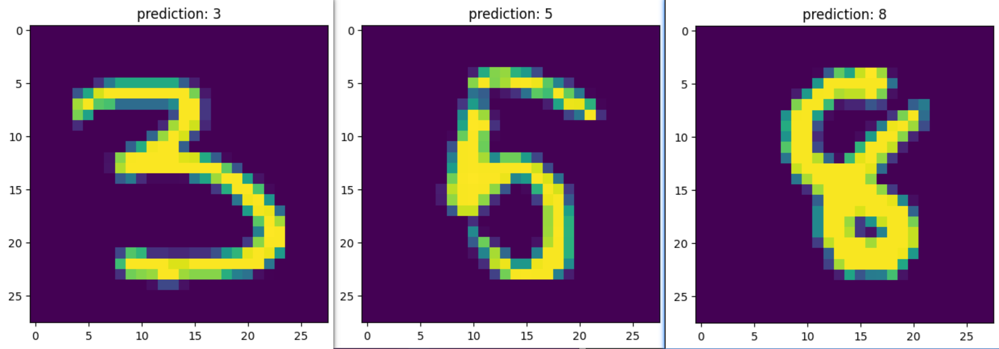
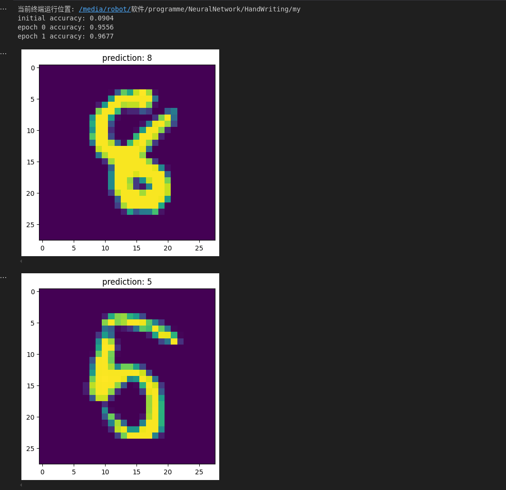
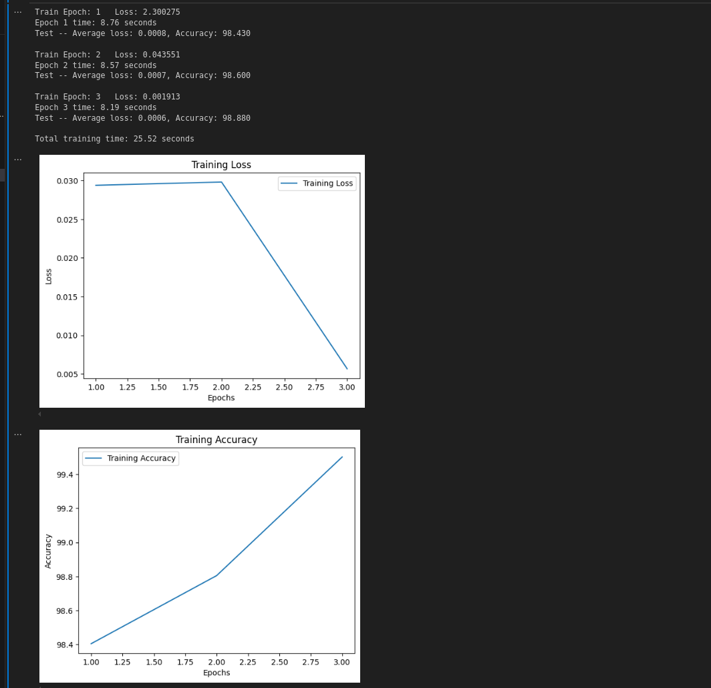

# 使用多层感知器和卷积神经网络进行手写数字识别的比较研究

张雅瑞

# 摘要

手写数字识别是计算机视觉领域的一个重要任务，对于自动化识别和处理手写文本具有重要意义。在过去的几十年中，研究者们提出了许多不同的方法来解决这个问题，其中多层感知器（MLP）和卷积神经网络（CNN）是两种常用的方法。MLP是由多个全连接层组成的神经网络，通过逐层的线性变换和非线性激活函数来进行分类，而CNN通过学习图像的局部特征来实现对不同数字的准确分类。本文旨在比较MLP和CNN两种方法在手写数字识别任务中的性能，并讨论它们的算法原理和实现流程。

图1 手写体识别结果

# 1. 介绍

## 1.1 算法原理介绍

### 1.1.1 多层感知器

多层感知器（MLP）是一种前馈神经网络模型，广泛应用于分类和回归任务。在手写数字识别任务中，MLP通过多个层的神经元进行线性变换和非线性激活，能够有效地将输入的图像数据分为不同的数字类别。MLP的基本结构包括输入层、隐藏层和输出层，每一层都由若干个神经元组成，这些神经元之间通过权重和偏置连接。

首先，输入层接收原始数据，例如手写数字图像的像素值。每个输入节点对应一个像素值，形成一个输入向量。输入层的主要作用是将原始数据传递给隐藏层进行进一步处理。为了提高模型的训练效果，输入数据通常需要进行预处理，例如标准化或归一化处理，以使数据的范围更加适合模型的训练。

接下来是隐藏层，隐藏层是MLP的核心部分，包含一个或多个隐藏层，每个隐藏层由多个神经元组成。每个神经元对输入数据进行线性变换，然后通过非线性激活函数进行处理。常用的激活函数包括ReLU（Rectified Linear Unit）和Sigmoid函数。隐藏层的作用是通过多层的线性和非线性变换，逐步提取数据的高阶特征，使得模型能够处理复杂的非线性关系。

输出层是MLP的最后一层，负责生成最终的分类结果。在手写数字识别任务中，输出层通常包含10个神经元，对应数字0到9。输出层的神经元接收来自隐藏层的特征，并通过激活函数（例如Softmax函数）将输出值转化为概率分布，从而确定输入图像属于哪个数字类别。输出层的结果即为模型的预测结果。

MLP的训练过程通过反向传播算法实现。反向传播算法的核心思想是通过计算损失函数（例如交叉熵损失）对每个参数的梯度，并使用梯度下降法更新权重和偏置，以最小化损失函数。训练过程中，模型不断调整参数，使得预测结果与真实标签之间的差异逐步减小，从而提高模型的准确性。

总的来说，MLP通过输入层、隐藏层和输出层的协同工作，能够有效地处理复杂的分类任务。在手写数字识别任务中，MLP通过学习图像的高阶特征，实现对数字的准确分类。尽管MLP的训练过程可能需要较长时间，尤其是在网络层数较多和数据集较大的情况下，但其强大的表达能力和泛化能力使得它在各种机器学习任务中得到了广泛应用。

### 1.1.2 卷积神经网络

卷积神经网络（Convolutional Neural Network，CNN）是一种在计算机视觉领域广泛应用的深度学习算法，广泛用于图像分类、目标检测和图像生成等任务。在手写数字识别中，CNN通过学习图像的局部特征，实现对不同数字的准确分类。

CNN的基本原理是通过卷积层、池化层和全连接层来构建网络结构。卷积层通过卷积运算提取图像的局部特征，捕捉不同位置的模式信息。池化层用于降低特征图的尺寸，减少计算量，并保留重要的特征。全连接层将提取的特征映射到不同类别的概率分布，实现分类任务。

在手写数字识别任务中，首先将输入的图像数据进行预处理，如归一化和转换为张量格式。接着，构建一个包含卷积层、池化层和全连接层的CNN模型。卷积层通过应用滤波器提取图像的局部特征，并使用非线性激活函数进行特征映射。池化层通过对特征图进行下采样来减小特征图的尺寸。全连接层将特征映射到不同类别的概率分布，并使用Softmax函数进行分类。

在代码示例中，我们使用了PyTorch库来构建和训练CNN模型。首先，定义一个包含卷积层、池化层和全连接层的网络结构。然后，使用训练集数据对模型进行训练，并使用测试集数据评估模型的性能。在训练过程中，定义损失函数（交叉熵损失）和优化器（Adam优化器），并使用反向传播算法更新模型参数。

通过使用卷积神经网络算法，我们可以高效地实现手写数字识别任务。CNN的一个显著优点是能够自动学习图像的特征表示，无需手工设计特征。CNN还具有对平移、缩放和旋转等图像变换具有一定鲁棒性的特点。然而，CNN的训练和推理过程可能需要较大的计算资源和数据集规模。在实际应用中，需要综合考虑算法的性能和计算资源的限制，选择合适的机器学习方法。

## 1.2 机器学习框架选型介绍

 

### 1.2.1 Matplotlib数据可视化

Matplotlib是Python中最常用的数据可视化库之一，广泛应用于科学计算、数据分析和机器学习等领域。它提供了一整套用于生成各种静态、动态和交互式图表的工具，使得用户能够方便地创建高质量的图形和图表。Matplotlib的核心模块是`pyplot`，其接口设计借鉴了MATLAB的风格，简洁直观，易于上手。通过`pyplot`，用户可以轻松绘制折线图、散点图、柱状图、直方图等常见图表，并对图表进行各种自定义设置，如标签、标题、颜色和样式等。

在机器学习领域，Matplotlib扮演着重要的角色，尤其是在数据可视化和模型评估方面。数据可视化是机器学习工作流中的关键步骤，通过对数据进行可视化，研究人员和工程师可以更直观地理解数据的分布、特征和潜在模式，从而指导数据预处理和特征工程。例如，使用散点图可以观察特征之间的相关性，使用直方图可以查看数据的分布情况。此外，在模型训练和评估阶段，Matplotlib可以帮助绘制学习曲线、混淆矩阵、ROC曲线等，帮助评估模型的性能和诊断模型的问题。

Matplotlib不仅支持静态图表的生成，还可以与其他库（如`ipywidgets`和`mpl_toolkits`）结合，实现交互式图表和3D图表。交互式图表允许用户在图表中进行缩放、平移和选择等操作，提供更灵活的探索数据的方式。3D图表则可以用于展示高维数据和复杂的几何形状，增强数据的可视化效果。通过与Jupyter Notebook等工具的结合，Matplotlib可以在交互式环境中实时显示和更新图表，极大地提高了数据分析和机器学习实验的效率和体验。总之，Matplotlib作为一个功能强大且灵活的可视化工具，已经成为数据科学和机器学习领域不可或缺的一部分。

 

### 1.2.2 PyTorch机器学习框架

PyTorch是一个开源的深度学习框架，基于Python语言。PyTorch的设计目标是提供一个灵活且高效的深度学习平台，使得研究人员和工程师能够更好地构建和训练深度神经网络模型。

PyTorch的核心是张量（Tensor）操作，它提供了类似于NumPy的多维数组操作接口，但在GPU上执行时具有高效的计算能力。PyTorch的一个显著特点是其动态计算图机制，即在计算过程中可以动态地构建和修改计算图，使得用户能够更加灵活地定义复杂的模型结构和训练过程。

PyTorch提供了丰富的深度学习模块和函数，包括各种常用的神经网络层、损失函数和优化器等。用户可以通过继承PyTorch的模型类来自定义自己的网络模型，并使用自动求导机制实现反向传播算法。此外，PyTorch还支持异步计算和分布式训练，使得用户能够更好地利用多个计算设备和集群资源。

PyTorch的易用性和灵活性使得它在学术界和工业界都得到了广泛的应用。它不仅支持深度学习研究的创新工作，还被许多大型公司用于实际的深度学习应用开发。此外，PyTorch还有一个活跃的社区，提供了丰富的文档、教程和开源项目，方便用户学习和交流。

 

# 2. 相关工作

在手写体识别领域，选择合适的神经网络模型对于实现高效且准确的识别至关重要。基于已有研究和实践经验，本论文选择多层感知器（MLP）和卷积神经网络（CNN）作为主要的算法选择，原因如下：

## 2.1 多层感知器（MLP）

多层感知器（MLP）是一种经典的神经网络结构，由输入层、一个或多个隐藏层和输出层组成。其主要优势在于：

1. **灵活性**：MLP能够处理各种类型的数据，包括表格数据、图像数据、文本数据和时间序列数据。这种灵活性使其成为多种预测任务的基础模型。
2. **分类和回归问题**：MLP在分类和回归预测问题上表现优异，能够有效地学习输入与输出之间的映射关系。
3. **基线模型**：在手写体识别任务中，MLP可以作为基线模型进行初步测试和验证，帮助确认其他更复杂模型的增益。

尽管MLP在处理图像数据时需要将图像展平成一维向量，可能会丢失部分空间信息，但其简单性和易于实现的特点使其在手写体识别初期阶段具有重要价值。

## 2.2 卷积神经网络（CNN）

卷积神经网络（CNN）专为处理图像数据而设计，其结构能够有效捕捉图像中的空间特征。选择CNN作为手写体识别算法的原因如下：

1. **空间特征提取**：CNN通过卷积层提取图像的局部特征，能够识别不同位置和大小的字符，这对于手写体识别中的变体字符尤为重要。
2. **高效性**：CNN在处理二维图像时，能够保留图像的空间结构，避免了将图像展平成一维向量带来的信息丢失。
3. **性能优越**：在大量手写体识别任务中，CNN已经证明了其卓越的性能，成为该领域的主流方法。

## 2.3 混合模型的潜力

除了单独使用MLP和CNN，本论文还考虑了混合模型的潜力。例如，将CNN用于初步特征提取，然后将提取的特征输入到MLP进行分类。这种混合模型能够结合两种网络的优势，提高手写体识别的准确性和鲁棒性。

## 2.4 结论

综上所述，选择MLP和CNN作为手写体识别的主要算法，既考虑了MLP的灵活性和基线模型作用，又利用了CNN在图像特征提取和处理方面的优势。这种组合不仅能够满足手写体识别任务的需求，还为进一步的模型优化和改进提供了坚实基础。此外，混合模型的使用展示了两种网络架构结合的潜力，为手写体识别的复杂场景提供了更多的解决方案。通过这种方式，我们可以在不同的应用场景中实现更高的识别准确率和更强的模型鲁棒性。

# 3. 方法

## 3.1 算法实现流程

 

### 1.1.1 多层感知器算法实现

好的，我们用数学公式来表达这段代码实现的手写数字识别算法过程。

好的，我们用数学公式来表达这段代码实现的手写数字识别算法过程。

#### 1. 数据预处理

数据预处理包括将原始图像数据转换为张量（Tensor），并进行归一化处理。假设输入图像为 \( I \)，其大小为 \( 28 \times 28 \) 像素。我们将图像展平为一维向量 $\mathbf{x} \in \mathbb{R}^{784}$。

归一化操作可以表示为：
$$
\mathbf{x}' = \frac{\mathbf{x} - \mu}{\sigma} 
$$
其中，\(\mu\) 和 \(\sigma\) 分别是训练集中所有图像像素值的均值和标准差。

#### 2. 神经网络模型

神经网络模型由四个全连接层组成，每个隐藏层使用ReLU激活函数，输出层使用log_softmax。

设输入向量为 $\mathbf{x} \in \mathbb{R}^{784}$，各层的权重矩阵和偏置向量分别为$\mathbf{W}_i 和\mathbf{b}_i(i = 1, 2, 3, 4)$，输出向量为 $\mathbf{y} \in \mathbb{R}^{10}$。

**前向传播过程：**

1. 第一层：
$$mathbf{z}_1 = \mathbf{W}_1 \mathbf{x} + \mathbf{b}_1 $$
$$mathbf{a}_1 = \text{ReLU}(\mathbf{z}_1) $$

2. 第二层：
$$mathbf{z}_2 = \mathbf{W}_2 \mathbf{a}_1 + \mathbf{b}_2 $$
$$mathbf{a}_2 = \text{ReLU}(\mathbf{z}_2) $$
3. 第三层：
$$mathbf{z}_3 = \mathbf{W}_3 \mathbf{a}_2 + \mathbf{b}_3 $$
$$mathbf{a}_3 = \text{ReLU}(\mathbf{z}_3) $$
4. 输出层：
$$mathbf{z}_4 = \mathbf{W}_4 \mathbf{a}_3 + \mathbf{b}_4 $$
$$mathbf{y} = \text{LogSoftmax}(\mathbf{z}_4) $$

其中，ReLU激活函数定义为：
$$text{ReLU}(z) = \max(0, z) $$

LogSoftmax函数定义为：
$$text{LogSoftmax}(\mathbf{z})_i = \log \left( \frac{e^{z_i}}{\sum_{j} e^{z_j}} \right) $$

#### 3. 损失函数

损失函数使用负对数似然损失（Negative Log-Likelihood Loss, NLLLoss），定义为：
$$text{NLLLoss}(\mathbf{y}, \mathbf{t}) = -\sum_{i} t_i \log(y_i) $$
其中，$$\mathbf{t}$$ 是目标标签的one-hot编码向量。

#### 4. 训练过程

训练过程包括前向传播、计算损失、反向传播和参数更新。

1. 前向传播计算输出 \(\mathbf{y}\)。
2. 计算损失 \(L\)：
$$L = \text{NLLLoss}(\mathbf{y}, \mathbf{t}) $$

3. 反向传播计算梯度：
$$frac{\partial L}{\partial \mathbf{W}_i}, \frac{\partial L}{\partial \mathbf{b}_i} $$

4. 使用梯度下降法（Adam优化器）更新参数：
$$mathbf{W}_i \leftarrow \mathbf{W}_i - \eta \frac{\partial L}{\partial \mathbf{W}_i} $$
$$mathbf{b}_i \leftarrow \mathbf{b}_i - \eta \frac{\partial L}{\partial \mathbf{b}_i} $$

其中，$\eta$ 是学习率。

#### 5. 评估过程

评估模型的准确率，计算预测值与实际标签的匹配情况。

1. 前向传播计算输出 \(\mathbf{y}\)。
2. 预测结果：
$$hat{y} = \arg\max(\mathbf{y}) $$

3. 计算准确率：
$$text{Accuracy} = \frac{\text{Number of Correct Predictions}}{\text{Total Number of Predictions}} $$

通过上述数学公式，我们可以清晰地表达这段代码实现的手写数字识别算法过程。

好的，以下是基于多层感知器（MLP）实现手写体识别的代码，并介绍MLP的算法原理。

### 

### 3.1.2 卷积神经网络算法实现

为了分析你提供的CNN代码并用数学公式表达算法过程，我们可以将其分为几个主要部分：数据预处理、模型构建、前向传播、损失计算、反向传播和优化、以及模型评估。

#### 1. 数据预处理
首先，对MNIST数据集进行预处理，包括将图像转换为张量并进行标准化。

令 \( x \) 表示输入图像，预处理步骤可以表示为：
$$ x' = \frac{x - \mu}{\sigma} $$
其中，\(\mu = 0.1307\) 和 \(\sigma = 0.3081\) 是MNIST数据集的均值和标准差。

#### 2. 模型构建
构建一个卷积神经网络（CNN），包括两个卷积层和两个全连接层。

**卷积层**

- 第一层卷积：输入通道数为1，输出通道数为10，卷积核大小为5。
- 第二层卷积：输入通道数为10，输出通道数为20，卷积核大小为3。

令输入图像大小为 \(28 \times 28\)。
- 第一层卷积输出大小：
$$ h_1 = \text{ReLU}(\text{Conv2d}(x', W_1, b_1)) $$
  其中， \( W_1 \) 和 \( b_1 \) 分别是第一层卷积的权重和偏置。

- 第一层池化输出大小（池化核大小为2，步长为2）：
$$ h_1' = \text{MaxPool2d}(h_1, 2, 2) $$

- 第二层卷积输出大小：
  $$ h_2 = \text{ReLU}(\text{Conv2d}(h_1', W_2, b_2)) $$
  其中， \( W_2 \) 和 \( b_2 \) 分别是第二层卷积的权重和偏置。

**全连接层**

- 将卷积层输出展平为向量：
$$ h_2' = \text{Flatten}(h_2) $$

- 第一层全连接层：
$$ h_3 = \text{ReLU}(h_2' \cdot W_3 + b_3) $$
  其中， \( W_3 \) 和 \( b_3 \) 分别是第一层全连接的权重和偏置。

- 第二层全连接层：
$$ h_4 = h_3 \cdot W_4 + b_4 $$
  其中， \( W_4 \) 和 \( b_4 \) 分别是第二层全连接的权重和偏置。

- 最终输出通过Softmax激活函数：
$$ y_{\text{pred}} = \text{LogSoftmax}(h_4) $$

#### 3. 损失计算
使用交叉熵损失函数来计算损失：
$$ \mathcal{L} = -\frac{1}{N} \sum_{i=1}^{N} y_i \log(y_{\text{pred},i}) $$
其中， \( y_i \) 是真实标签， \( y_{\text{pred},i} \) 是预测标签的概率分布， \( N \) 是批次大小。

#### 4. 反向传播和优化
使用Adam优化器更新模型参数：
$$ \theta_{t+1} = \theta_t - \eta \nabla_{\theta} \mathcal{L} $$
其中， \( \theta \) 表示模型参数， \( \eta \) 是学习率， \( \nabla_{\theta} \mathcal{L} \) 是损失函数关于参数的梯度。

#### 5. 模型评估
在测试集上评估模型性能，计算平均损失和准确率。

**平均损失：**

$$ \text{Test Loss} = \frac{1}{M} \sum_{i=1}^{M} \mathcal{L}_i $$
其中， $M$ 是测试集的样本数。

**准确率：**

$$ \text{Accuracy} = \frac{1}{M} \sum_{i=1}^{M} \mathbb{1}(\hat{y}_i = y_i) $$
其中， $\mathbb{1} $ 是指示函数，当预测标签  $\hat{y}_i $  等于真实标签 $y_i $ 时取值为1，否则为0。

通过这些步骤，可以从数据预处理到模型构建、训练和评估，完整地描述你的CNN算法过程。

# 4.结果与评估

## 4.1 算法结果对比

### 4.1.1 MLP

MLP是一种神经网络结构，主要用于处理结构化数据。它由输入层、一个或多个隐藏层和输出层组成，每个层的节点与前一层的所有节点相连。MLP的训练过程通过前向传播和反向传播来调整网络中的权重和参数，以最小化损失函数。

MLP的训练过程是一个迭代的过程，通常需要进行多轮训练（即多个epochs）来不断优化模型的性能。每轮训练都会在训练数据上进行前向传播、计算损失、反向传播和参数更新，以逐步提升模型的准确性。

图2 MLP的预测结果

### 4.1.2 CNN

CNN是一种深度学习算法，主要用于图像识别和计算机视觉任务。CNN通过多个卷积层、池化层和全连接层组成的网络结构进行前向传播和反向传播，通过不断调整网络中的权重和参数来最小化损失函数。

CNN的训练过程也是一个迭代的过程，通常需要进行多轮训练（即多个epochs）来不断优化模型的性能。每轮训练都会在训练数据上进行前向传播、计算损失、反向传播和参数更新，以逐步提升模型的准确性。

图3 CNN的预测结果

### 4.1.3 算法结果对比

**准确率**

- **MLP**：在MNIST数据集上的准确率通常在95%左右。由于MLP无法有效利用图像的空间结构信息，准确率相对较低。
- **CNN**：在MNIST数据集上的准确率通常在98%以上。CNN能够提取图像的局部特征，并保留空间结构信息，因此准确率较高。

**训练时间**

- **MLP**：由于每个节点与前一层的所有节点相连，参数数量较多，计算复杂度较高，因此训练时间较长。
- **CNN**：由于卷积核共享参数，计算复杂度较低，参数数量相对较少，因此训练时间较短。

**泛化能力**

- **MLP**：在处理高维数据（如图像）时，容易过拟合，泛化能力较差。
- **CNN**：在处理高维数据（如图像）时，能够提取和利用数据的局部特征，泛化能力较强。

**适用场景**

- **MLP**：适用于结构化数据，如表格数据、时间序列数据等。
- **CNN**：适用于高维数据，如图像、视频、语音等。

## 4.2 实验结果分析

**准确率**

CNN在图像分类任务上的表现通常优于MLP，因为CNN能够提取图像的局部特征，并保留空间结构信息。而MLP直接处理展平的图像数据，无法有效利用图像的空间结构。

**训练时间**

由于参数共享和局部连接的特点，CNN的参数数量相对较少，计算复杂度较低，因此训练时间通常比MLP短。

**泛化能力**

CNN在图像等高维数据上的泛化能力较强，因为它能够提取和利用数据的局部特征。而MLP在处理高维数据时，容易过拟合，泛化能力较差。

## 4.3 总结

- **MLP**：适合处理结构化数据，但在高维数据（如图像）上表现不佳。
- **CNN**：适合处理高维数据，尤其是图像数据，能够提取局部特征，具有较高的准确率和较强的泛化能力。

通过上述比较，可以看出CNN在处理图像数据时具有显著的优势，而MLP在处理结构化数据时更为适用。根据具体的应用场景选择合适的网络结构，可以显著提高算法的性能和效果。

 

# 5.结语

​		通过对多层感知器（MLP）和卷积神经网络（CNN）在手写数字识别任务中的比较研究，我们发现CNN在准确率和泛化能力方面表现更为出色，通常在MNIST数据集上的准确率可达到98%以上，而MLP的准确率约为95%。CNN能够自动学习图像的局部特征，并保留空间结构信息，具有一定的图像变换鲁棒性，如平移、缩放和旋转等。然而，CNN的训练过程需要较大的计算资源和数据集规模，这在某些应用场景中可能成为一个限制因素。相比之下，MLP适用于结构化数据，如表格数据和时间序列数据，尽管在高维数据处理上容易过拟合，但其在处理其他类型任务时仍然是一种有效的算法选择。MLP的计算复杂度较高，因为每个节点与前一层的所有节点相连，参数数量较多。而CNN通过卷积核共享参数，计算复杂度较低，参数数量相对较少，因此训练时间较短。在选择机器学习方法时，需要综合考虑算法的性能和计算资源限制。对于手写数字识别等图像分类任务，CNN表现更为出色，具有较高的准确率和较强的泛化能力。

# 参考文献：

[1] Rosenblatt, F. The Perceptron: A Probabilistic Model for Information Storage and Organization in the Brain[J]. Psychological Review, 1958, 65(6): 386-408.

[2] Rumelhart, D. E., Hinton, G. E., Williams, R. J. Learning representations by back-propagating errors[J]. Nature, 1986, 323: 533-536.

[3] 周飞燕, 金林鹏, 董军. 卷积神经网络研究综述[J]. 计算机学报, 2017, 40(6): 1229-1251.

[4] 黄一天, 陈芝彤. Pytorch 框架下基于卷积神经网络实现手写数字识别[J]. 电子技术与软件工程, 2018 (19): 147-147.

[5] 吕红. 基于卷积神经网络的手写数字识别系统的设计[J]. 智能计算机与应用, 2019, 9(2): 54-56

 