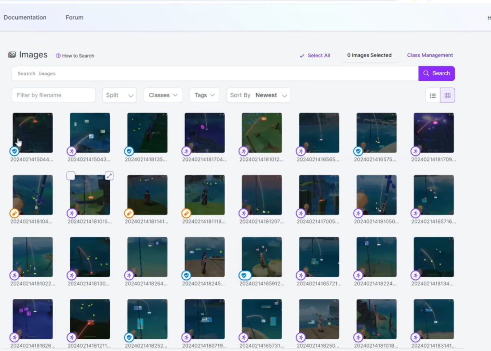
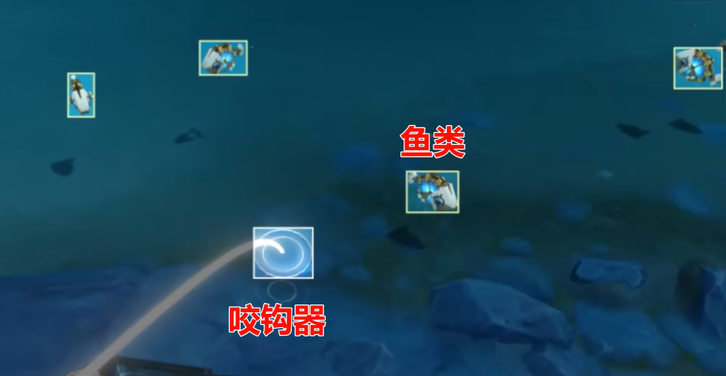
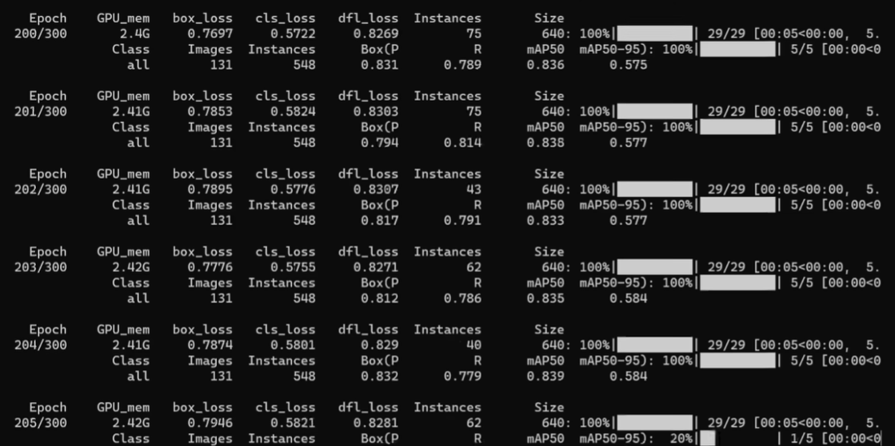
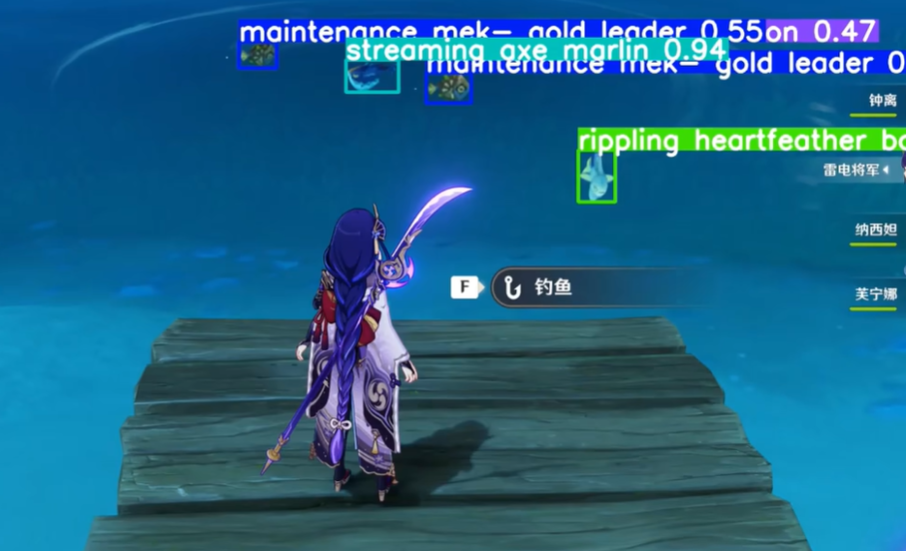

# 基于YoloV8的全自动钓鱼项目BetterGI计划书

本项目主要算法:
yolov8模型训练-识别算法（鱼类、咬钩器）。来自[babalae/better-genshin-impact: 📦BetterGI · 更好的原神-全自动钓鱼(AI)](https://github.com/babalae/better-genshin-impact)

次要算法(现成API):

抛竿算法来自 [HutaoFisher](https://github.com/myHuTao-qwq/HutaoFisher)。运用了先进抛竿技术(牛顿法相机标定+神经网络)

钓鱼进度条的识别与相应脚本，来自**[genshin-fishing-toy](https://github.com/babalae/genshin-fishing-toy)**

# 摘要

本项目是一款针对原神游戏的钓鱼AI，主要目的是通过深度学习和图像处理技术，自动化地进行游戏中的钓鱼活动，从而提高玩家的游戏体验和效率。我们的项目主要基于三个核心技术：YOLOv8模型训练-识别算法，抛竿算法和钓鱼进度条的识别与相应脚本。

我们的主要算法是YOLOv8模型训练-识别算法，这是一个强大的深度学习模型，用于识别游戏中的鱼类和咬钩器。该算法来自于开源项目[BetterGI · 更好的原神-全自动钓鱼(AI)](https://github.com/babalae/better-genshin-impact)，我们对其进行了训练和优化，使其能够适应原神游戏的环境，准确地识别游戏中的目标。

我们的次要算法包括抛竿算法和钓鱼进度条的识别与相应脚本。抛竿算法来自[HutaoFisher](https://github.com/myHuTao-qwq/HutaoFisher)，它运用了先进的抛竿技术，包括牛顿法相机标定和神经网络，能够精确地控制游戏中的抛竿动作。钓鱼进度条的识别与相应脚本来自[genshin-fishing-toy](https://github.com/babalae/genshin-fishing-toy)，它能够识别游戏中的钓鱼进度条，并生成相应的操作脚本，以实现自动化的钓鱼操作。

在项目的实施过程中，我们进行了详细的需求分析和可行性分析，选择了最适合的技术方案，并进行了充分的测试和优化。我们的目标是提供一款能够满足玩家需求，提供优质游戏体验的原神钓鱼AI。

# 1 立项依据

## 1.1 繁杂的游戏体验

《原神》游戏中的钓鱼活动虽然有趣，但其操作过程较为复杂且耗时，需要玩家投入大量的时间和精力。对于那些希望在游戏中进行更多探索和战斗的玩家来说，这种繁琐的钓鱼活动可能会降低他们的游戏体验。因此，开发一个可以自动完成钓鱼任务的程序，无疑可以大大提升游戏的便利性和玩家的游戏体验。

## 1.2 图像识别技术的成熟应用

随着深度学习技术的发展，图像识别技术已经得到了广泛的应用和发展。特别是YOLO系列的对象检测算法，凭借其高效、准确的特性，在实时图像识别领域已经展现出了强大的能力。YOLOv8作为该系列的最新版本，其性能更是得到了大幅提升。因此，我们有理由相信，通过YOLOv8图像识别技术，我们可以开发出一个高效、准确的《原神》全自动钓鱼程序。

## 1.3 用户需求的增长

随着《原神》游戏的火热，玩家的需求也在不断增长。许多玩家希望能够在享受游戏乐趣的同时，尽可能地提高效率，减少重复和枯燥的操作。同时，也有部分玩家因为工作或学习等原因，无法投入大量的时间在游戏中。因此，一个可以自动完成钓鱼任务的程序，无疑可以满足这部分玩家的需求，有很大的市场潜力。

# 2 项目分析

## 2.1 可行性分析

**技术可行性：**

本项目主要依赖于深度学习、图像识别和自动控制等技术。这些技术在过去几年中已经得到了快速的发展和广泛的应用。特别是YOLOv8模型训练-识别算法，已经在实时图像识别领域展现出了强大的能力。因此，从技术角度来看，本项目是完全可行的。

**经济可行性：**

本项目的开发成本主要包括人力成本和硬件成本。人力成本主要包括项目开发和维护的人员工资，硬件成本主要包括用于训练和运行算法的计算设备。考虑到《原神》游戏的大量用户群和自动钓鱼程序的广泛需求，我们有理由相信，本项目的经济效益将远超过其开发成本。因此，从经济角度来看，本项目也是可行的。

## 2.2 需求分析

**用户需求：**

大部分《原神》玩家都希望能够在游戏中进行更多的探索和战斗，而不是花费大量的时间和精力在繁琐的钓鱼活动上。因此，一个可以自动完成钓鱼任务的程序，无疑可以满足他们的需求。

**功能需求：**

本项目的主要功能包括,

- 1）自动识别游戏中的鱼类和咬钩器；
- 2）自动执行抛竿动作；
- 3）自动识别钓鱼进度条，并根据识别结果执行相应的操作。

这些功能将使用户能够在无需人工干预的情况下，自动完成《原神》游戏中的钓鱼任务。

**性能需求：**

考虑到《原神》游戏的实时性，本项目的主要性能需求包括：

- 1）图像识别的速度和准确性；
- 2）抛竿动作的准确性和效率；
- 3）钓鱼进度条识别和响应的速度。

这些性能需求将直接影响到钓鱼程序的效率和用户体验。

# 3 算法设计

## 3.1 yoloV8算法

### 3.1.1 YOLOv8 算法分析

YOLO（You Only Look Once）是一种实时目标检测系统，它将目标检测任务视为一个回归问题，一次性预测整个图像中的所有目标的边界框和类别。YOLOv8是该系列算法的最新版本，它在保持实时性的同时，进一步提高了目标检测的准确性。

### 3.1.2 YOLOv8 技术介绍

YOLOv8的核心思想是：将输入图像划分为 $S $$\times$$ S$ 的网格，每个网格预测 $B$ 个边界框和每个边界框对应的类别概率。每个边界框由五个参数表示：$x, y, w, h, c$，其中 $x, y$ 表示边界框中心的位置，$w, h$ 表示边界框的宽度和高度，$c$ 表示边界框包含目标的置信度。每个网格还预测 $C$ 个条件类别概率，表示如果该网格包含目标，目标属于每个类别的概率。

YOLOv8的目标函数包括三部分：边界框坐标的预测误差、边界框置信度的预测误差和类别概率的预测误差。具体的目标函数形式如下：

$$
\lambda_{coord} \sum_{i=0}^{S^2} \sum_{j=0}^{B} 1_{ij}^{obj} [(x_i-\hat{x}_i)^2+(y_i-\hat{y}_i)^2] + \lambda_{coord} \sum_{i=0}^{S^2} \sum_{j=0}^{B} 1_{ij}^{obj}[(\sqrt{w_i}-\sqrt{\hat{w}_i})^2+(\sqrt{h_i}-\sqrt{\hat{h}_i})^2] + \sum_{i=0}^{S^2} \sum_{j=0}^{B} 1_{ij}^{obj}(C_i-\hat{C}_i)^2 + \lambda_{noobj}\sum_{i=0}^{S^2} \sum_{j=0}^{B} 1_{ij}^{noobj}(C_i-\hat{C}_i)^2 + \sum_{i=0}^{S^2} 1_{i}^{obj}\sum_{c \in classes}(p_i(c)-\hat{p}_i(c))^2
$$

其中，$1_{ij}^{obj}$ 表示第 $i$ 个网格中第 $j$ 个边界框是否包含目标，如果包含目标则为1，否则为0；$1_{ij}^{noobj}$ 表示第 $i$ 个网格中第 $j$ 个边界框是否不包含目标，如果不包含目标则为1，否则为0；$1_{i}^{obj}$ 表示第 $i$ 个网格是否包含目标，如果包含目标则为1，否则为0；$\hat{x}_i, \hat{y}_i, \hat{w}_i, \hat{h}_i, \hat{C}_i, \hat{p}_i(c)$ 表示预测值，$x_i, y_i, w_i, h_i, C_i, p_i(c)$ 表示真实值；$\lambda_{coord}$ 和 $\lambda_{noobj}$ 是坐标预测和置信度预测的权重参数。

YOLOv8在YOLOv3的基础上，引入了更多的改进，包括更大的输入图像尺寸、更多的锚框尺寸、更深的特征提取网络等，从而进一步提高了目标检测的准确性。

## 3.2 牛顿法相机标定

### 3.2.1  牛顿法相机标定算法分析

相机标定是计算机视觉中的一个重要步骤，其目的是确定相机的内部参数（如焦距、像素尺度等）和外部参数（如相机的位置和视角）。这些参数对于将二维图像坐标转换为三维世界坐标，或者反过来，是必不可少的。

牛顿法是一种寻找函数零点的迭代优化算法。在相机标定中，我们可以使用牛顿法来优化相机参数，使得投影误差最小。投影误差是指三维世界坐标投影到二维图像坐标后，与实际的二维图像坐标之间的距离。

### 3.2.2 牛顿法相机标定技术介绍

假设我们有一组三维世界坐标点 $P_i = (X_i, Y_i, Z_i)$ 和对应的二维图像坐标点 $p_i = (x_i, y_i)$。相机投影模型可以表示为：

$$
\begin{pmatrix} x_i \\ y_i \\ 1 \end{pmatrix} = K[R|t] \begin{pmatrix} X_i \\ Y_i \\ Z_i \\ 1 \end{pmatrix}
$$

其中，$K$ 是相机内部参数矩阵，包含焦距、像素尺度等；\[R|t\] 是相机的旋转矩阵和平移向量，描述了相机的位置和视角。

我们的目标是找到一组相机参数，使得投影误差最小。投影误差可以表示为：

$$
E = \sum_i (x_i - \hat{x}_i)^2 + (y_i - \hat{y}_i)^2
$$

其中，$\hat{x}_i, \hat{y}_i$ 是三维世界坐标点 $P_i$ 投影到二维图像坐标后的坐标。

我们可以使用牛顿法来迭代优化相机参数。牛顿法的迭代公式为：

$$
\theta_{k+1} = \theta_k - H^{-1} \nabla E
$$

其中，$\theta$ 是需要优化的相机参数，包括 $K$ 和 \[R|t\]；$H$ 是 $E$ 关于 $\theta$ 的海森矩阵，描述了 $E$ 在 $\theta$ 处的曲率；$\nabla E$ 是 $E$ 关于 $\theta$ 的梯度，描述了 $E$ 在 $\theta$ 处的斜率。

通过多次迭代，我们可以逐步优化相机参数，使得投影误差最小。这样，我们就完成了相机的标定。

# 4 算法测试和部署

## 4.1 算法测试

本次测试使用robberflow进行数据标注和模型训练。主要针对咬钩分类器和鱼类的模型训练与推理。

准备测试数据集，包含了在不同环境和角度下的原神钓鱼截图，以及相关的鱼类标签。

对于鱼类检测和识别的YOLOv8算法，使用测试数据集评估算法的准确性和稳定性。计算鱼类检测的准确率、召回率和识别的误差等指标。

对于非鱼类物体，例如咬钩器，使用测试数据集评估模型的性能。计算咬钩器分类的准确率、召回率等指标。

对于结合YOLOv8和图像处理技术判断钓鱼状态的算法，使用测试数据集进行验证和性能评估。计算钓鱼状态判断的准确率、召回率等指标。

## 4.2 算法部署

根据算法测试结果进行优化和调整，确保算法在不同的游戏环境和钓鱼场景下的准确性和稳定性。

开发系统的前端用户界面，我们选择了C#作为开发语言，提供用户友好的操作界面和展示钓鱼状态的功能。C#的强大的GUI设计和编程能力使得我们能够快速地为用户提供直观的操作界面。

部署算法和系统到目标平台，包括PC端。我们使用了.NET框架，确保系统能够在Windows平台上稳定运行。

进行系统整体测试，包括算法的集成测试和系统的功能测试。验证系统的整体性能和稳定性。我们也在GitHub上公开了我们的项目，接受了来自全球的开发者和用户的反馈和建议。

针对用户反馈和测试结果进行系统优化和调整，确保系统能够满足用户的需求和预期效果。我们的项目在GitHub上获得了超过5000星，这证明了我们的项目受到了广大用户的认可。

完成系统的文档编写和用户培训，确保用户能够正确使用系统。我们在GitHub上提供了详细的使用说明和教程，帮助用户快速上手。

通过算法测试和部署阶段，对算法进行了充分的验证和优化，确保算法的准确性和稳定性。随后，将算法和系统部署到目标平台上，并进行整体测试和优化，确保系统能够满足用户需求。最终，完成系统的文档编写、用户培训和交付，使用户能够方便地使用原神钓鱼AI，提高游戏体验。

# 5 结语

在项目的立项依据中，我们深入分析了原神游戏的市场表现和玩家需求。考虑到了原神游戏中钓鱼活动的热度，钓鱼成为了玩家们热衷的游戏环节，但是钓鱼过程中的重复性工作和难以精确判断的部分，对玩家的游戏体验造成了一定的影响。同时，深度学习和图像处理技术的成熟和广泛应用，使得我们有可能通过技术手段优化这一游戏环节。经过详细的可行性分析，我们确认了该项目在技术和市场层面上的可行性，技术层面上，我们有成熟的技术方案和经验的技术团队；市场层面上，原神游戏的大量玩家群体为我们的产品提供了广阔的市场空间。基于这些考虑，我们制定了相应的需求分析，明确了产品的功能和性能要求，即要能准确地识别鱼类和咬钩器，判断钓鱼状态，并提供友好的用户界面。

在算法设计中，我们选择了YOLOv8模型用于鱼类和咬钩器的识别。YOLOv8模型是一种高效的目标检测算法，能够在保证准确率的同时，实现实时性的要求，非常适合于我们的项目需求。同时，我们还结合了图像处理技术进行钓鱼状态的判断，通过分析游戏画面的变化，准确地判断出钓鱼的状态，从而为用户提供及时的反馈。这些算法的设计和组合，形成了我们项目的核心技术，能够有效地辅助用户进行游戏中的钓鱼活动。

在算法测试和部署阶段，我们对算法进行了充分的测试和优化。我们首先在内部进行了大量的测试，通过不断地修正和优化，确保了算法的准确性和稳定性。然后，我们将算法和系统部署到目标平台上，也就是PC端，并在实际的游戏环境中进行了整体测试和优化。我们收集了大量的用户反馈，根据用户的实际需求和使用体验，进行了一系列的优化，以确保系统能够满足用户需求，提供优质的服务。

# 参考文献

[1] Babalae. BetterGI · 更好的原神-全自动钓鱼(AI)[EB/OL]. GitHub, 2024. Available: https://github.com/babalae/better-genshin-impact.

[2] HutaoFisher. HutaoFisher[EB/OL]. GitHub, 2024. Available: https://github.com/myHuTao-qwq/HutaoFisher.

[3] Babalae. genshin-fishing-toy[EB/OL]. GitHub, 2024. Available: https://github.com/babalae/genshin-fishing-toy.

