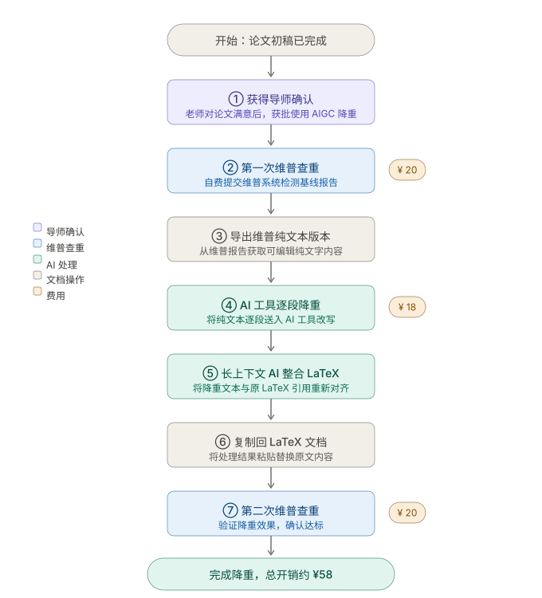

我的AI论文降重方法流程如下：首先先让指导老师审定毕业论文初稿，达到老师认可、自己满意的状态，确认定稿方向后，再自行用AIGC工具降重，降重后无需再交给老师审核，这是最稳妥的方式。 先经老师确认后，将论文提交至维普查重系统进行自费检测，单次检测费用20元。查重完成后，获取论文纯文字版本。如果论文是LaTeX格式，维普系统会导出纯文本内容，将这份纯文字分段发送给灵感AI进行逐段逐行降重。 降重完成后，把LaTeX原文和AI降重后的文本，一并输入上下文窗口较大的大模型AI，下达指令：参照LaTeX原始格式与引用标注，为降重后的文字补全LaTeX引用格式并重新优化处理。处理完成后，再将内容复制回原LaTeX文档中。 全部流程处理完毕后，再次提交维普系统进行二次查重。经过这样两轮查重和AI精细化降重，重复率能降到很低，整体查重成本也能控制在最低。整体需要维普两次查重共40元，灵感AI一万字收费约十五元左右，合计费用大概58元，既能高效完成论文降重，又能节省开支。

----

