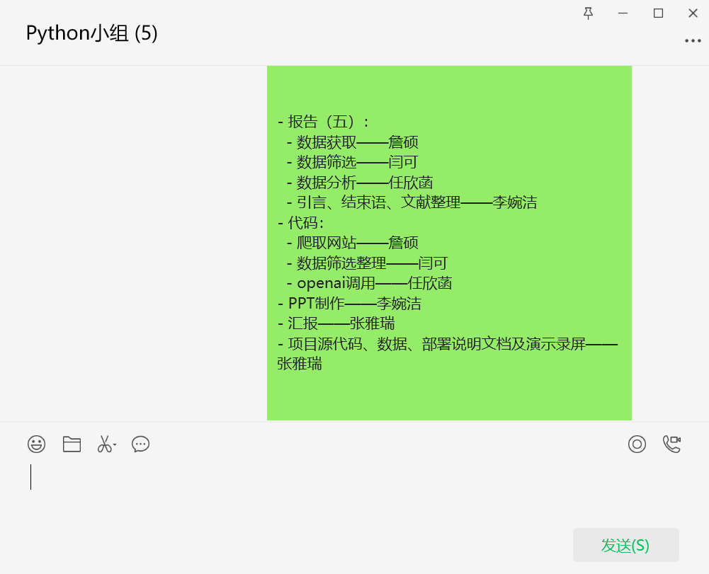
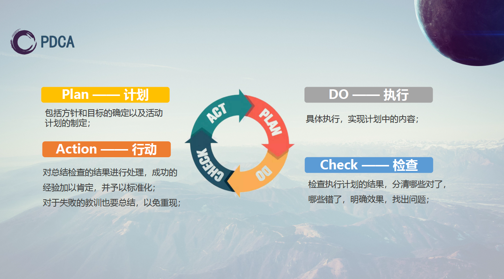

# 工程项目管理——以票房分析小组项目为例

## 一、项目背景介绍

在Python高阶课程中，我们小组承担了一个具有挑战性的大作业——票房数据分析项目。作为小组组长，我肩负着统筹整个项目、安排任务、督促进度以及检验组员工作内容的重要职责。这个项目不仅是对我们Python编程能力的一次全面检验，也是对我们项目管理和团队协作能力的一次实战演练。

大作业在10月23日（第八周）正式发布，我们有五周的时间来完成这个项目，最终需要在11月27日（第十二周）前完成汇报。时间紧迫，任务繁重，这要求我们必须高效地利用每一分每一秒，确保项目的每一个环节都能按时完成。

在本次项目管理的工作中，我运用了多种在工程伦理与项目管理课程中所学到的知识。这些知识包括但不限于项目规划、时间管理、团队协作、风险评估和质量控制等。通过这些知识的运用，我们能够成功且高效地完成项目，同时也确保了项目的质量符合预期标准。

## 二、项目目标设定——SMART原则

项目目标的设定是项目管理中的关键一环，它为项目的实施提供了明确的方向和衡量标准。在本项目中，我们采用了SMART原则来设定目标，即目标需要是具体的（Specific）、可衡量的（Measurable）、可达成的（Attainable）、相关的（Relevant）以及有时间限制的（Time-bound）。

SMART原则是一种广泛认可的目标设定框架，它帮助确保目标的清晰性和可执行性。具体来说：

- **Specific（具体）**：目标需要明确，没有歧义。
- **Measurable（可衡量）**：目标应该有明确的衡量指标，以便于跟踪进度。
- **Attainable（可达成）**：目标应该是现实的，可以在给定的资源和条件下实现。
- **Relevant（相关）**：目标应与项目的整体愿景和战略相一致。
- **Time-bound（有时间限制）**：目标应该有明确的完成时限。

在选题阶段，我凭借之前暑假实习期间积累的数据分析和项目管理经验，对票房分析这一课题有了初步的实现思路。基于这些经验，我主动选择了这个课题，并承担起了项目统筹管理的责任。我的目标是将实习期间学到的理论知识和实践技能应用到实际项目中，确保项目能够高效、顺利地完成。

在本项目的票房数据分析中，SMART原则的应用如下：

- **Specific（具体）**：我们的目标是完成一个票房数据分析报告，包括数据获取、筛选、分析及预测。
- **Measurable（可衡量）**：我们通过数据分类整理的准确性、可视化图表的生成质量以及票房趋势预测的准确性来衡量项目成果。
- **Attainable（可达成）**：考虑到团队成员的技能和项目的时间框架，我们设定了符合实际的目标，确保每个成员都能在其专业领域内发挥作用。
- **Relevant（相关）**：项目结果将为电影行业提供票房趋势分析，对行业决策具有实际参考价值，与我们的学习目标和行业需求紧密相关。
- **Time-bound（有时间限制）**：项目严格按照时间节点推进，确保在11月27日前完成所有任务，包括报告撰写、PPT制作和项目汇报。

通过SMART原则的应用，我们的项目目标设定既具有挑战性，又确保了可实现性，为项目的成功奠定了坚实的基础。

## 三、项目时间管理——用模块化设计提高质量

项目时间管理是确保项目按时完成的关键环节，它涉及到对项目进度的严格控制和对资源的合理分配。在本项目的票房数据分析中，我们采用了模块化设计的方法来提高工作效率和质量，确保项目能够按照既定的时间线顺利推进。

我们的项目时间线是根据分工和任务安排文件中的截至时间来制定的。这个时间线详细规划了从项目启动到最终汇报的每一个阶段，包括数据爬取、数据筛选整理、数据分析、报告撰写、PPT制作和项目汇报等。每个阶段都有明确的责任人和截止日期，确保了任务的连续性和及时性。通过严格遵守时间线，我们能够确保每个阶段的任务都能按时完成，从而避免项目延期的风险。

为了提高项目的工作效率和质量，我们将项目分解为几个关键的模块，每个模块都由专人负责。具体来说，我们的模块包括：

- **数据爬取模块**：由詹硕负责，负责从网站爬取原始数据。
- **数据筛选整理模块**：由闫可负责，负责对爬取的数据进行分类整理。
- **数据分析模块**：由任欣菡负责，负责使用openai库对数据进行深入分析。
- **报告撰写和PPT制作模块**：由李婉洁负责，负责撰写项目报告和制作演示文稿。
- **项目汇报和演示录屏模块**：由张雅瑞负责，负责项目的最终汇报和演示录屏的制作。

图 模块化设计任务——会议记录

通过模块化设计，每个成员都能专注于自己的领域，发挥专长，从而提高了整体的工作效率和质量。

## 四、项目范围管理——用PDCA法则实施质量保证

图 PDCA原则

项目范围管理是确保项目成功的关键环节，它涉及到项目目标的实现和项目成果的质量控制。在本项目的票房数据分析中，我们采用了PDCA（计划-执行-检查-行动）原则来实施质量保证，确保项目目标的达成和项目成果的质量。

- **计划（Plan）**
在项目开始之前，我们首先进行了详细的计划。根据分工和任务安排文件，我们明确了每个成员的职责和任务，制定了详细的工作计划和时间表。计划阶段，我们考虑了项目的各个方面，包括数据爬取、数据筛选整理、数据分析、报告撰写、PPT制作和项目汇报等。每个成员都清楚自己的任务和截止日期，确保了项目的有序进行。

- **执行（Do）**
按照计划，我们开始执行任务。在执行阶段，我们专注于实施计划中的任务，包括数据的爬取、筛选、分析等。每个模块的负责人都积极地推进自己的工作，并且定期与团队沟通，确保任务的顺利进行。在这个阶段，我们也注重团队协作，确保信息的流通和资源的共享，以提高工作效率。

- **检查（Check）**
在每个阶段的任务完成后，我们会进行检查。检查阶段，我们评估任务的完成情况，确保工作成果符合项目要求。我们会对数据爬取的完整性、数据筛选整理的准确性、数据分析的深度进行检查，确保每个环节的质量。此外，我们还会检查报告撰写和PPT制作的质量，确保最终的汇报材料能够准确、清晰地传达我们的分析结果。

- **行动（Act）**
根据检查结果，我们采取相应的行动。如果发现问题或偏差，我们会及时调整计划，解决发现的问题，并优化后续工作流程。行动阶段，我们可能会重新分配资源，调整任务优先级，或者提供额外的培训和支持，以确保项目能够回到正确的轨道上。我们的目标是持续改进，确保项目质量的持续提升。

通过PDCA原则的应用，我们能够系统地管理项目范围，确保项目目标的实现和项目成果的质量。这个循环的过程不仅帮助我们及时发现和解决问题，还促进了项目的持续改进和质量提升。通过这种动态的管理方法，我们能够确保项目的成功完成，并且为客户提供高质量的服务。

## 五、结语

随着本项目的圆满结束，我们可以自豪地说，通过有效的工程项目管理，我们成功实现了对电影票房数据的深入分析和预测。这个项目不仅展示了数据科学在实际应用中的强大潜力，也证明了良好的项目管理对于复杂项目成功的重要性。

具体来说，我们成功在第十周就完成了所有的代码撰写工作，这比原定的计划提前了一周。这一成就的取得，得益于团队成员的共同努力和良好的项目管理实践，展示了项目管理在数据科学项目中的重要性。

在代码撰写工作提前完成后，我们在之后的两周时间里，轻松完成了汇报工作的准备。这段时间内，我们专注于报告的撰写、PPT的制作和项目汇报的演练，确保了最终汇报的流畅和专业。这种前瞻性的项目管理和时间规划，不仅提高了工作效率，也为团队成员减轻了压力，使得我们能够以更加自信和从容的姿态面对最终的汇报。

项目的成功得益于团队成员的共同努力和良好的项目管理实践。每位成员都以其专业知识和技能，为项目的各个阶段贡献了自己的力量。从数据的爬取、筛选、分析，到报告的撰写、PPT的制作，再到最终的汇报和演示，每一步都凝聚了团队的智慧和汗水。这不仅展示了项目管理在数据科学项目中的重要性，也体现了团队合作精神在实现项目目标中的核心作用。

总之，本项目的完成标志着我们团队在工程项目管理领域的一次成功实践。我们期待将这些经验应用到未来的项目中，继续在数据科学和项目管理的道路上不断前进，为更多的行业和领域提供我们的专业服务和解决方案。

