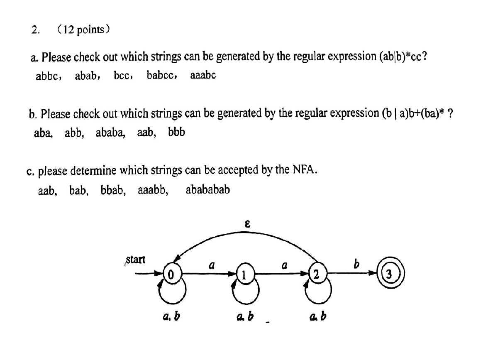
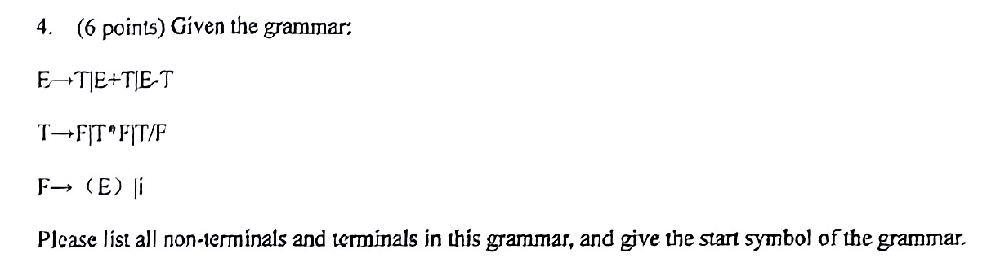
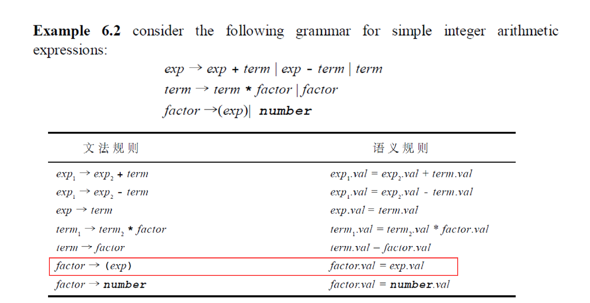

# 2024期末卷（回忆版）

一、名词解释（12分）——要记住书上第一章的那个流程图

compiler

scanner

tokens

Ambiguitous gammar

二、正则表达式——原题

三、终结符与非终结符——原题

四、消除左递归

五、NFA，DFA，最小化

（a|b）*a（a|b）

（1）画NFA

（2）画最小化的DFA

六、LL（1）

七、LR（1）

八、属性文法——书上例题

