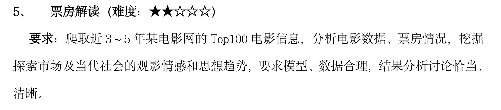

## 任务量：

- 报告
- PPT（一人完成）
- 代码（爬虫爬取、数据筛选、openai分析）
- 汇报
- 项目源代码、数据、部署说明文档及演示录屏
- 每个人的个人报告

## 分工（五人）

小组成员：

闫可

詹硕

任欣菡

张雅瑞

李婉洁

- 报告（五）：
  - 数据获取——詹硕
  - 数据筛选——闫可
  - 数据分析——任欣菡
  - 引言、结束语、文献整理——李婉洁
- 代码：
  - 爬取网站——詹硕
  - 数据筛选整理——闫可
  - openai调用——任欣菡
- PPT制作——李婉洁
- 汇报——张雅瑞
- 项目源代码、数据、部署说明文档及演示录屏——张雅瑞

报告：前言、数据获取、数据筛选、数据分析、结语

## 截至时间

10.24——10.28周一晚前（第八周）：A詹硕-代码

10.29——11.1周五晚前（第八周）：B闫可-代码

11.2——11.7周四晚前（第九周）：C任欣菡-代码

11.7——11.14周四晚前（第十周）：ABCD-报告

11.14——11.21周四晚前（第十一周）：PPT制作、项目部署整理录屏

## 需求文档

### 数据爬取（已完成）

### 数据筛选整理

**基本需求：**

- 读取excel格式的数据
- 对数据进行分类整理，至少包括以下几点：
  - 1.对电影票房进行分类（如：一千万以上、五百万以上、百万以上电影各多少等）
  - 2.对电影发布日期分类（如：近年四个季度各发布多少电影等）
  - 3.对电影类型分类（如：各个类型片的数量）

**进阶需求：**

- 对爬取进行深一步的整理（各年份总票房排名等）
- 将各组数据导出成excel（电影票房分类一张表、电影发布日期一张表等）

**高阶需求：**

- 对数据进行可视化，用相关依赖库，生成图表（饼图、柱状图等）

**截至时间：11.1周五晚前（第八周）**

### 数据分析

**基本需求：**

- 读取excel格式的文本数据
- 使用openai库，调用GPT（或者其他大语言模型）的API，对数据表进行分析，至少包括以下几点：
  - 每张数据表的文本数据都要进行分析，至少对应一个分析总结
  - 可以对多张数据表的内容一同进行分析，总结几张表中的内在联系
  - 对未来的票房趋势进行预测，推测未来的票房热点（分析并评价每季度票房，总结每季度的票房）

**进阶需求：**

- 输入prompt时，保证表中各项数据都能被完成读取被利用（可以检查的办法：能够单独回答某一行数据的值在表中的意义，如前50名票房中某爱情片为什么能在该名词、有什么潜在意义）

**高阶需求：**

- 调用能进行图像识别的大语言模型api，对图表内容进行识别，分析图像内容，并输出、反馈其意义

**截至时间：11.7周四晚前（第九周）**

## 报告撰写与汇报内容

写完代码的同学，可以先着手写报告了

要写的报告文件有：

- 项目报告（工作对应的章节）
- 个人报告（做了什么工作，个人工作是如何完成的）
- 部署说明文档（解释自己项目代码的内容——代码注释好喂GPT就行）

需要注意的是，除代码和报告以外，还请三位录一下自己代码的运行过程，说明下代码思路，时长一两分钟就行。我负责后期剪辑。

### 报告撰写

> 11.7一一11.14周四晚前（第十周）：ABCD-报告
>
> 11.14一一11.21周四晚前（第十一周）：PPT制作、项目部署整理录屏

**11.10号周日晚前**，完成各自的报告撰写、部署说明文档、项目录屏——詹硕、闫可、任欣菡

**11.14周四晚前**，完成报告的引言、结束语、文献整理——李婉洁

**11.17号周日晚前**，完成项目演示视频——张雅瑞

**11.21周四晚前**，完成PPT制作——李婉洁

汇报——张雅瑞

