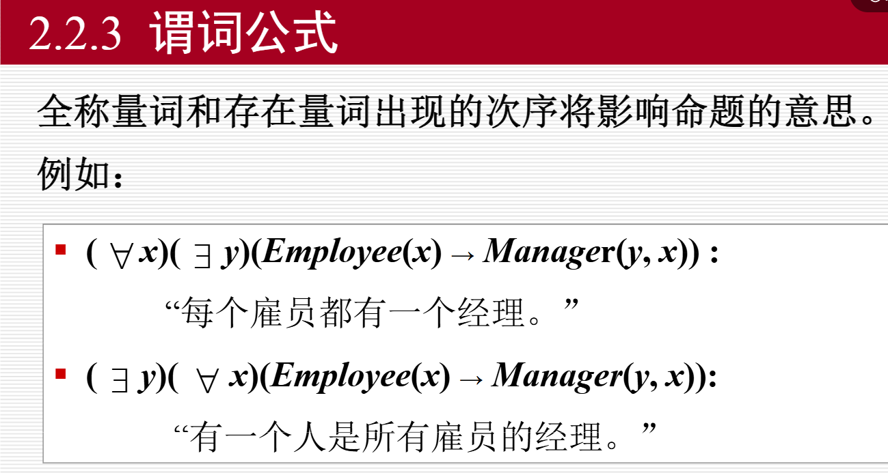
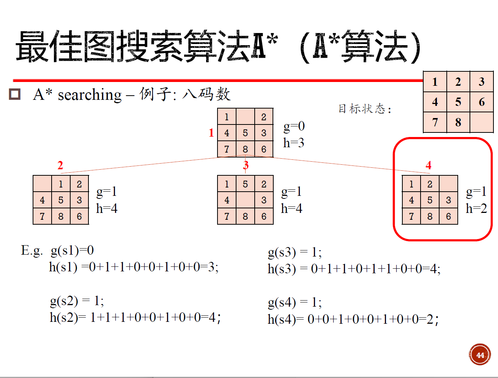
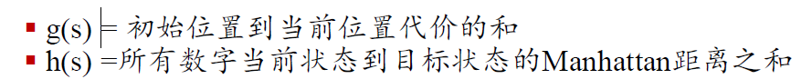
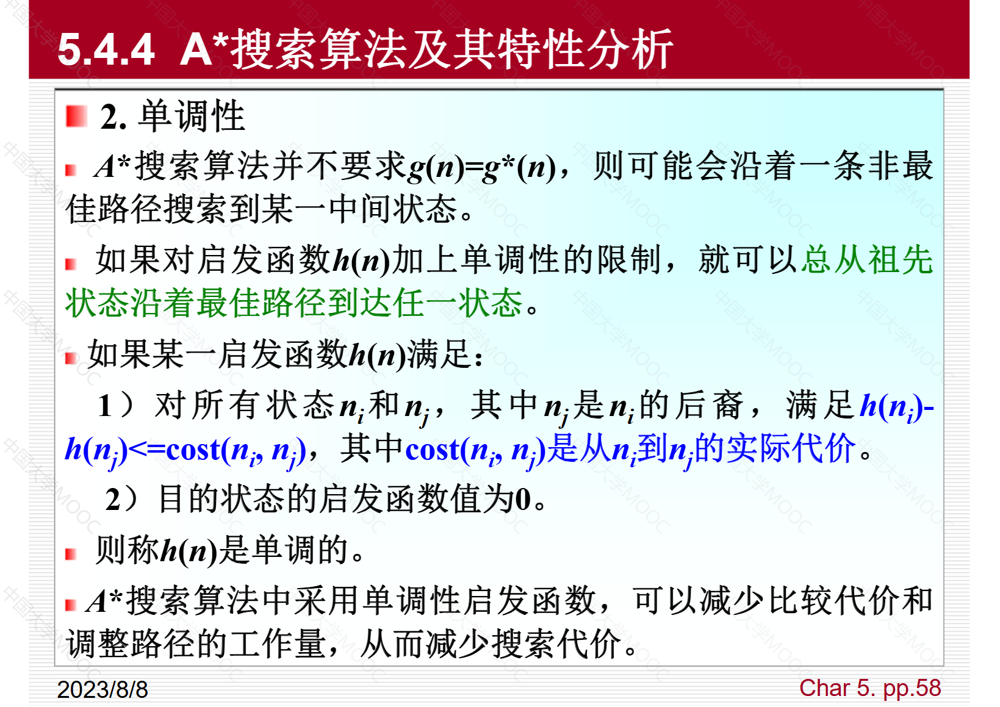
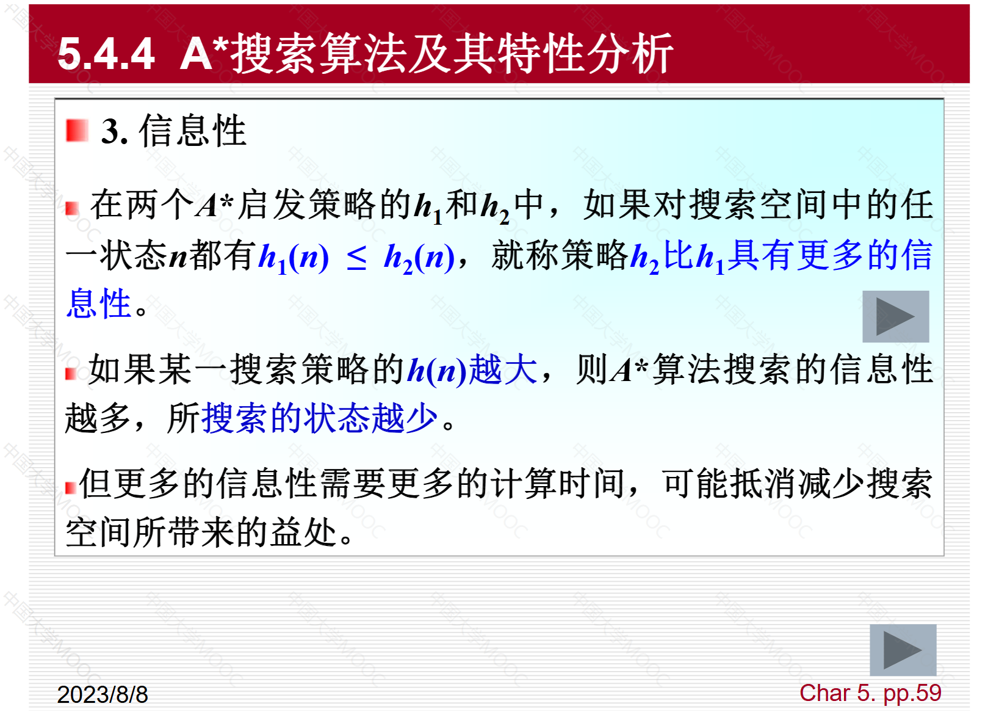
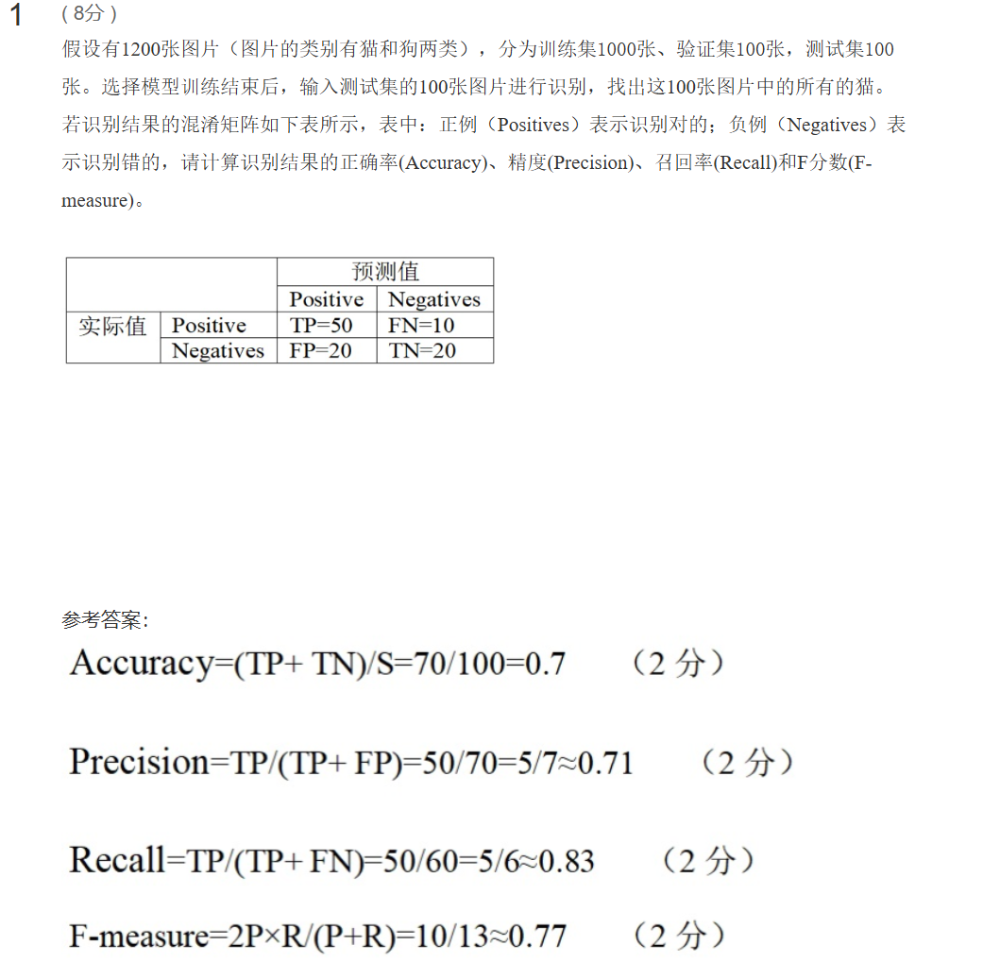
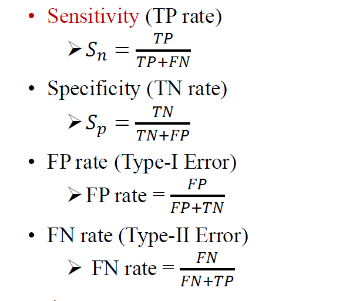
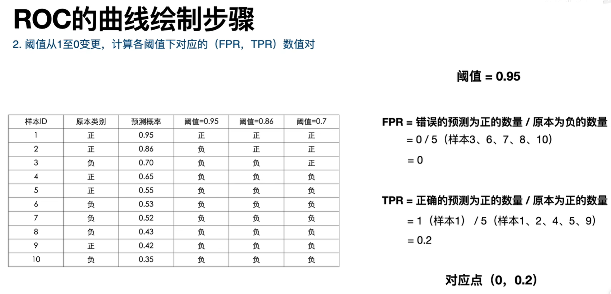
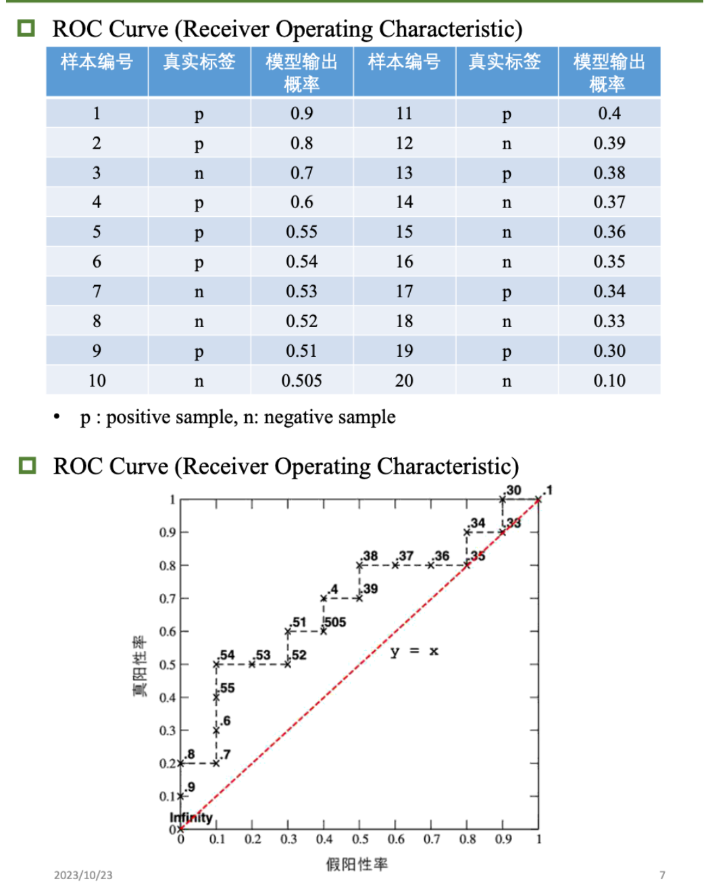
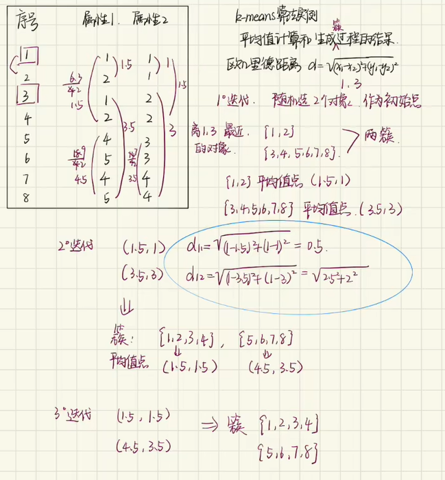

# 复习要点

---

人工智能考点：
- 离散：量词命题
- 搜索算法：图A搜索算法，曼哈顿走格子
- 模型评估与选择：ROC曲线的TPR学习
- 非监督学习：k-均值聚类计算
- 神经网络：前向计算-计算方式、反向计算-各参数含义


# 复习提纲


## 量词


## 谓词公式




## A*算法










```
A*搜索算法是一种最佳优先搜索算法，使用估价函数f(n)=g(n)+h(n)来设计启发函数h(n)。通过比较f(n)的大小来确定open表中需要扩展的状态次序，选择f(n)值最小的进行扩展。以八数码问题为例，设置估价函数g(n)为节点n的深度，h(n)为节点n与目标棋局不相同的位数。通过不断扩展和计算f(n)，最终找到目标状态，达到最少移动次数。然而，A*搜索算法存在存储空间占用大和不能保证找到最优解的问题。
```


## 模型评估与选择







**题目：**

```
TP+FN=10，FP+TN=10
阈值=0.9，TP=1，FP=0。TPR=0.1，FPR=0
阈值=0.8，TP=2，FP=0。TPR=0.2，FPR=0
阈值=0.7，TP=2，FP=1。TPR=0.2，FPR=0.1
....
```





## k-means聚类

```
多次迭代,直到没有新的分类结果为止
```





## BP算法

