# 汇编语言复习提纲

- [ ] 先整理书中和mooc上的知识点，整理成提纲
- [ ] 再通过mooc上的习题进行巩固
- [ ] 写往年试卷整理一下题型


# 第一章_基础知识

## 无符号数和带符号数的计算案例

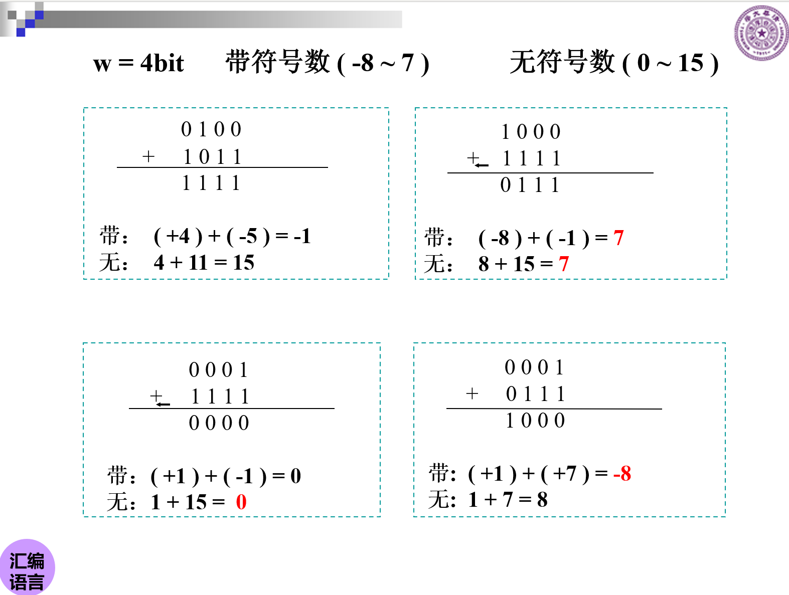


易错知识点

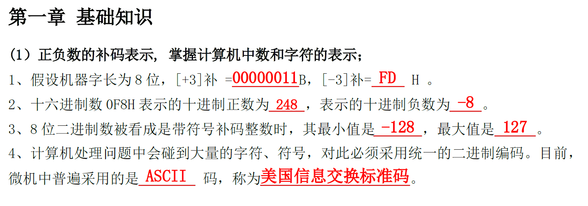


若是带符号数，开头是1，则代表的数值为其补码的负数。

如1111=-1，1011=-5


而两个带符号数的运算，其直接相加后的结果的补码，就是实际值。


补码表示的带符号数和原码表示的带符号数在算法上有一些关键的区别。以下是两者的总结：

### 原码表示的带符号数

原码表示法是一种直观的二进制表示法，其中最高位（符号位）为0表示正数，为1表示负数。数值部分就是符号位以外的部分。

**算法**：

1. **判断符号**：最高位（符号位）为0表示正数，为1表示负数。
2. **计算绝对值**：忽略符号位，将剩余的位转换为十进制数。
3. **确定真值**：如果符号位为0，则真值就是转换得到的十进制数；如果符号位为1，则真值是十进制数的相反数（即取负）。

### 补码表示的带符号数

补码表示法是现代计算机系统中常用的表示带符号整数的方法。对于正数，补码与其原码相同；对于负数，补码是其绝对值的二进制表示（即原码）取反后加1。

**算法**：

1. **判断符号**：最高位（符号位）为0表示正数，为1表示负数。对于正数，直接处理；对于负数，需要进行补码到原码的转换。
2. **计算绝对值（仅对负数）**：对于负数，需要将其补码转换回原码来得到绝对值。这通常通过取反（即每位取0或1的相反值）然后加1来实现。
3. **确定真值**：如果符号位为0，则真值就是转换得到的十进制数；如果符号位为1，则真值是十进制数的相反数（即取负）。注意，这里的十进制数是通过将补码（对于负数，实际上是原码转换后的结果）的其余位转换为十进制得到的。

**注意**：补码表示法的好处之一是它允许加法和减法操作使用相同的电路，因为对于负数，加法可以通过加上其补码来实现。此外，补码表示法还解决了原码表示法中可能出现的“+0”和“-0”的问题，因为在补码中，它们有相同的表示（全0）。


## 补码的加法和减法运算规则

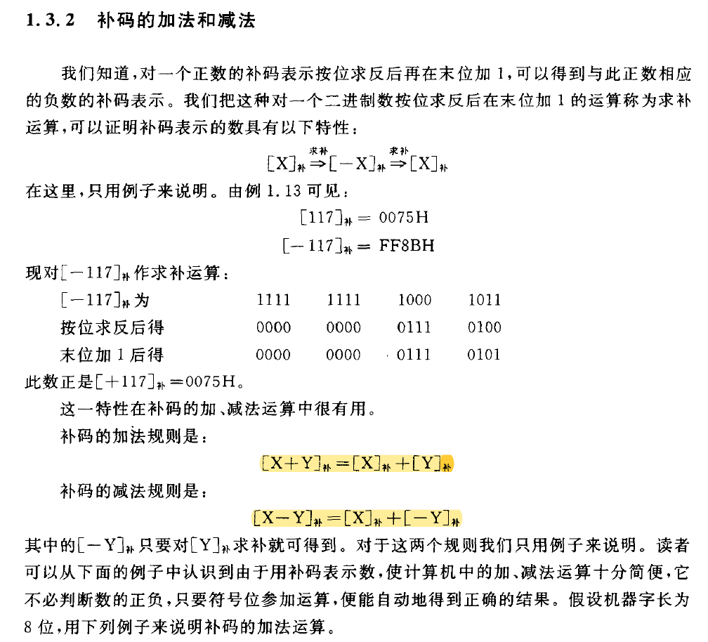


## 案例习题

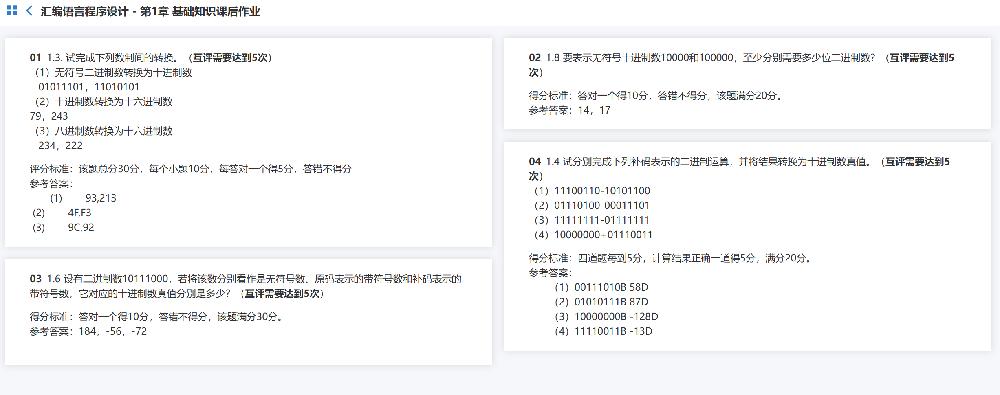

（1）11100110-10101100（补码的减法运算）

将-10101100取补码01010100，变成11100110+01010100=00111010


# 第二章_80x86 计算机组织


## 寄存器

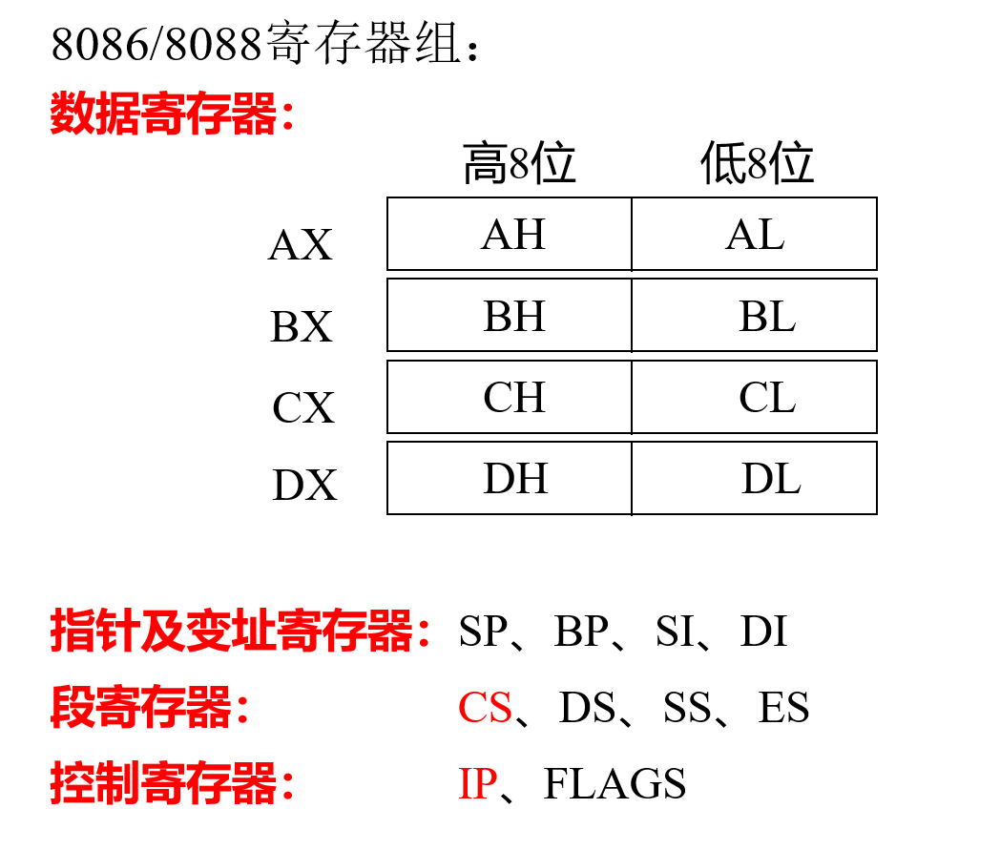


程序可见寄存器：可以分为通用寄存器 、专用寄存器和段寄存器3类。


### 通用寄存器

- 数据寄存器：	AX\BX\CX\DX	

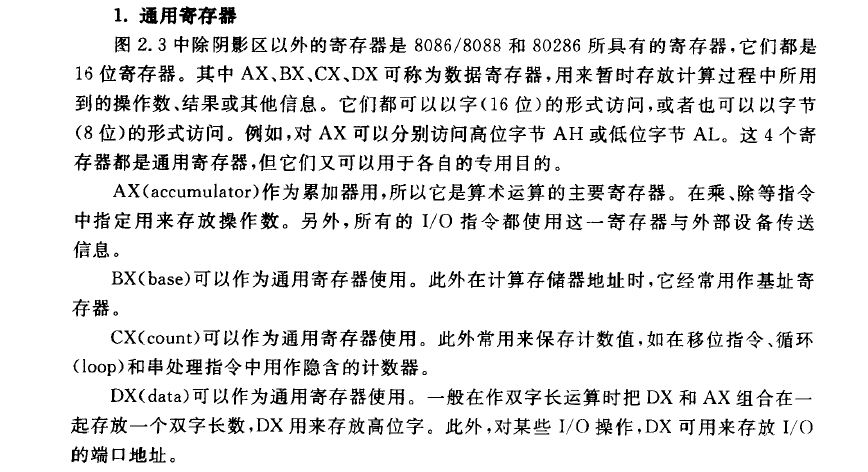

- 指针及变址寄存器：SP\BP\SI\DI


### 专用寄存器

- 指令指针寄存器:IP
- 堆栈指针寄存器:SP

- 标志寄存器：FLAGS

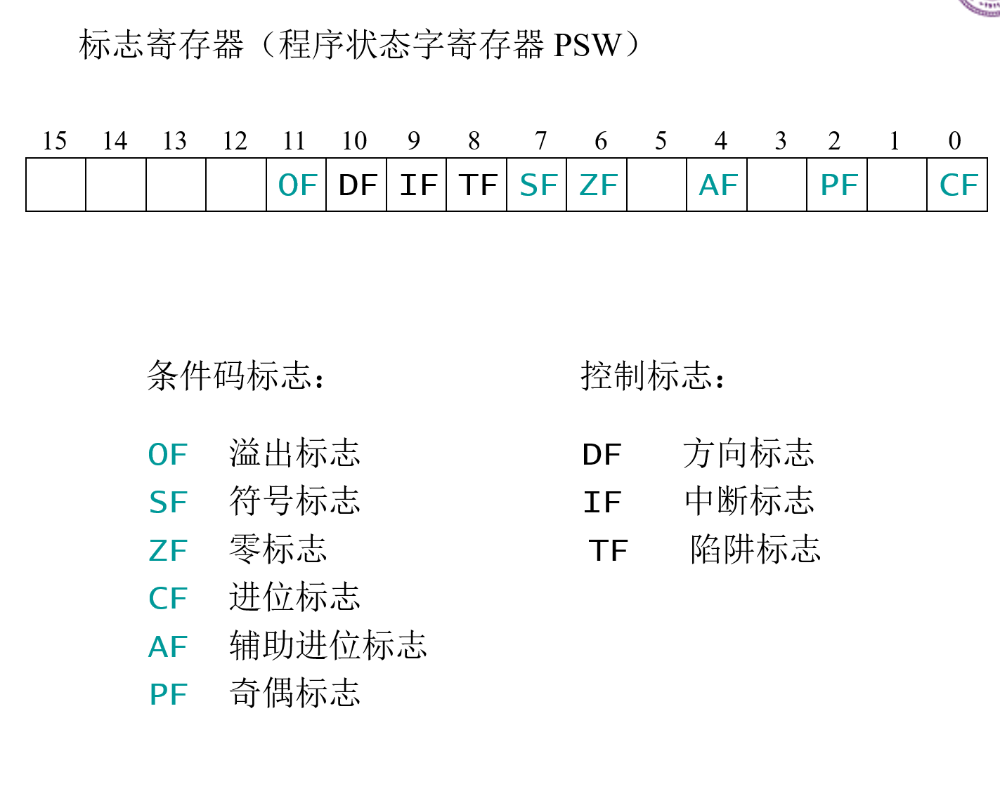


### 段寄存器

- code代码段：CS	
- data数据段：DS
- stack堆栈段：SS
- extra附加段：ES


## 存储器

### 物理地址的计算

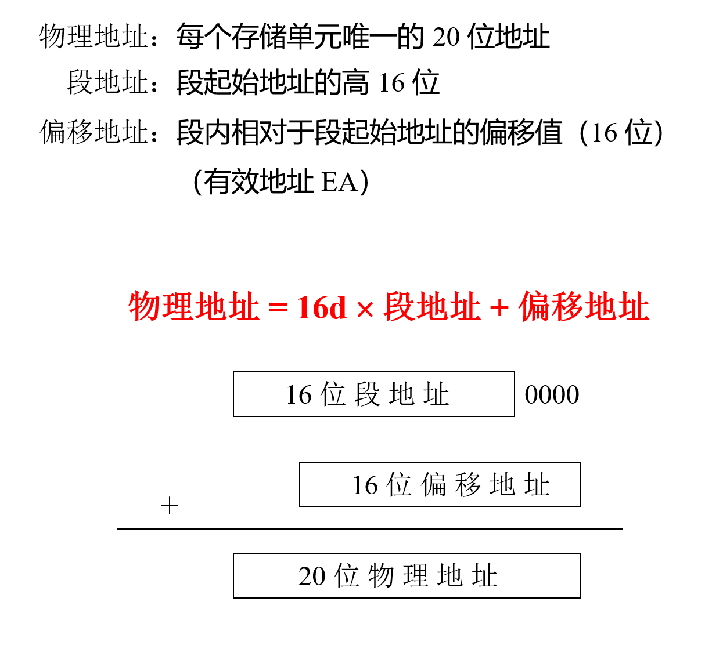


### 逻辑地址

逻辑地址（即段地址：偏移地址）


## 存储器与寄存器的关系


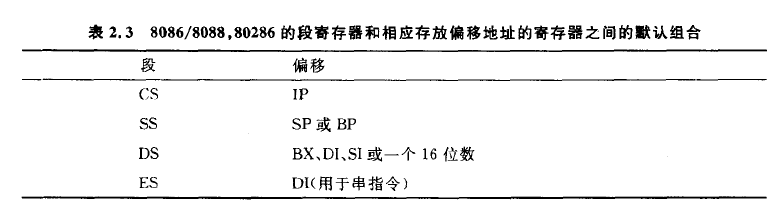


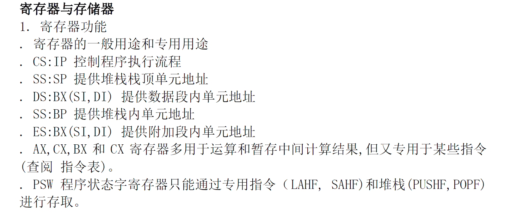


## 重难点

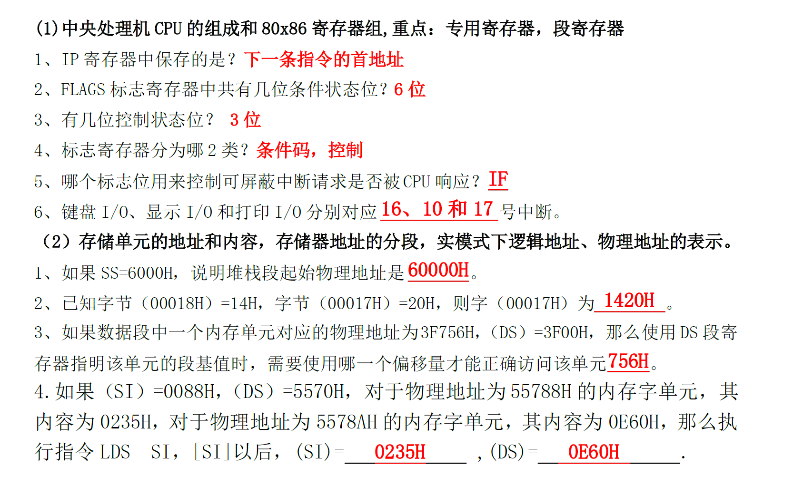


## 习题

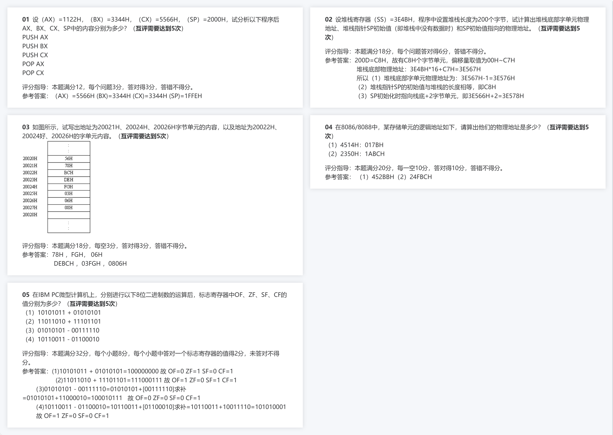

**解析**

### 第一题

**为什么执行完PUSH AX后(SP)的值变为2000H - 2 = 1FFEH**

在x86架构中，堆栈是一个后进先出（LIFO）的数据结构，它通常用于临时存储数据，比如函数调用的返回地址、局部变量等。堆栈指针（`SP` 或 `ESP` 在32位模式下）指向堆栈的顶部。

当你执行一个`PUSH`指令时，操作数（在这个例子中是`AX`寄存器的内容）被压入堆栈。这意味着该操作数的值会被写入当前堆栈指针所指向的内存地址，并且堆栈指针会向下移动（向低地址方向）以反映新的堆栈顶部位置。

在16位模式下，每个寄存器（如`AX`）的内容占用2个字节（16位 = 2字节）。因此，当你执行`PUSH AX`时，`AX`的内容会被写入到当前`SP`指向的地址，然后`SP`的值会减少2，以指向新的堆栈顶部。

在你给出的例子中，初始的`(SP) = 2000H`。执行`PUSH AX`后，`AX`的内容（1122H）被写入到地址`2000H`，然后`(SP)`的值减少2，变为`1FFEH`。这样，堆栈指针现在就指向了新的堆栈顶部，该顶部是刚刚压入的`AX`内容之后的位置。

### 第二题-改正后的答案

这道题目考查了堆栈寄存器和堆栈内存区域的基础知识。我们逐一分析并回答每个问题。

1. **堆栈底部字单元物理地址**

   - 首先，题目告诉我们堆栈寄存器的值（SS）= 3E4BH。
   - 堆栈长度为200字节。由于200的十六进制表示为C8H（因为 \(200_{10} = C8_{16}\)），所以堆栈将占用C8H个字节单元，这些字节单元的**偏移量取值范围是00H到C7H。**
   - 堆栈的底部将是偏移量为C7H的字节单元，因为堆栈是向下增长的（即向低地址方向增长）。
   - 堆栈底部字单元（一个字单元等于两个字节）的物理地址可以通过以下公式计算：物理地址 = (SS的值) * 16 + 偏移量。因此，堆栈底部字单元的物理地址 = 3E4BH * 16 + C7H = 3E567H。但是，由于这是一个字单元（16位，即2字节），所以堆栈底部字单元的物理地址实际上是3E567H的前一个字节地址，即3E566H。

   所以，**堆栈底部字单元物理地址**为3E566H。

2. **堆栈指针SP初始值**

   - 堆栈指针（SP）在初始化时指向堆栈的顶部。由于堆栈是空的，所以SP应该指向堆栈的底部。
   - 堆栈的长度是C8H个字节，所以SP的初始值应该是C8H，因为当堆栈为空时，SP指向堆栈的底部偏移量C8H。

   所以，**堆栈指针SP的初始值**为C8H。

3. **SP初始值指向的物理地址**

   - 如前所述，**SP的初始值是C8H**，这表示它指向堆栈的底部。
   - 由于SS寄存器的值是3E4BH，我们可以通过以下公式找到SP指向的物理地址：物理地址 = (SS的值) * 16 + **SP的值**。
   - 因此，SP初始值指向的物理地址 = 3E4BH * 16 + C8H = 3E568H。
   - 但是，请注意，堆栈指针实际上指向的是下一个要压入堆栈的字节位置。这意味着当堆栈为空时，SP实际上指向堆栈底部的下一个字节单元。因此，我们应该考虑加1（或加2，如果是指向字单元）。
   - 但是，由于题目要求的是SP初始值指向的物理地址，而不是指向下一个空闲位置，所以直接使用上面的计算值即可。

   所以，**SP初始值指向的物理地址**为3E568H。但请注意，这个答案与参考答案不一致，因为参考答案中的计算似乎有误（可能是对字单元和字节单元的理解混淆了）。在这里，我们遵循了标准的堆栈初始化和寻址原则。


**（1）为什么堆栈底部字单元物理地址要在堆栈底部物理地址的基础上-1**

在x86架构中，堆栈通常是以字节为单位增长的，但是当我们谈论“字单元”时，我们实际上是指两个字节（16位）的数据单元。当一个程序使用`PUSH`指令将一个16位的值（比如一个字）压入堆栈时，它会占用堆栈上的两个连续的字节。

现在，当我们说“堆栈底部字单元物理地址”时，我们实际上是在寻找一个地址，该地址指向一个可以从那里开始读取一个16位（或两个字节）数据的内存位置。

假设堆栈的底部是在偏移量`C7H`的位置（即堆栈的最后一个字节），那么堆栈底部的字单元实际上是从这个偏移量之前的地址开始的，即`C6H`（因为一个字由两个字节组成）。

但是，当我们计算物理地址时，我们首先会找到堆栈底部的物理地址，即`(SS的值) * 16 + C7H`。这个地址实际上是指向堆栈底部最后一个字节的。但是，因为我们要找的是一个字单元的开始地址（即可以从中读取16位数据的地址），所以我们需要从该地址中减去1（或减去一个字节的偏移量），以得到字单元的开始位置。

因此，堆栈底部字单元物理地址是在堆栈底部物理地址的基础上减去1（或减去一个字节的偏移量），以确保我们指向的是一个字的开始位置，而不是一个字的中间或结尾。

总结来说，堆栈底部字单元物理地址的计算需要考虑到字的大小（两个字节）以及堆栈的增长方向（向下，即向低地址方向）。


### 第三题

0001H的字单元内容=0002H字节单元内容+0001字节单元内容

### 第四题

知晓逻辑地址的意义即可

### 第五题

为了解答这个问题，我们需要理解IBM PC微型计算机（基于x86架构）的标志寄存器（FLAGS register）中的各个标志位（OF, ZF, SF, CF）的含义，并知道它们是如何在算术运算中设置的。

标志位含义：
- OF (Overflow Flag): 溢出标志，当结果超出了目标操作数的范围时设置。
- ZF (Zero Flag): 零标志，当结果为0时设置。
- SF (Sign Flag): 符号标志，当结果的最高位（符号位）为1时设置。
- CF (Carry Flag): 进位标志，在加法运算中，当最高位产生进位时设置；在减法运算中，当需要借位时设置。

现在，我们按照题目要求分析每个小题：

（1）10101011 + 01010101

- 运算结果：10000000（注意这里只显示了9位，但实际上在8位系统中会丢弃最高位的进位）
- OF：没有溢出（因为最高位的进位被丢弃），所以OF=0
- ZF：结果不为0，所以ZF=0
- SF：结果的最高位是0，所以SF=0
- CF：最高位有进位，所以CF=1

（2）11011010 + 11101101

- 运算结果（考虑进位）：111000000（注意这里只显示了9位）
- OF：有溢出（因为最高位的进位被丢弃），所以OF=1
- ZF：结果不为0，所以ZF=0
- SF：结果的最高位（考虑进位后的第9位）是1，但只考虑8位，所以SF=1（因为结果的最高位是1）
- CF：最高位有进位，所以CF=1

（3）01010101 - 00111110

- 转换为加法并运算：01010101 + 11000010 = 10001011（注意这里只显示了8位）
- OF：没有溢出，所以OF=0
- ZF：结果不为0，所以ZF=0
- SF：结果的最高位是0，所以SF=0
- CF：从减法转换为加法时，需要借位，所以CF=1

（4）10110011 - 01100010

- 转换为加法并运算：10110011 + 10011110 = 101010001（注意这里显示了9位，但只考虑低8位）
- OF：有溢出（因为最高位的进位被丢弃），所以OF=1
- ZF：结果不为0，所以ZF=0
- SF：结果的最高位（考虑进位后的第9位）是0，但只考虑8位，所以SF=0（因为结果的最高位是0）
- CF：从减法转换为加法时，需要借位，所以CF=1

注意：在实际的x86架构中，减法是通过取第二个操作数的补码（即二进制反码加1）然后执行加法来实现的。在上面的解答中，我已经将减法转换为了加法，并考虑了进位和溢出的情况。

最后，将每个小题的答案与参考答案进行比较，确保每个标志位的值都是正确的。


## 真题

完成将累加器AL清零,并使进位标志CF清零, 下面错误的指令是 ( D)

​    A. SUB AL, AL   B. AND AL, 00H   C. XOR AL, AL  D. MOV AL, 00H

**解析**

**1、MOV**是数据传送指令，不会清零并进位。 

  2、XOR是异或指令 

  **3、ADD**是加指令 

  **4、SUB**是减指令 

  汇编语言中：
 OF是溢出标志位，OF=1或0，表示运算结果有无溢出。
 CF是进位标志位，CF=1或0，表示加减法操作中最高位有无进借位。


7. 下列传送指令中有语法错误的是 (  ) A.  MOV DI , SI     B. MOV [DI], [SI]   C. MOV DI, [SI]   D. MOV [DI], SI

**解析**


```
DATA  SEGMENT

 ARRAY  DW 23，5，678 ORG 0020H 

BUFF  DB 2，3，’5678’                   

 BASUB  EQU ARRAY - BUFF                      

DATA   ENDS 
```

请回答：（1）该数据段已占有的存储字节数是多少？ ( 2 ) BASUB的值是多少？


**解析**

（1）首先，我们需要确定数据段中每个数据项所占用的字节数，然后加总得到整个数据段占用的字节数。

`ARRAY` 是一个字（`DW`）数组，其中每个字（`DW`）占用2个字节。数组中有三个元素：`23`、`5` 和 `678`，因此总共是 3 * 2 = 6 个字节。

`BUFF` 是一个字节（`DB`）数组，其中包含了两个数字（`2` 和 `3`）和一个字符串 `'5678'`。数字每个占用1个字节，字符串 `'5678'` 占用4个字节（每个字符占用1个字节）。因此，`BUFF` 数组总共是 2 + 4 = 6 个字节。

将数据段中的 `ARRAY` 和 `BUFF` 的字节数相加，我们得到 6 + 6 = 12 个字节。所以，该数据段已占有的存储字节数是 12 个字节。

（2）`BASUB` 是一个等价（`EQU`）指令，用于定义一个符号名（`BASUB`）来代表两个地址之间的差值。在这里，`BASUB` 被定义为 `ARRAY` 的地址减去 `BUFF` 的地址。

由于我们没有具体的地址信息（因为这是一个片段，没有给出具体的内存布局），我们通常假设在汇编中，数据段中的变量是按照它们在代码中出现的顺序进行排列的。因此，`ARRAY` 会先于 `BUFF` 被放置在内存中。

假设 `ARRAY` 的起始地址是某个值（我们不知道具体是多少，但在这种情况下不重要），那么 `BUFF` 的起始地址就是 `ARRAY` 的起始地址加上 `ARRAY` 的大小（即6个字节）。因此，`BASUB` 的值就是 `ARRAY` 的大小，即 6。所以，`BASUB` 的值是 6。

# 第三章_80x86的指令系统和寻址方式


## 习题

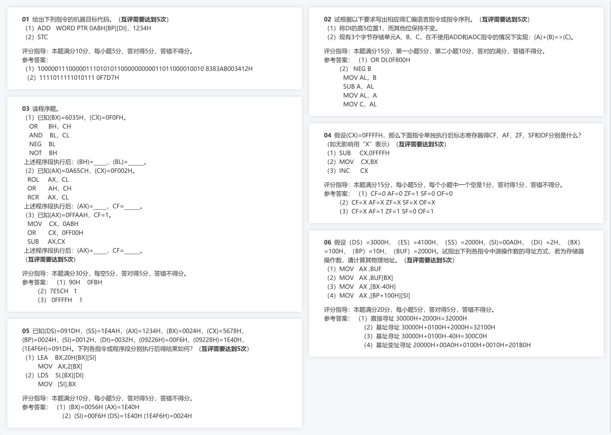


### 第一题


## 真题

现有程序段如下：(5分)

​     MOV CX，31H           DON：ADD AX，BX

​     MOV AX，2               ADD BX，2

​     MOV BX，4               LOOP DON

   请回答:（1）该程序完成的功能是什么？

（2）程序执行后，（AX）=

### loop cx

`LOOP`指令依赖于`CX`（或`ECX`）寄存器的值来决定循环应该执行多少次。在每次循环迭代结束时，`LOOP`指令都会自动递减`CX`的值，并检查它是否为零，从而决定是否继续循环。


# 第四章

## 习题

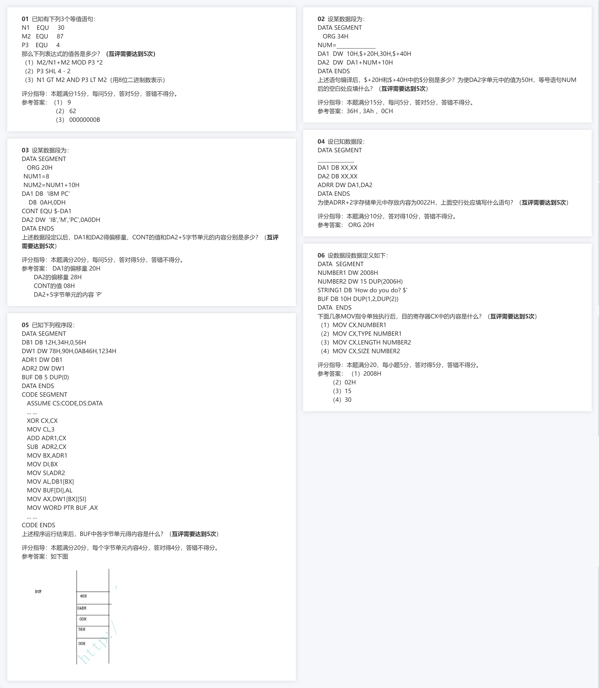


# 第五章

## 习题

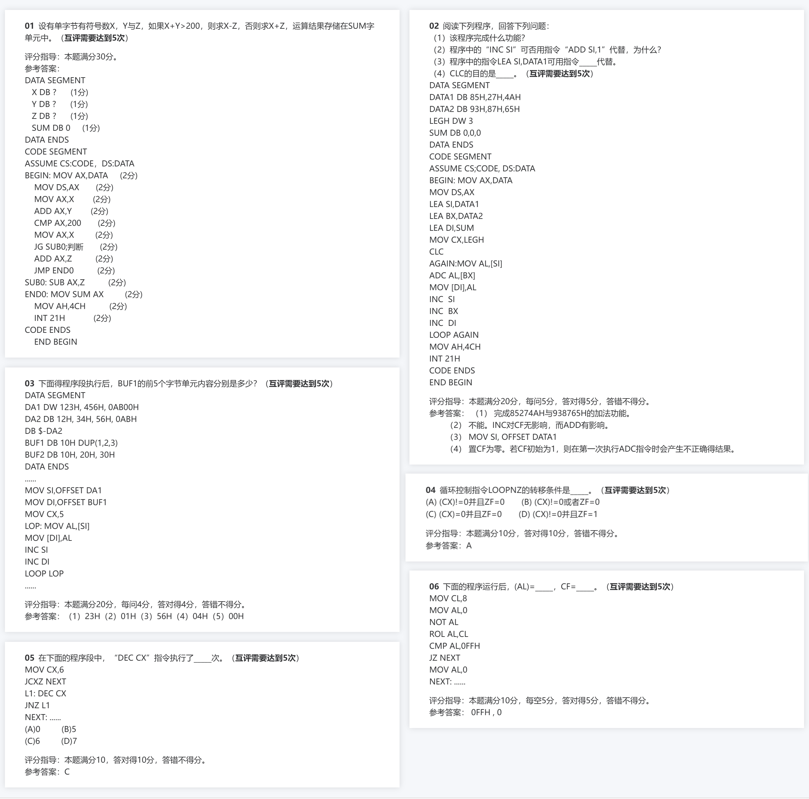
