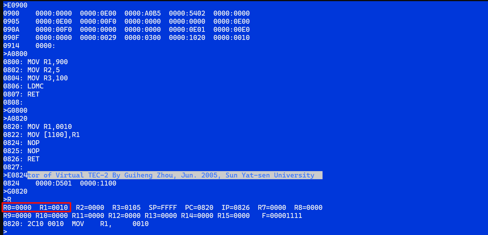

# 计组课设

一、实验内容：

选定指令格式、操作码，设计如下指令：

（1）减法指令。

指令格式：D5DRSR，ADDR   双字指令（控存入口100H）

功能：  DR=SR -[ADDR]

（2）传送指令。

指令格式：D8DRSR，ADDR1，ADDR2  三字指令（控存入口110H）

功能：  [ADDR1]←[ADDR2+SR]

（3）转移指令。判断两个通用寄存器内容是否相等，若相等则转移到指定目的地址（(IP)+DISP），否则顺序执行。

指令格式：E0 DR SR，DISP 双字指令（控存入口130H, DISP为相对转移地址偏移量）

功能：  if DR>SR goto IP+DISP else　顺序执行。


# 学长的思路

[学长的报告](E:\书籍\zstu-study\计算机组成原理\课程设计\计算机组成原理课程设计报告.md)


# 减法指令

指令格式：D5DRSR，ADDR   双字指令（控存入口100H）

功能：  DR=SR -[ADDR]


## 设计

### 微指令


```
PC->AR,PC+1->PC	
MEM->AR
MEM->Q
SR-Q->Q
Q->DR,CC#=0 
```


### 微指令对应微码


| 地址 | 微指令编码            | 说明                 |
| ---- | --------------------- | -------------------- |
| 100H | `0000 0E00 A0B5 5402` | PC -> AR, PC+1 -> PC |
| 101H | `0000 0E00 00F0 0000` | MEM -> AR            |
| 102H | `0000 0E00 00F0 0000` | MEM -> Q             |
| 103H | `0000 0E01 00E0 0000` | SR - Q -> Q          |
| 104H | `0029 0300 1020 0010` | Q -> DR, CC#=0       |


### 微码分析


1. **PC -> AR, PC+1 -> PC**
   - 微指令：`0000 0E00 A0B5 5402`
   - **意义**：将程序计数器 `PC` 的值加载到地址寄存器 `AR` 中，并将 `PC` 加1。
   - 具体操作：
     - `CI3-0`：顺序执行
     - `I8-6`：ALU结果F=PC+1 -> B=R5=PC, A=R5=PC -> AM2901输出Y
     - `I5-3`：ALU结果F=R+S
     - `I2-0`：R=0, S=B=R5=PC
     - `A口`：R5, PC
     - `B口`：R5, PC
     - `SCi`：进位
     - `DC2`：AM2901输出Y -> AR
2. **MEM -> AR**
   - 微指令：`0000 0E00 00F0 0000`
   - **意义**：从内存读取地址 `ADDR` 到地址寄存器 `AR` 中。
   - 具体操作：
     - `CI3-0`：顺序执行
     - `/MI0 REQ /WE`：存储器读MEM送到AM2901外部输入D
     - `I8-6`：ALU结果F送AM2901输出Y
     - `I5-3`：ALU结果F=R+S
     - `I2-0`：R=ALU输入D, S=0
     - `DC2`：AM2901输出Y -> AR
3. **MEM -> Q**
   - 微指令：`0000 0E00 00F0 0000`
   - **意义**：从内存地址 `ADDR` 读取数据到寄存器 `Q` 中。
   - 具体操作：
     - `CI3-0`：顺序执行
     - `/MI0 REQ /WE`：存储器读MEM送到AM2901外部输入D
     - `I8-6`：ALU结果F送寄存器Q, ALU结果F送AM2901输出Y
     - `I5-3`：ALU结果F=R+S
     - `I2-0`：R=ALU输入D, S=0
4. **SR - Q -> Q**
   - 微指令：`0000 0E01 00E0 0000`
   - **意义**：将源寄存器 `SR` 和寄存器 `Q` 的值相减，结果存储到寄存器 `Q` 中。
   - 具体操作：
     - `CI3-0`：顺序执行
     - `SST`：接收ALU的标志位输出值
     - `/MI0 REQ /WE`：存储器读MEM送到AM2901外部输入D
     - `I8-6`：ALU结果F=R-S=SR-Q -> Q
     - `I5-3`：F=R-S=D-Q=SR-Q
     - `I2-0`：R=D, S=Q
5. **Q -> DR, CC#=0**
   - 微指令：`0029 0300 1020 0010`
   - **意义**：将寄存器 `Q` 的值写入目标寄存器 `DR`，并清除条件码。
   - 具体操作：
     - `CI3-0`：条件转移, 3#
     - `/MI0 REQ /WE`：存储器写, 内部总线数据IB写入MEM
     - `I8-6`：ALU结果F送AM2901输出Y
     - `I5-3`：F=R+S=0+Q
     - `I2-0`：R=0, S=Q
     - `DC1`：运算器输出Y送内部总线IB

### 用于加载微码的汇编指令


```

MOV R1, 900   ; 微码从0900地址开始
MOV R2, 5     ; 有5条微指令
MOV R3, 100   ; 控存为100H，对应操作码为D5
LDMC          ; 装入微码
RET           ; 汇编语句结束，子程序返回
```


### 用于测试我们做好的微程序的汇编指令


```

MOV R1, 0010
MOV [1100],R1
NOP
NOP
RET           ; 汇编语句结束，子程序返回
```


## 实验


### 1 输入微码

将微码输入到由0900H开始的内存单元中。

用E命令输入微码，回车后输入微程序。每个数值间以空格分开，输入完毕后按回车键。

```
E0900
```


| 地址 | 微指令编码            | 说明                 |
| ---- | --------------------- | -------------------- |
| 100H | `0000 0E00 A0B5 5402` | PC -> AR, PC+1 -> PC |
| 101H | `0000 0E00 00F0 0000` | MEM -> AR            |
| 102H | `0000 0E00 00F0 0000` | MEM -> Q             |
| 103H | `0000 0E01 00E0 0000` | SR - Q -> Q          |
| 104H | `0029 0300 1020 0010` | Q -> DR, CC#=0       |

### 2 编写用于加载微码的汇编指令

```
A0800         ; 从0800地址开始输入汇编语句
```


```

MOV R1, 900   ; 微码从0900地址开始
MOV R2, 5     ; 有5条微指令
MOV R3, 100   ; 控存为100H，对应操作码为D5
LDMC          ; 装入微码
RET           ; 汇编语句结束，子程序返回
```

### 3 运行用于加载微码的汇编指令

```
G0800
```

### 4 编写用于测试我们做好的微程序的汇编指令

```
A0820         ; 从0820地址开始输入汇编语句
```

两个NOP空操作是为了给我们编写的微程序（双字指令）留位置。我们自定义的指令 `D501 1100` 不能直接用A命令写在内存里，会报错。

```asm

MOV R1, 0010	
MOV [1100],R1
NOP
NOP
RET           ; 汇编语句结束，子程序返回
```

### 5 用E命令直接编辑两个NOP

把NOP编辑为我们的双字指令。

```
E0824
D501 1100
```

### 6 运行用于测试我们做好的微程序的汇编指令

```
G0820
```


R命令查看寄存器地址

```
R
```





# 传送指令

指令格式：D8DRSR，ADDR1，ADDR2  三字指令（控存入口110H）

功能：  [ADDR1]←[ADDR2+SR]


## 设计

 [ADDR1]←[ADDR2]

### 微指令

```
PC+1->AR,PC+1->PC
MEM+R1->AR	
MEM->Q
PC-1->AR,PC+1->PC
MEM->AR
Q->MEM, CC#=0
```

测试

```
E0900
0000 0E00 90B0 5402 0000 0E00 10F0 0002 0000 0E00 10F0 0082 0000 0E00 00F0 0000 0000 0E00 80B0 5402 0000 0E00 10F0 0002 0029 0300 1020 0010

A0800
MOV R1, 900   
MOV R2, 7     
MOV R3, 110   
LDMC          
RET

G0800

A0820
MOV R1, 0010
MOV [1010],R1
NOP
NOP
RET

E0824
D801 1020 1000

G0820
D1010
```


```
PC+1->AR,PC+1->PC
MEM->AR
AR+SR->AR
MEM->Q
PC-1->AR,PC+1->PC
MEM->AR
Q->MEM, CC#=0
```


```

```


### 微指令对应微码


以下是完整的微指令及其对应的微码：


| 微指令                 | 微码                  | 说明                                                         |
| ---------------------- | --------------------- | ------------------------------------------------------------ |
| PC+1 -> AR, PC+1 -> PC | `0000 0E00 90B0 5402` | 将程序计数器 `PC` 的值加1后加载到地址寄存器 `AR` 中，同时将 `PC` 的值加1。 |
| MEM + SR -> AR         | `0000 0E00 10F0 0082` | 从内存读取数据并加上源寄存器 `SR` 的值，然后将结果加载到地址寄存器 `AR` 中。 |
| MEM -> Q               | `0000 0E00 00F0 0000` | 从内存读取数据到寄存器 `Q` 中。                              |
| PC-1 -> AR, PC+1 -> PC | `0000 0E00 80B0 5402` | 将程序计数器 `PC` 的值减1后加载到地址寄存器 `AR` 中，同时将 `PC` 的值加1。 |
| MEM -> AR              | `0000 0E00 10F0 0002` | 从内存读取数据到地址寄存器 `AR` 中。                         |
| Q -> MEM, CC#=0        | `0029 0300 1020 0010` | 将寄存器 `Q` 的值写入内存，并清除条件码。                    |


通过以上微码，可以实现指令 `D8DRSR，ADDR1，ADDR2` 的功能 `[ADDR1] ← [ADDR2 + SR]`。


### 微码推导

为了从微指令推导出微码，我们需要了解微指令的具体操作和控制信号，以及这些操作和信号在微码中的编码方式。以下是详细的步骤和方法：


#### 微指令和微码的关系


微指令是控制处理器执行特定操作的低级指令，而微码是微指令的二进制表示。每条微指令对应一组控制信号，这些信号在微码中以特定的位模式表示。


#### 具体步骤


1. **确定微指令的操作**：每条微指令描述了处理器需要执行的操作，例如将寄存器的值加载到地址寄存器，或者将内存中的值加载到寄存器等。
2. **确定控制信号**：每个操作对应一组控制信号，这些信号控制处理器的各个部分如何执行操作。例如，控制信号可以指示处理器从内存读取数据，或者将数据写入寄存器。
3. **编码控制信号**：将控制信号编码为二进制模式，这些模式在微码中表示。例如，某些位可能用于选择寄存器，其他位用于控制ALU操作等。


示例分析


以下是具体的微指令和对应的微码的推导过程：


#### 微指令：PC+1 -> AR, PC+1 -> PC


- 操作

  ：

  - 将程序计数器 `PC` 的值加1后加载到地址寄存器 `AR` 中。
  - 同时将 `PC` 的值加1。

- 控制信号

  ：

  - `PC` 加1并加载到 `AR`。
  - `PC` 加1。

- 微码

  ：

  ```
  0000 0E00 90B0 5402
  ```

  - 具体编码方式可能如下：
    - `0000`：操作码或其他控制位。
    - `0E00`：控制信号，表示 `PC` 加1并加载到 `AR`。
    - `90B0`：控制信号，表示 `PC` 加1。
    - `5402`：其他控制信号或标志位。


#### 微指令：MEM + SR -> AR


- 操作

  ：

  - 从内存读取数据并加上源寄存器 `SR` 的值，然后将结果加载到地址寄存器 `AR` 中。

- 控制信号

  ：

  - 从内存读取数据。
  - 加上 `SR` 的值。
  - 将结果加载到 `AR`。

- 微码

  ：

  ```
  0000 0E00 10F0 0082
  ```

  - 具体编码方式可能如下：
    - `0000`：操作码或其他控制位。
    - `0E00`：控制信号，表示从内存读取数据。
    - `10F0`：控制信号，表示加上 `SR` 的值。
    - `0082`：控制信号，表示将结果加载到 `AR`。


#### 微指令：MEM -> Q


- 操作

  ：

  - 从内存读取数据到寄存器 `Q` 中。

- 控制信号

  ：

  - 从内存读取数据。
  - 将数据加载到 `Q`。

- 微码

  ：

  ```
  0000 0E00 00F0 0000
  ```

  - 具体编码方式可能如下：
    - `0000`：操作码或其他控制位。
    - `0E00`：控制信号，表示从内存读取数据。
    - `00F0`：控制信号，表示将数据加载到 `Q`。
    - `0000`：其他控制信号或标志位。


#### 微指令：PC-1 -> AR, PC+1 -> PC


- 操作

  ：

  - 将程序计数器 `PC` 的值减1后加载到地址寄存器 `AR` 中。
  - 同时将 `PC` 的值加1。

- 控制信号

  ：

  - `PC` 减1并加载到 `AR`。
  - `PC` 加1。

- 微码

  ：

  ```
  0000 0E00 80B0 5402
  ```

  - 具体编码方式可能如下：
    - `0000`：操作码或其他控制位。
    - `0E00`：控制信号，表示 `PC` 减1并加载到 `AR`。
    - `80B0`：控制信号，表示 `PC` 加1。
    - `5402`：其他控制信号或标志位。


#### 微指令：Q -> MEM, CC#=0


- 操作

  ：

  - 将寄存器 `Q` 的值写入内存。
  - 清除条件码。

- 控制信号

  ：

  - 将 `Q` 的值写入内存。
  - 清除条件码。

- 微码

  ：

  ```
  0029 0300 1020 0010
  ```

  - 具体编码方式可能如下：
    - `0029`：操作码或其他控制位。
    - `0300`：控制信号，表示将 `Q` 的值写入内存。
    - `1020`：控制信号，表示清除条件码。
    - `0010`：其他控制信号或标志位。


### 微码分析


1. 好的，以下是根据你提供的格式，对每条微指令的微码进行详细分析：

   

   ### 微指令及其微码分析

   

   #### 1. **PC+1 -> AR, PC+1 -> PC**

   

   - **微指令**：`PC+1 -> AR, PC+1 -> PC`

   - **微码**：`0000 0E00 90B0 5402`

   - **意义**：将程序计数器 `PC` 的值加1后加载到地址寄存器 `AR` 中，同时将 `PC` 的值加1。

   - 具体操作

     ：

     - `CI3-0`：顺序执行
     - `I8-6`：ALU结果F=PC+1 -> B=R5=PC, A=R5=PC -> AM2901输出Y
     - `I5-3`：ALU结果F=R+S
     - `I2-0`：R=0, S=B=R5=PC
     - `A口`：R5, PC
     - `B口`：R5, PC
     - `SCi`：进位
     - `DC2`：AM2901输出Y -> AR

   

   #### 2. **MEM + SR -> AR**

   

   - **微指令**：`MEM + SR -> AR`

   - **微码**：`0000 0E00 10F0 0082`

   - **意义**：从内存读取数据并加上源寄存器 `SR` 的值，然后将结果加载到地址寄存器 `AR` 中。

   - 具体操作

     ：

     - `CI3-0`：顺序执行
     - `/MI0 REQ /WE`：存储器读MEM送到AM2901外部输入D
     - `I8-6`：ALU结果F送AM2901输出Y
     - `I5-3`：ALU结果F=R+S
     - `I2-0`：R=ALU输入D, S=SR
     - `SA`：SA=1, A=SR
     - `DC2`：AM2901输出Y -> AR

   

   #### 3. **MEM -> Q**

   

   - **微指令**：`MEM -> Q`

   - **微码**：`0000 0E00 00F0 0000`

   - **意义**：从内存读取数据到寄存器 `Q` 中。

   - 具体操作

     ：

     - `CI3-0`：顺序执行
     - `/MI0 REQ /WE`：存储器读MEM送到AM2901外部输入D
     - `I8-6`：ALU结果F送寄存器Q, ALU结果F送AM2901输出Y
     - `I5-3`：ALU结果F=R+S
     - `I2-0`：R=ALU输入D, S=0

   

   #### 4. **PC-1 -> AR, PC+1 -> PC**

   

   - **微指令**：`PC-1 -> AR, PC+1 -> PC`

   - **微码**：`0000 0E00 80B0 5402`

   - **意义**：将程序计数器 `PC` 的值减1后加载到地址寄存器 `AR` 中，同时将 `PC` 的值加1。

   - 具体操作

     ：

     - `CI3-0`：顺序执行
     - `I8-6`：ALU结果F=PC-1 -> B=R5=PC, A=R5=PC -> AM2901输出Y
     - `I5-3`：ALU结果F=R-S
     - `I2-0`：R=0, S=B=R5=PC
     - `A口`：R5, PC
     - `B口`：R5, PC
     - `SCi`：进位
     - `DC2`：AM2901输出Y -> AR

   

   #### 5. **MEM -> AR**

   

   - **微指令**：`MEM -> AR`

   - **微码**：`0000 0E00 10F0 0002`

   - **意义**：从内存读取数据到地址寄存器 `AR` 中。

   - 具体操作

     ：

     - `CI3-0`：顺序执行
     - `/MI0 REQ /WE`：存储器读MEM送到AM2901外部输入D
     - `I8-6`：ALU结果F送AM2901输出Y
     - `I5-3`：ALU结果F=R+S
     - `I2-0`：R=ALU输入D, S=0
     - `DC2`：AM2901输出Y -> AR

   

   #### 6. **Q -> MEM, CC#=0**

   

   - **微指令**：`Q -> MEM, CC#=0`

   - **微码**：`0029 0300 1020 0010`

   - **意义**：将寄存器 `Q` 的值写入内存，并清除条件码。

   - 具体操作

     ：

     - `CI3-0`：条件转移, 3#
     - `/MI0 REQ /WE`：存储器写, 内部总线数据IB写入MEM
     - `I8-6`：ALU结果F送AM2901输出Y
     - `I5-3`：F=R+S=0+Q
     - `I2-0`：R=0, S=Q
     - `DC1`：运算器输出Y送内部总线IB

### 用于加载微码的汇编指令


```
MOV R1, 900   ; 微码从0900地址开始
MOV R2, 6     ; 有6条微指令
MOV R3, 110   ; 控存为110H，对应操作码为D8
LDMC          ; 装入微码
RET           ; 汇编语句结束，子程序返回
```


### 用于测试我们做好的微程序的汇编指令


```
MOV R1, 0100
MOV [1100],R1
NOP
NOP
RET           ; 汇编语句结束，子程序返回
```


## 实验


### 1 输入微码

将微码输入到由0900H开始的内存单元中。

用E命令输入微码，回车后输入微程序。每个数值间以空格分开，输入完毕后按回车键。

```
E0900
```


| 微指令                 | 微码                  | 说明                                                         |
| ---------------------- | --------------------- | ------------------------------------------------------------ |
| PC+1 -> AR, PC+1 -> PC | `0000 0E00 90B0 5402` | 将程序计数器 `PC` 的值加1后加载到地址寄存器 `AR` 中，同时将 `PC` 的值加1。 |
| MEM + SR -> AR         | `0000 0E00 10F0 0082` | 从内存读取数据并加上源寄存器 `SR` 的值，然后将结果加载到地址寄存器 `AR` 中。 |
| MEM -> Q               | `0000 0E00 00F0 0000` | 从内存读取数据到寄存器 `Q` 中。                              |
| PC-1 -> AR, PC+1 -> PC | `0000 0E00 80B0 5402` | 将程序计数器 `PC` 的值减1后加载到地址寄存器 `AR` 中，同时将 `PC` 的值加1。 |
| MEM -> AR              | `0000 0E00 10F0 0002` | 从内存读取数据到地址寄存器 `AR` 中。                         |
| Q -> MEM, CC#=0        | `0029 0300 1020 0010` | 将寄存器 `Q` 的值写入内存，并清除条件码。                    |

### 2 编写用于加载微码的汇编指令

```
A0800         ; 从0800地址开始输入汇编语句
```


```
MOV R1, 900   
MOV R2, 6     
MOV R3, 110   
LDMC          
RET           
```

### 3 运行用于加载微码的汇编指令

```
G0800
```

### 4 编写用于测试我们做好的微程序的汇编指令

```
A0820         ; 从0820地址开始输入汇编语句
```

两个NOP空操作是为了给我们编写的微程序（双字指令）留位置。我们自定义的指令 `D501 1100` 不能直接用A命令写在内存里，会报错。

```asm
MOV R1, 0100
MOV [1100],R1
NOP
NOP
RET
```

### 5 用E命令直接编辑两个NOP

把NOP编辑为我们的双字指令。

```
E0824
D801 1200 1000
```

### 6 运行用于测试我们做好的微程序的汇编指令

```
G0820
```


D命令查看结果

```
D1200
```


### 测试

```
E0900
0000 0E00 90B0 5402 0000 0E00 10F0 0082 0000 0E00 00F0 0000 0000 0E00 80B0 5402 0000 0E00 10F0 0002 0029 0300 1020 0010
```


```
0000 0E00 10F0 0082
```


```
0000 0E00 A0B5 5402
0000 0E00 30F0 7002
0000 0E00 00F0 0000
0000 0E01 02E0 0000
0000 0E00 A0B5 5402
0000 0E00 9047 0002
```


```
E0900
0000 0E00 A0B5 5402 0000 0E00 30F0 7002 0000 0E00 00F0 0000 0000 0E01 02E0 0000 0000 0E00 A0B5 5402 0000 0E00 9047 0002

A0800
MOV R1, 900
MOV R2, 6
MOV R3, 110
LDMC
RET

G0800

A0820
MOV R1, 0010
MOV [1010], R1
NOP
NOP
NOP
RET

E0824
D801 1020 1000

G0820
D1000
```

```
E0900
0000 0E00 90B0 5402 0000 0E00 10F0 0002 0000 0E00 10F0 0080 0000 0E00 A0B5 5402 0000 0E00 B0B0 5400 0000 0E00 10F0 0002 0029 0300 1020 0010

A0800
MOV R1, 900
MOV R2, 7
MOV R3, 110
LDMC
RET

G0800

A0820
MOV R1, 0010
MOV [1010], R1
NOP
NOP
NOP
RET

E0824
D801 1020 1000

G0820
D1000
```


```
PC+1 -> AR
MEM -> AR
MEM -> Q
PC -> AR, PC+1 -> PC
PC+1 -> PC
MEM -> AR
Q -> MEM, CC#=0
```


# 测试一

### 微码

以下是完整的微指令及其对应的微码：


| 微指令                 | 微码                  | 说明                                                         |
| ---------------------- | --------------------- | ------------------------------------------------------------ |
| PC+1 -> AR, PC+1 -> PC | `0000 0E00 90B0 5402` | 将程序计数器 `PC` 的值加1后加载到地址寄存器 `AR` 中，同时将 `PC` 的值加1。 |
| MEM + SR -> AR         | `0000 0E00 10D0 008A` | 从内存读取数据并加上源寄存器 `SR` 的值，然后将结果加载到地址寄存器 `AR` 中。 |
| MEM -> Q               | `0000 0E00 00F0 0000` | 从内存读取数据到寄存器 `Q` 中。                              |
| PC-1 -> AR, PC+1 -> PC | `0000 0E00 B0B0 5402` | 将程序计数器 `PC` 的值减1后加载到地址寄存器 `AR` 中，同时将 `PC` 的值加1。 |
| MEM -> AR              | `0000 0E00 10F0 0002` | 从内存读取数据到地址寄存器 `AR` 中。                         |
| Q -> MEM, CC#=0        | `0029 0300 1020 0010` | 将寄存器 `Q` 的值写入内存，并清除条件码。                    |


```
PC+1 -> AR, PC+1 -> PC            0000 0E00 90B0 5402
MEM+SR->AR          0000 0E00 10D0 008A 
MEM->Q              0000 0E00 00F0 0000
PC->AR,PC+1->PC     0000 0E00 A0B5 5402
PC+1->PC            0000 0E00 B0B0 5400
MEM->AR             0000 0E00 10F0 0002
Q->MEM, CC#=0       0029 0300 1020 0010
```


```
E0900
0000 0E00 90B0 5402 0000 0E00 10D0 008A 0000 0E00 00F0 0000 0000 0E00 A0B5 5402 0000 0E00 B0B0 5400 0000 0E00 10F0 0002 0029 0300 1020 0010

A0800
MOV R1, 900
MOV R2, 7
MOV R3, 110
LDMC
RET

G0800

A0820
MOV R1, 0010
MOV [1010], R1
NOP
NOP
NOP
RET

E0824
D801 1020 1000

G0820
D1000
```


# 转移指令

判断两个通用寄存器内容是否相等，若相等则转移到指定目的地址（(IP)+DISP），否则顺序执行。

指令格式：E0 DR SR，DISP 双字指令（控存入口130H, DISP为相对转移地址偏移量）

功能：  if DR>SR goto IP+DISP else　顺序执行。


## 设计

```
DR-SR                  相同,DR-SR=0,Z=1,/Z=0=CC#
SF+ZF->Q				若DR>SR，则运算结果为0，否则为1
PC->AR ,PC+1->PC       
MEM+IP->IP,CC#=/Q,8Eh  若DR>SR，则执行条件转移到8Eh:IP->PC, 否则不转移
CC#=0                  否则，执行这条语句自然结束
```

```
DR-SR                  
S+Z->Q				
PC->AR ,PC+1->PC       
MEM+IP->IP,CC#=/Q,8Eh  
CC#=0                  
```


## 实验

微码——AI喂出来是错的

```

0000 0E00 90B0 5402
0000 0E00 00F0 0000
0000 0E00 A0B5 5402
0000 0E00 10F0 0002
0029 0300 1020 0010
```

再次分析微码

```
DR-SR                  0000 0E01 9190 0088
PC->AR ,PC+1->PC       0000 0E00 A0B5 5402
MEM+IP->IP ,CC#=/Z     0023 83E1 30D6 6000
CC#=0                  0029 0300 9080 0000
```

```
DR-SR                  0000 0E01 9190 0088
S+Z->Q				
PC->AR ,PC+1->PC       0000 0E00 A0B5 5402
MEM+IP->IP,CC#=/Q,8Eh  
CC#=0                  0029 0300 9080 0000
```


## 设计2

```
DR-SR                  0000 0E01 9190 0088				
PC->AR ,PC+1->PC       0000 0E00 A0B5 5402
CC#=/S					
MEM+IP->IP,CC#=/Z,8Eh  0023 83E0 30D6 6000
CC#=0                  0029 0300 9080 0000
```


# 微码尝试一

```
DR-SR                  0000 0E01 9190 0088				
PC->AR ,PC+1->PC       0000 0E00 A0B5 5402
CC#=/S					0029 03B0 9080 0000
MEM+IP->IP,CC#=Z,8Eh  0023 83E0 30D6 6000
CC#=0                  0029 0300 9080 0000
```


### 测试一（没有goto实现）

```
DR-SR                  
S+Z->Q				
PC->AR ,PC+1->PC       
MEM+IP->IP,CC#=/Q,8Eh  
CC#=0                  
```


```
E900
0000 0E00 90B0 5402 0000 0E00 00F0 0000 0000 0E00 A0B5 5402 0000 0E00 10F0 0002 0029 0300 1020 0010

A800
MOV R1,900
MOV R2,5
MOV R3,130
LDMC
RET

G0800

A0820
MOV R0, 0002
MOV R1, 0001
NOP
NOP
MOV R7, 0007
MOV R8, 0008
RET

E0824
E101 0004
```


```
E900
0000 0E00 90B0 5402 0000 0E00 00F0 0000 0000 0E00 A0B5 5402 0000 0E00 10F0 0002 0029 0300 1020 0010

A800
MOV R1,900
MOV R2,5
MOV R3,130
LDMC
RET

G0800

A0820
MOV R0, 0001
MOV R1, 0002
NOP
NOP
MOV R7, 0007
MOV R8, 0008
RET

E0824
E101 0004


```


```
G0820
```


# 测试二，微码一

```
E900
0000 0E01 9190 0088 0000 0E00 A0B5 5402 0029 03B0 9080 0000 0023 83E0 30D6 6000 0029 0300 9080 0000

A800
MOV R1,900
MOV R2,5
MOV R3,140
LDMC
RET

G0800

A0820
MOV R0, 0002
MOV R1, 0001
NOP
NOP
MOV R7, 0007
MOV R8, 0008
RET

E0824
E501 0003
```


```
E900
0000 0E01 9190 0088 0000 0E00 A0B5 5402 0029 03B0 9080 0000 0023 83E0 30D6 6000 0029 0300 9080 0000

A800
MOV R1,900
MOV R2,5
MOV R3,140
LDMC
RET

G0800

A0820
MOV R0, 0001
MOV R1, 0002
NOP
NOP
MOV R7, 0007
MOV R8, 0008
RET

E0824
E501 0003
```


```
E900
0000 0E01 9190 0088 0000 0E00 A0B5 5402 0029 03B0 9080 0000 0023 83E0 30D6 6000 0029 0300 9080 0000

A800
MOV R1,900
MOV R2,5
MOV R3,140
LDMC
RET

G0800

A0820
MOV R0, 0001
MOV R1, 0001
NOP
NOP
MOV R7, 0007
MOV R8, 0008
RET

E0824
E501 0003
```

