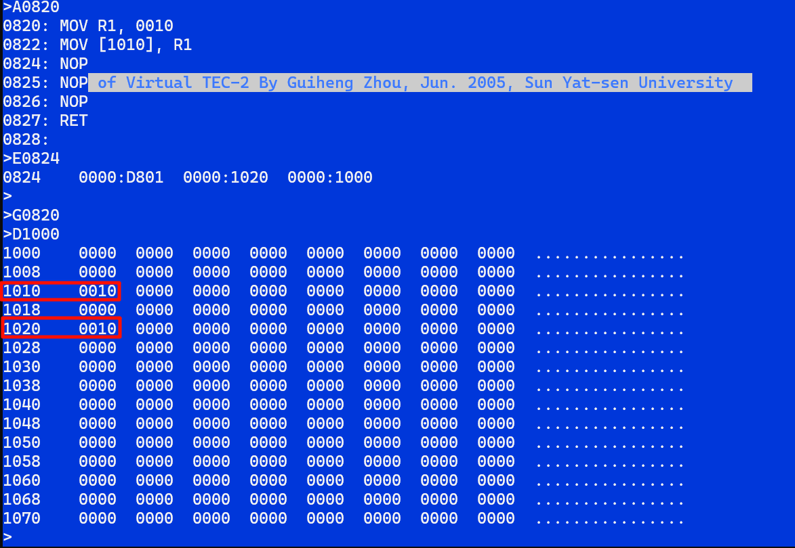
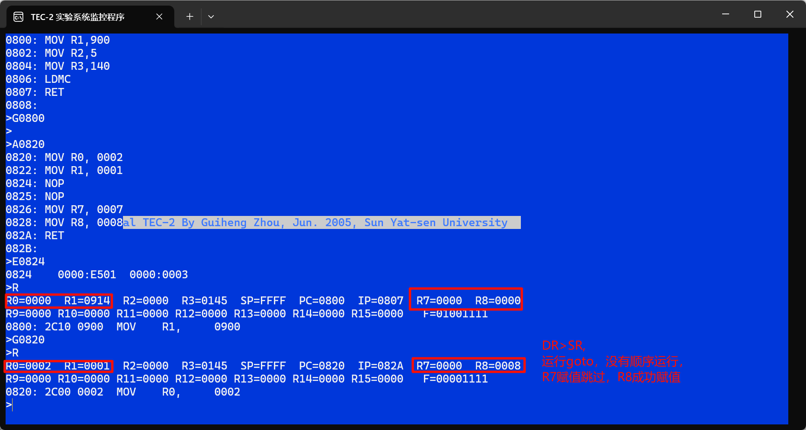

## 一、目的和要求

深入了解计算机各种指令的执行过程，以及控制器的组成，指令系统微程序设计的具体知识，进一步理解和掌握动态微程序设计的概念；完成微程序控制的特定功能计算机的指令系统设计和调试。

要求清楚懂得以下内容：

（1） TEC-2机的功能部件及其连接关系；

（2） TEC-2机每个功能部件的功能与具体组成；

（3） TEC-2机支持的指令格式；

（4） TEC-2机的微指令格式，AM2910芯片的用法；

（5） 已实现的典型指令的执行实例，即相应的微指令与其执行次序的安排与衔接；

（6） 要实现的新指令的格式与功能。

## 二、实验环境

1. TEC-2机一台
2. 电脑一台
3. TEC-2模拟软件一套

## 三、具体内容

### 1 运算器知识

#### Am2901 的控制与操作

为了控制Am2901运算器按我们的意图完成预期的操作功能,就必须向其提供相应的控制信号和数据。

**控制信号包括:** 

选择ALU的八种运算（三种算术、五种逻辑运算）功能中我们所要求的一种。这可通过提供三位功能选择码I5 I4 I3实现。如表2.1所示。

选择送入ALU的两个操作数据 R和S的组合关系（实际来源）。表上已标明, R从D和A中选择, S从A、B和Q中选择, 再考虑到两边还均可选"0"值,  则我们可以从这许多可能组合中选取最有用的8种组合, 即A、Q组合, A、B组合, O、Q组合, 0、B组合, 0、A组合, D、A组合, D、Q组合,  D、O组合 ，并用I2 I1 I0三位操作数选择码控制二组多路选通门选取其一, 具体规定如表2.1所示。

选择运算结果或有关数据以什么方式送往何处的处理方案, 这主要指通用寄存器组和Q寄存器执不执行接收操作或移位操作,  以及向芯片输出信息Y提供的是什么内容。这是通过 I8 I7 I6三位结果选择码来控制三组相应的选择门电路实现的, 具体规定如表2.1所示。


**外部的数据包括:** 

(1)通过D接收外部送来的数据, 这已经在ALU的操作数来源选择中解决。

(2)应正确给出芯片的最低位的进位输入信号Cn。

(3)关于左右移位操作过程中的RAM3、RAM0、Q3和Q0的处理, 左移操作时RAM3与Q3为输出, RAM0和Q0为输入；相反, 右移操作时,  RAM0和Q0为输出, RAM3和Q3为输入, 这是由I8和I7共同控制的。这几个外部信息的接收与送入，需要在 Am2901芯片之外用另外的电路解决。

(4)四个标志位的值的接收与记忆电路, 需在Am2901芯片之外实现。

(5)当执行通用寄存器组的读操作时，由外部送入的A地址选中的通用寄存器的内容送往A端口,由B地址选中的通用寄存器的内容送往B端口,  B地址还用作通用寄存器的写入控制。由于有16个通用寄存器, 故A、B地址均由4位组成。当A、B地址给出同一数值时, 则将选中同一通用寄存器,  此时A、B端口同时输出同一寄存器的内容。

(6)如有通用寄存器组的写操作时, 结果将写入由B地址选择的寄存器中。

(7)芯片的输出数据Y可以从AUL的运算结果F或A口的数据二者之中选择其一。

#### 运算器的控制与操作

关于数据, 主要是D15-D0这16位数据输入, 这可以用教学计算机上的16位数据开关直接提供。

关于控制信号, 当我们不考虑教学计算机的其它功能部件, 尤其是不提供控制器支持时,  就只能用实验机上的两个12位的微型开关SW2和SW1来向运算器提供全部的控制信号, 包括I8-I0, SST, A地址、B地址、SCi,  SSH共24位。其具体安排如图5.1所示。


这样就可以借助开关、按钮、指示灯来操作和控制运算器的运算操作，观察运算器的运算结果，这就是我们称之为脱机的运算器实验方式。用这种方式学习、理解运算器的组成与运行机制是足够简便直观的。

当我们把运算器部件接入教学机整机之内运行时, 就不能靠微型开关来为其提供控制信号,  而改由控制器来给出前面刚提到的这24位控制信号。在微程序控制方式下, 这些控制信号是由一个被称之为微指令寄存器PLR的相应的24位直接提供的,  它与24位的微型开关提供的信号是互斥关系,  可用二选一逻辑来指明选用它们中的哪24位控制信号。二选一逻辑的选择控制信号就是教学机上设置的FS4功能选择开关。当其状态为"1"(开关向上拨),  选通微型开关的信号作为控制信号, 为"0"时, 选通控制器的PLR的24位信号作为控制信号, 如图5.2所示。


LS240器件与PLR器件的输出均有三态控制逻辑, 当选通信号为低电位时, 器件输出有效, 否则输出为高阻态。

### 2 控制器知识

#### 控制器的功能、组成概述

控制器部件是计算机的五大功能部件之一，其作用是向整机每个部件(包括控制器部件本身)提供协同运行所需要的控制信号。计算机的最本质的功能是连续执行指令，而每一条指令往往又要分成几个执行步骤才得以完成。由此又可以说，计算机控制器的基本功能，是依据当前正在执行的指令和它所处的执行步骤，形成(或称得到)并提供出在这一时刻整机各部件要用到的控制信号。

执行一条指令，要经过读取指令、分析指令、执行指令所规定的处理功能三个阶段完成，控制器还要保证能按程序中设定的指令运行次序，自动地连续执行指令序列。

为此，控制器组成中，必须有一个能提供指令在内存中的地址的部件，通称程序计数器(PC)，服务于读取指令，并接收下条要执行的指令的地址。

还要有一个能保存读来的指令内容的部件，通称指令寄存器(IR)，以提供本指令执行的整个过程中要用到的指令本身的主要信息。

控制器的第三个组成成分，是脉冲源、启停控制逻辑，指令执行的步骤标记线路，它标记出每条指令的各执行步骤的相对次序关系。

控制器的第四个、也是控制器设计中最费力的一个组成成分，是全部时序控制信号的产生部件，它依据指令内容、指令的执行步骤(时刻)，也许还有些别的什么条件信号，来形成并提供出当前各部件本时刻要用到的控制信号。计算机整机各硬件系统，正是在这些信号控制下协同运行，产生予期的执行结果，也就是执行一条又一条的指令。

依据前述控制器的最后两个组成成分的具体组成与运行原理的不同，通常把控制器区分为微程序的控制器和组合逻辑(硬布线)的控制器两大类。教学计算机系统中，分别设计并实现了这两种控制器，为教学提供了比较理想的实例，也为实验人员开辟了选择使用与进行实验的广阔天地。图1.1给出了控制器组成与其在整机中地位的示意表示。


#### 微程序控制器的设计与实现

1. 基本组成部分

基本组成指的是该控制器的必不可少的组成部分，如图3.4所示。它与微程序设计的最基本的原理直接相关，是课程的重点内容。
从图3.1可以看出该控制器的基本组成部件及它们相互间的逻辑关系。

最核心的部分是控制存储器，用于存放教学机的微程序，由56位组成，用7片74LS6116随机读写的8位×2048字的内存芯片实现。通常控存都是用ROM芯片实现，把厂家设计好的微程序固化在里边，仅提供读操作功能，可靠性更高些。教学机要支持动态微程序设计，即允许实验人员把自己设计的微程序写进控存，我们只能用可读写存储器支持这一要求。这还带来一个新的问题，即在实验机加电启动时，首先必须把已设计好的53条机器指令用到的微程序调入控存，这个问题将到该控制器的辅助组成部分去进一步讲解。正常执行微程序时，该控存将依据Am2910提供给它的10位地址，在读写命令W/R(为高是读操作)控制下读出相应单元的一条微指令。


读出的微指令将通过CP脉冲，打入该控制器的第二个组成部件——微指令寄存器PLR中。前边已提到过，一条微指令的内容通常由下地址和控制信号(微命令)两部分组成。下地址可能又被分成几个小字段，它们被用于控制、形成、或直接提供下一条微指令的地址，是供给控制器部件本身使用的。微命令也由若干个小字段组成，提供对计算机其它功能部件，如运算器、主存、输入/输出设备的控制信号。在第二章，我们已看到用于控制运算器的许多控制信号。在本小节稍后部分，将详细介绍教学计算机的微指令的格式和每个字段的内容及其控制功能。

该控制器的第三个组成成分，是微程序定序器Am2910器件及其配套电路。

在本教学计算机的实现中，已把Am2910的/OE端接地，使其输出Y11-Y0总保持有效(实用Y9-Y0共10位)。

把/CCEN接地，使Am2910的条件判断结果只取决于/CC。

把CI接电源，使微指令地址 +1总是执行。

用/VECT信号把通过水平板上的开关给出的10位微指令的手拨地址接通到Am2910的D输入端。

分别用/MAP和/PL两个信号选通MAPROM和微指令下地址字段的输出送到Am2910的D输入端，从而形成D输入端的3选1逻辑功能。

与Am2910配套的电路，主要包括MAPROM和用于形成/CC信号逻辑值的条件判定线路。MAPROM被用作为指令微地址映射部件，它变换指令的操作码为该指令对应的微程序段入口地址，由两片74LS2716  ROM芯片组成，其地址为指令的操作码，对应单元中存放相应微程序段的入口地址，执行读操作，并用/MAP选通读出的信息，解决的是指令功能分支问题。

关于/CC条件码的形成问题，需解决指明判定条件和完成条件判定两个方面的需求。要判断的条件相当多，是通过微指令中下地址字段中的SCC(3位)和SC(1位)两个子字段指明的，其具体规定如表3.1所示,采用专门的硬件电路，即一片Gal20v8器件实现表中所规定的功能。


表中的FS1、FS2和FS3是水平板上的3个功能开关，用于选择教学机执行不同的操作功能，其具体规定如表3.2所示


/WAIT是教学处于单步执行时，用于单步控制线路的等待状态(等待按下STEP微型按键)。

C、Z、V、S或它们的取反值/C、/Z、/V、/S是运算器中的四个状态标志位。当SCC的3位微码为111,即十进制编码值为7时，通过条件转移指令的指令操作码  IR的第10-8位选择它们，以形成条件码/CC的值。

当SC为1时，通过SCC三位编码的2、3、4和5状态选择/C、/Z、/V、/S形成条件码/CC的值，用于非条件转移指令所用的微指令中。

/INT为中断请求信号，低电平有效，在每条指令结束时，判有无中断请求，以确定转中断处理还是执行下一条指令。

采用专门的硬件电路，即一片Gal20v8器件实现表3.2所规定的功能。

微指令字下地址字段中还有一个子字段CI3-CI0，用于给出Am2910的命令码，它与/CC的取值、Am2910内部的R/C的内容是否为零等一起，共同决定Am2910芯片内部的操作和形成下一条微指令地址的具体办法。

#### 自行设计新指令的微程序

所谓新指令，是指教学机支持的64条基本指令中未实现、留给学生自行设计与实现的11条机器指令，即指令汇总表中最后的11条指令。这11条指令的情况是:

——  6位操作码已定，为D4、D8、DC、E0、E4、E8、EC、F0、F4、F8和FC，这是按8位长度的16进制方式给出的。其最低两位，可用于选择C、Z、V、S四个标志位作条件转移指令的判别条件。

——  这11条指令的微程序段的入口地址已定为100h，110h，120h,...1FEh。这是由MAPROM器件的内容限定的,这些内容已写好在该器件的相应单元中。

——  这11条指令没有相应的汇编语句名，执行的功能也未定义。但在使用时，必须使其指令格式与已实现的53条指令的格式类同，如要用C、Z、V、S作为判别条件，只能用指令寄存器的第9,8两位编码加以标明，作为写入用的寄存器编号只能通过IR7-IR4标明等等。使用不当，目前已给出的硬件可能无法直接支持。
设计新指令的微程序段将涉及以下几个问题:

—— 选定指令格式及功能，包括确定要用的操作码，指令中其它字段的内容分配与使用，本指令要实现的具体功能。

—— 按新指令的功能与格式，设计该指令的执行过程，即分成几步完成，每一步要实现的详细操作细节，各步之间的衔接次序等。

——  将每一步中的操作，用一条微指令实现，即具体设计每条微指令各字段的具体编码值，既包括控制码的各字段，也包括下地址字段，形成下地址用到的条件码等等。

—— 将设计好的微码，装入控制存储器的相应单元。

—— 设计一个使用新、旧指令的用户程序，检查程序运行的正确性，以确定新指令是否正确执行，对新指令的执行过程仔细调试，直到得到满意的结果。

这一过程中的向控存中装入新指令的微码有两种方法，一是通过水平板上的开关与按键直接拨入，具体操作方法参见教学计算机补充材料；二是在程序中用LDMC指令指令实现自动装入，其具体操作步骤介绍如下。

作为例子，最简单的方法，是抄一条现有指令作为新指令予以实现。例如，操作码选D4，指令格式选为D4 DR，SR,,实现DR+SR→DR的功能。它就是ADD  DR，SR那条指令，差别仅是操作码由04变为D4。查指令汇总表，D4操作码的微指令的入口地址应为100h,故将1Ch地址中的微指令(实现ADD  DR，SR的操作)中的内容复制到100h单元，就完成了这条新指令的微程序设计的过程。看下面一个程序例子。

```
<A800
800: MOV R8, 240 ；为指令的目的寄存器赋初值
MOV R9， 360 ；为指令的源寄存器赋初值
MOV  R1， 900 ；微码在内存的首地址
MOV R2, 1 ；微指令条数
MOV R3， 100 ；微码在控存中的首地址
LDMC  ；用R1,R2,R3作为参数,装入微码
D489 ；新指令的二进制执行码
RET
<E900
900：  0029...0301....b090....0088
```

以上用到的数值均为16进制。在监控命令工作时，输入均用16进制数，且都不能跟h字符。

该程序的功能是将240和360两个16进制形式的整数分别送入R8和R9。用新指令 (机器码为D489：操作码为D4，DR选R8,SR选R9)  完成两个寄存器的内容相加，结果写入R8。

该程序当中的4条指令，实现的是装入新指令的微码。微码在内存的首地址为900，四个字的内容为0029，0301，b090，0088，是控存1CH单元的内容，可以用监控程序的E命令键入。

该程序可以用监控程序的命令打入。倒数第2行的D489是新指令的机器码，不能在A命令方式下打入。具体操作过程，可以在A命令方式下，先在此处打入任何一条单字指令，例如，MOV  R0，R0。整个程序输入后，再将该单元的内容用E命令改为D489，该程序运行过程中，在为R8,R9赋值后，接着装入新指令的微码，再执行新指令，最后返回监控程序以结束该程序的执行过程。

该程序运行结束后，用R命令检查程序的执行结果，R8的值应变为05A0。

从这个例子可以得出以下几个结论:

—— 新旧指令可以用在同一程序中；
—— 新指令在每次教学机重新加电后，至少得重新装入一次对应的微码；  仅在装入相应微码后，新指令才能执行，即已将新指令追加到教学的指令系统中；
——  新指令无汇编码(因汇编程序实现在前，新指令实现在后)，故在程序中，只能通过机器码使用新指令；否则必须去扩展有关的汇编程序。
——  装入新的微指令与使用新指令变得非常容易，同学的精力就可以全部集中到微程序设计方面来。但必须想到，新、旧指令的微程序之间存在着如下协调与配合关系:
前边的例子中，只设计了新指令的具体执行功能，执行前的取指过程和执行后的判中断、与下条指令的衔接等均使用了原微程序的有关内容。从同学学习微程序设计的角度看，取指过程与每条指令完成后的相应处理是公用于所有指令的，而且比较简单，看懂原来的实现方法与细节，以及与每条指令执行过程的衔接方式，也就达到了深入掌握的程度，故一般不必在自己设计的微程序中考虑这一部分内容。若有的学生想在自己的微程序中实现自己设计的取指等处理过程，必须保证在新旧指令衔接时不出现矛盾。最简单的方法，是在自己的多条新指令中，有几条指令有自己设计的取指与后续处理，它们不能与原有指令的微程序段正确衔接。但有一条新指令用原有指令的取指处理完成取指过程，有另一条新指令用原有指令的后续处理完成判中断，保证能正确与原有指令的取指过程衔接。当用这样的两条指令“夹”起的其它新指令序列出现在任何程序中时，每条指令均将能正确衔接执行。
设计不同格式与功能的新指令的执行步骤，以及每一步中的微指令字的各字段的编码，是学习计算机微程序设计的重点，也是学懂计算机指令执行过程的核心内容。

### 3 提示

#### 微指令

PC: Program Counter (程序计数器)。程序开始时PC指向指令的第二个字，即第一个参数

AR: Address Register (地址寄存器)

MEM: Memory (当出现MEM的时候，就是在对"AR"存的地址取值)

AR相当于"指针"，MEM相当于"值"

Q: Q Register (用于计算)

注意：用G命令运行用于测试微程序的汇编程序后，汇编程序本身可能会发生变化，需要重新编辑。这通常是由于微指令设计存在问题。

#### 微码


指令中的DR位于B口，SR位于A口


DC2：选择哪个寄存器来接受来自IB的数据。一般为0，需要写入AR时设置为010 

A口、B口：需要使用SP、PC、IP（R4-R6）等寄存器时设置为寄存器的地址，分别为0100、0101、0110

SA=0  A口的值来自A口地址

SA=1  A口的值来自SR

SB=0  B口的值来自B口地址

SB=1  B口的值来自DR


# 四、实验内容

## 4.1 减法指令

指令格式：D5DRSR，ADDR   双字指令（控存入口100H）

功能：  DR=SR -[ADDR]

### 4.1.1 微程序 

```
PC->AR,PC+1->PC	
MEM->AR
MEM->Q
SR-Q->Q
Q->DR,CC#=0 
```

### 4.1.2 微程序流程

| 微指令               | 流程                                                         |
| -------------------- | ------------------------------------------------------------ |
| PC -> AR, PC+1 -> PC | 将程序计数器 `PC` 的值加载到地址寄存器 `AR` 中，并将 `PC` 加1。 |
| MEM -> AR            | 从内存读取地址 `ADDR` 到地址寄存器 `AR` 中。                 |
| MEM -> Q             | 从内存地址 `ADDR` 读取数据到寄存器 `Q` 中。                  |
| SR - Q -> Q          | 将源寄存器 `SR` 和寄存器 `Q` 的值相减，结果存储到寄存器 `Q` 中。 |
| Q -> DR, CC#=0       | 将寄存器 `Q` 的值写入目标寄存器 `DR`，并清除条件码。         |


### 4.1.3 微指令对应微码：

| 微指令               | 微指令编码            |
| -------------------- | --------------------- |
| PC -> AR, PC+1 -> PC | `0000 0E00 A0B5 5402` |
| MEM -> AR            | `0000 0E00 00F0 0000` |
| MEM -> Q             | `0000 0E00 00F0 0000` |
| SR - Q -> Q          | `0000 0E01 00E0 0000` |
| Q -> DR, CC#=0       | `0029 0300 1020 0010` |


### 4.1.4 微码分析：


1. **PC -> AR, PC+1 -> PC**
   - 微指令：`0000 0E00 A0B5 5402`
   - **意义**：将程序计数器 `PC` 的值加载到地址寄存器 `AR` 中，并将 `PC` 加1。
   - 具体操作：
     - `CI3-0`：顺序执行
     - `I8-6`：ALU结果F=PC+1 -> B=R5=PC, A=R5=PC -> AM2901输出Y
     - `I5-3`：ALU结果F=R+S
     - `I2-0`：R=0, S=B=R5=PC
     - `A口`：R5, PC
     - `B口`：R5, PC
     - `SCi`：进位
     - `DC2`：AM2901输出Y -> AR
2. **MEM -> AR**
   - 微指令：`0000 0E00 00F0 0000`
   - **意义**：从内存读取地址 `ADDR` 到地址寄存器 `AR` 中。
   - 具体操作：
     - `CI3-0`：顺序执行
     - `/MI0 REQ /WE`：存储器读MEM送到AM2901外部输入D
     - `I8-6`：ALU结果F送AM2901输出Y
     - `I5-3`：ALU结果F=R+S
     - `I2-0`：R=ALU输入D, S=0
     - `DC2`：AM2901输出Y -> AR
3. **MEM -> Q**
   - 微指令：`0000 0E00 00F0 0000`
   - **意义**：从内存地址 `ADDR` 读取数据到寄存器 `Q` 中。
   - 具体操作：
     - `CI3-0`：顺序执行
     - `/MI0 REQ /WE`：存储器读MEM送到AM2901外部输入D
     - `I8-6`：ALU结果F送寄存器Q, ALU结果F送AM2901输出Y
     - `I5-3`：ALU结果F=R+S
     - `I2-0`：R=ALU输入D, S=0
4. **SR - Q -> Q**
   - 微指令：`0000 0E01 00E0 0000`
   - **意义**：将源寄存器 `SR` 和寄存器 `Q` 的值相减，结果存储到寄存器 `Q` 中。
   - 具体操作：
     - `CI3-0`：顺序执行
     - `SST`：接收ALU的标志位输出值
     - `/MI0 REQ /WE`：存储器读MEM送到AM2901外部输入D
     - `I8-6`：ALU结果F=R-S=SR-Q -> Q
     - `I5-3`：F=R-S=D-Q=SR-Q
     - `I2-0`：R=D, S=Q
5. **Q -> DR, CC#=0**
   - 微指令：`0029 0300 1020 0010`
   - **意义**：将寄存器 `Q` 的值写入目标寄存器 `DR`，并清除条件码。
   - 具体操作：
     - `CI3-0`：条件转移, 3#
     - `/MI0 REQ /WE`：存储器写, 内部总线数据IB写入MEM
     - `I8-6`：ALU结果F送AM2901输出Y
     - `I5-3`：F=R+S=0+Q
     - `I2-0`：R=0, S=Q
     - `DC1`：运算器输出Y送内部总线IB


### 4.1.5 测试、遇到问题及解决方案

1）输入微码

将微码输入到由0900H开始的内存单元中。

用E命令输入微码，回车后输入微程序。每个数值间以空格分开，输入完毕后按回车键。

```
E0900
0000 0E00 A0B5 5402 0000 0E00 00F0 0000 0000 0E00 00F0 0000 0000 0E01 00E0 0000 0029 0300 1020 0010
```


2）编写用于加载微码的汇编指令

从0800地址开始输入汇编语句

```
A0800         
```

```
MOV R1, 900   ; 微码从0900地址开始
MOV R2, 5     ; 有5条微指令
MOV R3, 100   ; 控存为100H，对应操作码为D5
LDMC          ; 装入微码
RET           ; 汇编语句结束，子程序返回
```

3）运行用于加载微码的汇编指令

```
G0800
```


4）编写用于测试做好的微程序的汇编指令

```
A0820         ; 从0820地址开始输入汇编语句
```

两个NOP空操作是为了给我们编写的微程序（双字指令）留位置。我们自定义的指令 `D501 1100` 不能直接用A命令写在内存里，会报错。

```asm
MOV R1, 0010	
MOV [1100],R1
NOP
NOP
RET           ; 汇编语句结束，子程序返回
```


5）测试做好的微程序的汇编指令

用E命令直接编辑两个NOP

把NOP编辑为我们的双字指令。

```
E0824
D501 1100
```

运行用于测试我们做好的微程序的汇编指令

```
G0820
```

R命令查看寄存器地址

```
R
```

6）测试结果及分析


R0=R1-ADDR的值

R1=SR=0010

ADDR=1100,[ADDR]=R1=SR=0010

所以,R0=DR=0000


7）总结设计过程中遇到的问题，以及解决的过程。

问题：如何用简洁的语句编写用于测试做好的微程序的汇编指令

过程：采用下方的微程序，令R1与ADDR的值相同，当R0=0000时，说明结果正确

```
E0900
0000 0E00 A0B5 5402 0000 0E00 00F0 0000 0000 0E00 00F0 0000 0000 0E01 00E0 0000 0029 0300 1020 0010

A0800
MOV R1, 900   
MOV R2, 5     
MOV R3, 100   
LDMC          
RET

G0800
A0820
MOV R1, 0010
MOV [1200],R1
MOV R1,0020
NOP
NOP
RET           

E0824
D501 1100

G0820
R
```

 

 

 

## 4.2 传送指令

指令格式：D8DRSR，ADDR1，ADDR2  三字指令（控存入口110H）

功能：  [ADDR1]←[ADDR2+SR]

### 4.2.1 微程序 


```
PC+1 -> AR, PC+1 -> PC            
MEM+SR->AR           
MEM->Q              
PC-1 -> AR,PC+1->PC     
PC+1->PC            
MEM->AR             
Q->MEM, CC#=0       
```


### 4.2.2 微程序流程

| 微指令                 | 流程                                                         |
| ---------------------- | ------------------------------------------------------------ |
| PC+1 -> AR, PC+1 -> PC | 将程序计数器 `PC` 的值加1后加载到地址寄存器 `AR` 中，同时将 `PC` 的值加1。 |
| MEM + SR -> AR         | 从内存读取数据并加上源寄存器 `SR` 的值，然后将结果加载到地址寄存器 `AR` 中。 |
| MEM -> Q               | 从内存读取数据到寄存器 `Q` 中。                              |
| PC-1 -> AR, PC+1 -> PC | 将程序计数器 `PC` 的值减1后加载到地址寄存器 `AR` 中，同时将 `PC` 的值加1。 |
| MEM -> AR`             | 从内存读取数据到地址寄存器 `AR` 中。                         |
| Q -> MEM, CC#=0        | 将寄存器 `Q` 的值写入内存，并清除条件码。                    |


### 4.2.3 微指令对应微码：


| 微指令                 | 微码                  |
| ---------------------- | --------------------- |
| PC+1 -> AR, PC+1 -> PC | `0000 0E00 90B0 5402` |
| MEM + SR -> AR         | `0000 0E00 10D0 008A` |
| MEM -> Q               | `0000 0E00 00F0 0000` |
| PC-1 -> AR, PC+1 -> PC | `0000 0E00 B0B0 5402` |
| MEM -> AR              | `0000 0E00 10F0 0002` |
| Q -> MEM, CC#=0        | `0029 0300 1020 0010` |


### 4.2.4 微码分析：


1. **PC+1 -> AR, PC+1 -> PC**
   - 微指令：`0000 0E00 90B0 5402`
   - **意义**：将程序计数器 `PC` 加1后的值加载到地址寄存器 `AR` 中，并将 `PC` 加1。
   - 具体操作：
     - `CI3-0`：顺序执行
     - `I8-6`：ALU结果F=PC+1 -> B=R5=PC, A=R5=PC -> AM2901输出Y
     - `I5-3`：ALU结果F=R+S
     - `I2-0`：R=0, S=B=R5=PC
     - `A口`：R5, PC
     - `B口`：R5, PC
     - `SCi`：进位
     - `DC2`：AM2901输出Y -> AR
2. **MEM+SR -> AR**
   - 微指令：`0000 0E00 10D0 008A`
   - **意义**：将内存中的值与源寄存器 `SR` 的值相加，结果存储到地址寄存器 `AR` 中。
   - 具体操作：
     - `CI3-0`：顺序执行
     - `/MI0 REQ /WE`：存储器读MEM送到AM2901外部输入D
     - `I8-6`：ALU结果F=MEM+SR -> AM2901输出Y
     - `I5-3`：ALU结果F=R+S
     - `I2-0`：R=ALU输入D, S=SR
     - `DC2`：AM2901输出Y -> AR
3. **MEM -> Q**
   - 微指令：`0000 0E00 00F0 0000`
   - **意义**：从内存地址 `ADDR` 读取数据到寄存器 `Q` 中。
   - 具体操作：
     - `CI3-0`：顺序执行
     - `/MI0 REQ /WE`：存储器读MEM送到AM2901外部输入D
     - `I8-6`：ALU结果F送寄存器Q, ALU结果F送AM2901输出Y
     - `I5-3`：ALU结果F=R+S
     - `I2-0`：R=ALU输入D, S=0
4. **PC -> AR, PC+1 -> PC**
   - 微指令：`0000 0E00 B0B0 5402`
   - **意义**：将程序计数器 `PC` 的值加载到地址寄存器 `AR` 中，并将 `PC` 加1。
   - 具体操作：
     - `CI3-0`：顺序执行
     - `I8-6`：ALU结果F=PC -> B=R5=PC, A=R5=PC -> AM2901输出Y
     - `I5-3`：ALU结果F=R+S
     - `I2-0`：R=0, S=B=R5=PC
     - `A口`：R5, PC
     - `B口`：R5, PC
     - `SCi`：进位
     - `DC2`：AM2901输出Y -> AR
5. **PC+1 -> PC**
   - 微指令：`0000 0E00 10F0 0002`
   - **意义**：将程序计数器 `PC` 加1。
   - 具体操作：
     - `CI3-0`：顺序执行
     - `I8-6`：ALU结果F=PC+1 -> B=R5=PC, A=R5=PC -> AM2901输出Y
     - `I5-3`：ALU结果F=R+S
     - `I2-0`：R=0, S=B=R5=PC
     - `A口`：R5, PC
     - `B口`：R5, PC
     - `SCi`：进位
6. **MEM -> AR**
   - 微指令：`0000 0E00 10F0 0002`
   - **意义**：从内存读取地址 `ADDR` 到地址寄存器 `AR` 中。
   - 具体操作：
     - `CI3-0`：顺序执行
     - `/MI0 REQ /WE`：存储器读MEM送到AM2901外部输入D
     - `I8-6`：ALU结果F送AM2901输出Y
     - `I5-3`：ALU结果F=R+S
     - `I2-0`：R=ALU输入D, S=0
     - `DC2`：AM2901输出Y -> AR
7. **Q -> MEM, CC#=0**
   - 微指令：`0029 0300 1020 0010`
   - **意义**：将寄存器 `Q` 的值写入内存，并清除条件码。
   - 具体操作：
     - `CI3-0`：条件转移, 3#
     - `/MI0 REQ /WE`：存储器写, 内部总线数据IB写入MEM
     - `I8-6`：ALU结果F送AM2901输出Y
     - `I5-3`：F=R+S=0+Q
     - `I2-0`：R=0, S=Q
     - `DC1`：运算器输出Y送内部总线IB

### 4.2.5 测试、遇到问题及解决方案

1）输入微码

```
E0900
0000 0E00 90B0 5402 0000 0E00 10D0 008A 0000 0E00 00F0 0000 0000 0E00 A0B5 5402 0000 0E00 B0B0 5400 0000 0E00 10F0 0002 0029 0300 1020 0010
```

2）编写用于加载微码的汇编指令

```

A0800
MOV R1, 900
MOV R2, 7
MOV R3, 110
LDMC
RET
```

3）运行用于加载微码的汇编指令

```
G0800
```

4）编写用于测试做好的微程序的汇编指令

```
A0820
MOV R1, 0010
MOV [1010], R1
NOP
NOP
NOP
RET
```

5）测试做好的微程序的汇编指令

```
E0824
D801 1020 1000

G0820
D1000
```

6）测试结果及分析



ADDR1=1020

ADDR2+SR=1010

[1010]=0010

所以当[ADDR1]=[1020]=0010，说明程序正确运行

7）总结设计过程中遇到的问题，以及解决的过程。

 问题：如何用简洁的语句编写用于测试做好的微程序的汇编指令

过程：采用下方的微程序，令1010与1020的值相同，说明结果正确

```
E0900
0000 0E00 90B0 5402 0000 0E00 10D0 008A 0000 0E00 00F0 0000 0000 0E00 A0B5 5402 0000 0E00 B0B0 5400 0000 0E00 10F0 0002 0029 0300 1020 0010

A0800
MOV R1, 900
MOV R2, 7
MOV R3, 110
LDMC
RET

G0800

A0820
MOV R1, 0010
MOV [1010], R1
NOP
NOP
NOP
RET

E0824
D801 1020 1000

G0820
D1000
```


## 4.3 转移指令

判断两个通用寄存器内容是否相等，若相等则转移到指定目的地址（(IP)+DISP），否则顺序执行。

指令格式：E0 DR SR，DISP 双字指令（控存入口130H, DISP为相对转移地址偏移量）

功能：  if DR>SR goto IP+DISP else  顺序执行。

### 4.3.1 微程序 


```
DR-SR                  			
PC->AR ,PC+1->PC       
CC#=/S					
MEM+IP->IP,CC#=/Z,8Eh  
CC#=0                  
```


### 4.3.2 微程序流程


| 微指令                 | 流程                                                         |
| ---------------------- | ------------------------------------------------------------ |
| PC+1 -> AR, PC+1 -> PC | 将程序计数器 `PC` 的值加1后加载到地址寄存器 `AR` 中，同时将 `PC` 的值加1。 |
| MEM + SR -> AR         | 从内存读取数据并加上源寄存器 `SR` 的值，然后将结果加载到地址寄存器 `AR` 中。 |
| MEM -> Q               | 从内存读取数据到寄存器 `Q` 中。                              |
| PC-1 -> AR, PC+1 -> PC | 将程序计数器 `PC` 的值减1后加载到地址寄存器 `AR` 中，同时将 `PC` 的值加1。 |
| MEM -> AR`             | 从内存读取数据到地址寄存器 `AR` 中。                         |
| Q -> MEM, CC#=0        | 将寄存器 `Q` 的值写入内存，并清除条件码。                    |


### 4.3.3 微指令对应微码：

| 微指令               | 微码                |
| -------------------- | ------------------- |
| DR-SR                | 0000 0E01 9190 0088 |
| PC->AR ,PC+1->PC     | 0000 0E00 A0B5 5402 |
| CC#=/S               | 0029 03B0 9080 0000 |
| MEM+IP->IP,CC#=Z,8Eh | 0023 83E0 30D6 6000 |
| CC#=0                | 0029 0300 9080 0000 |


### 4.3.4 微码分析：

1. **DR - SR**
   - 微指令：`0000 0E01 9190 0088`
   - **意义**：将目标寄存器 `DR` 和源寄存器 `SR` 的值相减，结果存储到 `DR` 中。
   - 具体操作：
     - `CI3-0`：顺序执行
     - `I8-6`：ALU结果F=DR-SR -> AM2901输出Y
     - `I5-3`：ALU结果F=R-S
     - `I2-0`：R=DR, S=SR
     - `A口`：DR
     - `B口`：SR
     - `DC2`：AM2901输出Y -> DR
2. **PC -> AR, PC+1 -> PC**
   - 微指令：`0000 0E00 A0B5 5402`
   - **意义**：将程序计数器 `PC` 的值加载到地址寄存器 `AR` 中，并将 `PC` 加1。
   - 具体操作：
     - `CI3-0`：顺序执行
     - `I8-6`：ALU结果F=PC -> B=R5=PC, A=R5=PC -> AM2901输出Y
     - `I5-3`：ALU结果F=R+S
     - `I2-0`：R=0, S=B=R5=PC
     - `A口`：R5, PC
     - `B口`：R5, PC
     - `SCi`：进位
     - `DC2`：AM2901输出Y -> AR
3. **CC#=/S**
   - 微指令：`0029 03B0 9080 0000`
   - **意义**：条件码不等于符号标志位 `S` 时执行特定操作。
   - 具体操作：
     - `CI3-0`：条件转移, 3#
     - `I8-6`：ALU结果F送AM2901输出Y
     - `I5-3`：ALU结果F=R+S
     - `I2-0`：R=0, S=0
     - `DC1`：运算器输出Y送内部总线IB
     - `CC#`：条件码不等于符号标志位 `S`
4. **MEM + IP -> IP, CC#=Z, 8Eh**
   - 微指令：`0023 83E0 30D6 6000`
   - **意义**：将内存中的值与指令指针 `IP` 相加，结果存储到 `IP` 中，并根据结果设置零标志位 `Z`。
   - 具体操作：
     - `CI3-0`：顺序执行
     - `/MI0 REQ /WE`：存储器读MEM送到AM2901外部输入D
     - `I8-6`：ALU结果F=MEM+IP -> AM2901输出Y
     - `I5-3`：ALU结果F=R+S
     - `I2-0`：R=ALU输入D, S=IP
     - `DC2`：AM2901输出Y -> IP
     - `CC#`：根据结果设置零标志位 `Z`
5. **CC#=0**
   - 微指令：`0029 0300 9080 0000`
   - **意义**：清除条件码。
   - 具体操作：
     - `CI3-0`：条件转移, 3#
     - `I8-6`：ALU结果F送AM2901输出Y
     - `I5-3`：ALU结果F=R+S
     - `I2-0`：R=0, S=0
     - `DC1`：运算器输出Y送内部总线IB
     - `CC#`：清除条件码

### 4.3.5 测试、遇到问题及解决方案

1）输入微码

```
E900
0000 0E01 9190 0088 0000 0E00 A0B5 5402 0029 03B0 9080 0000 0023 83E0 30D6 6000 0029 0300 9080 0000
```

2）编写用于加载微码的汇编指令

```
A800
MOV R1,900
MOV R2,5
MOV R3,140
LDMC
RET
```

3）运行用于加载微码的汇编指令

```
G0800
```

4）编写用于测试做好的微程序的汇编指令

```
A0820
MOV R0, 0002
MOV R1, 0001
NOP
NOP
MOV R7, 0007
MOV R8, 0008
RET
```

5）测试做好的微程序的汇编指令

```
E0824
E501 0003
R
G0820
R
```

6）测试结果及分析



DR=0002，SR=0001,DR>SR,成功运行goto，跳过了R7的赋值语句

7）总结设计过程中遇到的问题，以及解决的过程。

问题1：如何区分DR>SR,DR=SR,DR<SR的情况

过程：经分析，DR-SR后

若DR>SR,S=0,Z=0

若DR=SR,S=0,Z=1

若DR<SR,S=1,Z=0

故用两条判断语句，CC#=/S和CC#=Z完成判断

问题2：如何检测各种情况DR>SR,DR=SR,DR<SR

过程：改变R0R1的赋值

当DR>SR

```
E900
0000 0E01 9190 0088 0000 0E00 A0B5 5402 0029 03B0 9080 0000 0023 83E0 30D6 6000 0029 0300 9080 0000

A800
MOV R1,900
MOV R2,5
MOV R3,140
LDMC
RET

G0800

A0820
MOV R0, 0002
MOV R1, 0001
NOP
NOP
MOV R7, 0007
MOV R8, 0008
RET

E0824
E501 0003

R
G0820
R
```

 DR=SR

```
A0820
MOV R0, 0001
MOV R1, 0001
NOP
NOP
MOV R7, 0007
MOV R8, 0008
RET
```

DR<SR

```
A0820
MOV R0, 0001
MOV R1, 0002
NOP
NOP
MOV R7, 0007
MOV R8, 0008
RET
```


# 五、实验心得

 计算机组成原理课程设计是我进入大学以来接触的最困难的课程之一。从实验三：微程序控制器实验开始，堪称到处都是问题。

例如，

（1）微程序的微指令怎么来的？它的语法是什么？为什么PC可以直接写在编码里而ADDR1不行？

（2）微码是怎么来的？56个二进制变成十六进制怎么有16个？如果微码不小心写错了怎么调试？

（3）如何测试编好的微程序？微控存是什么？为什么指令的操作码是这个？为什么要有NOP？

如果解决了全部的这些问题，意味着课程设计已经进入尾声了。这次课程设计就是在边挖坑边填坑的过程中进行。

 

# 六、附加材料

《计算机组成原理实验指导书》

《TEC - 2 计算机组成原理实验系统 简明实验操作手册》

计算机组成原理课设Tec-2 01-基础入门
https://blog.csdn.net/qq_54869075/article/details/125249488

计算机组成原理课设Tec-2 02-实例分析 
https://blog.csdn.net/qq_54869075/article/details/125262669

计算机组成原理课设Tec-2 03-指令设计 
https://blog.csdn.net/qq_54869075/article/details/126899159

TEC-2 微程序设计与测试
https://www.cnblogs.com/daix6/p/4461895.html

TEC-2几条微指令的微码说明 & TEC-2微程序运行测试步骤 
https://www.cnblogs.com/joyeecheung/p/3687773.html

TEC-2机微程序设计实验
https://blog.csdn.net/qq_43594913/article/details/106735166

《计算机组成原理》课程设计报告——TEC-2实验系统——微程序设计
https://blog.csdn.net/weixin_43272781/article/details/106862614

