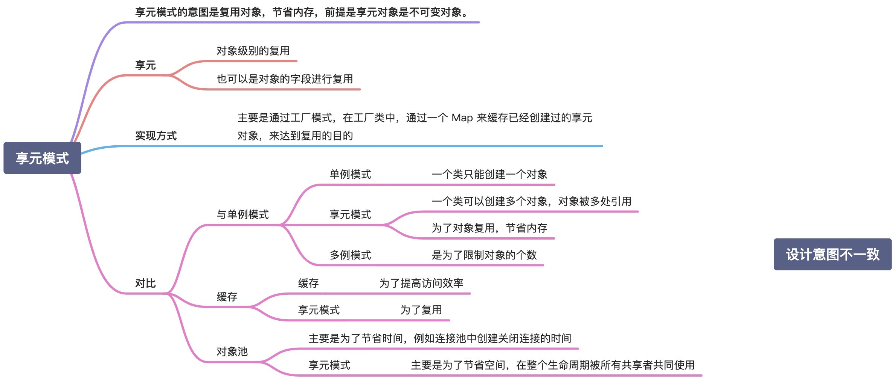

# 享元模式


In plain words 通俗易懂

> It is used to minimize memory usage or computational expenses by sharing as much as possible with similar objects.
> 它用于通过与类似对象共享尽可能多的内存使用或计算费用来最大程度地减少内存使用或计算费用。


And it can be used as below
它可以按以下方式使用

```php
$teaMaker = new TeaMaker();
$shop = new TeaShop($teaMaker);

$shop->takeOrder('less sugar', 1);
$shop->takeOrder('more milk', 2);
$shop->takeOrder('without sugar', 5);

$shop->serve();
// Serving tea to table# 1
// Serving tea to table# 2
// Serving tea to table# 5
```

