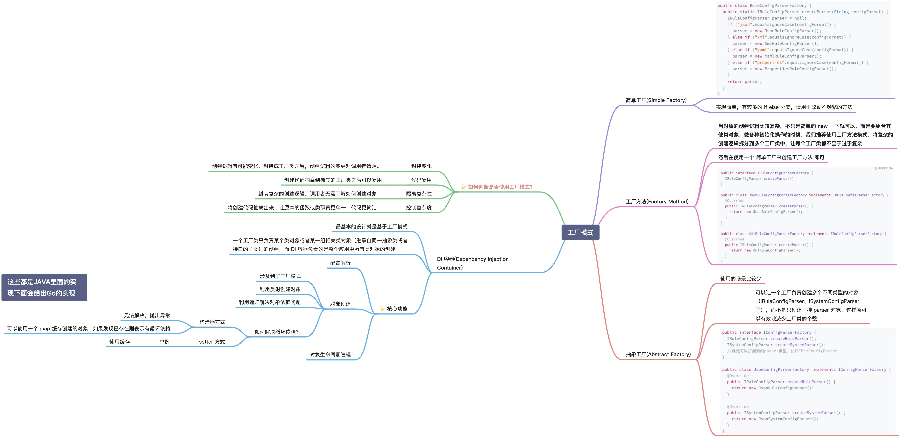

## 三种工厂模式的区别


## 概念


- **简单工厂模式**：通过一个工厂类来创建不同类型的对象，适合简单场景，但扩展性差。**Simple Factory 只是为 Client 端生成一个实例，而不向 Client 端公开任何实例化逻辑**
- **工厂方法模式**：定义一个创建对象的接口，由子类决定实例化哪一个类，遵循开闭原则，扩展性好。**它提供了一种将实例化逻辑委托给子类的方法。**
- **抽象工厂模式**：提供一个接口，用于创建一系列相关或互相依赖的对象，适合复杂产品族，扩展和替换更加灵活。**工厂中的工厂;将单个但相关/依赖的工厂分组在一起，而不指定它们的具体类。**工厂->haier工厂、TCL工厂


## 简单案例


### 简单工厂

在工厂中直接实现实例


工厂没有继承抽象类工厂

```php
class DoorFactory
{
    public static function makeDoor($width, $height): Door
    {
        return new WoodenDoor($width, $height);
    }
}
```


### 工厂方法

在基于类的编程中，工厂方法模式是一种创建模式，它使用工厂方法处理创建对象的问题，而不必指定要创建的对象的确切类。这是通过调用工厂方法（**在接口中指定并由子类实现，或者在基类中实现并选择性地由派生类重写）来创建对象**，而不是通过调用构造函数来实现的。


` DevelopmentManager`工厂继承抽象类的工厂` HiringManager`

```php
class DevelopmentManager extends HiringManager
{
    protected function makeInterviewer(): Interviewer
    {
        return new Developer();
    }
}

class MarketingManager extends HiringManager
{
    protected function makeInterviewer(): Interviewer
    {
        return new CommunityExecutive();
    }
}

```


### 抽象工厂

木门厂封装了`木匠`，`木门`厂也封装了`铁门`和`焊机`。因此，它帮助我们确保每扇门都不会找到错误的安装专家。

```php
interface DoorFactory
{
    public function makeDoor(): Door;
    public function makeFittingExpert(): DoorFittingExpert;
}

// Wooden factory to return carpenter and wooden door
class WoodenDoorFactory implements DoorFactory
{
    public function makeDoor(): Door
    {
        return new WoodenDoor();
    }

    public function makeFittingExpert(): DoorFittingExpert
    {
        return new Carpenter();
    }
}

// Iron door factory to get iron door and the relevant fitting expert
class IronDoorFactory implements DoorFactory
{
    public function makeDoor(): Door
    {
        return new IronDoor();
    }

    public function makeFittingExpert(): DoorFittingExpert
    {
        return new Welder();
    }
}
```


# mindmap

